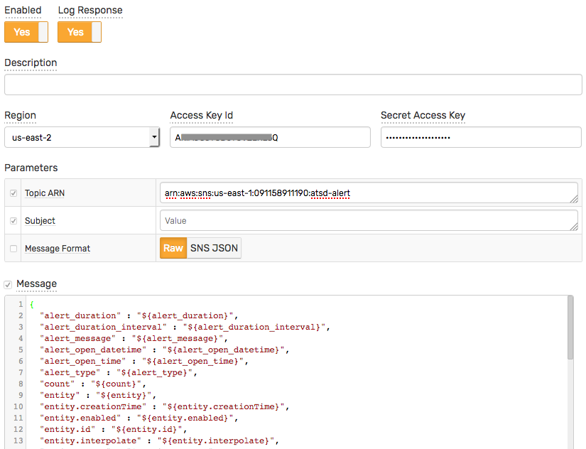

# Amazon SNS Notification

## Overview

The `AWS-SNS [notification](../web-notifications.md) publish a message to an [Amazon SNS](http://docs.aws.amazon.com/sns/latest/api/API_Publish.html) topic.

## Method

The message is sent using the `POST` method with `application/x-www-form-urlencoded` content type.

## Headers

The request will include the standard HTTP headers (such as Content-Type, Host, User-Agent etc.) and AWS headers (such as Authorization, X-Amz-Date)

## Signature

The request will be signed with the [AWS Signature Version 4](http://docs.aws.amazon.com/general/latest/gr/signature-version-4.html).

## Message

The default JSON message includes all fields that are relevant to the alert, including entity and metric metadata.

# Message Formats

|**Setting**|**Description**|
|---|---|
|`RAW`|The message will be sent as simple text.|
|`JSON`|The same as `RAW`, but the message editor supports highlight for JSON.|
|`SNS_JSON`|Select this format if you want to send [a different message for each protocol](http://docs.aws.amazon.com/sns/latest/api/API_Publish.html) ([example](http://docs.aws.amazon.com/sns/latest/dg/mobile-push-send-custommessage.html)).|

## Response

The response status code and response content is recorded in `atsd.log` if the `Log Response` setting is enabled.

## Configure Web Notification in ATSD

* Open **Alerts > Web Notifications** page.
* Click on an existing `AWS-SNS` template, or click the **Create** button below and switch the form to `AWS-SNS` type.
* Enter the `Name` value.
* Select the `Region` value.
* Enter the `Access Key Id` value.
* Enter the `Secret Access Key` value.
* Enter the `Topic ARN` value.

  

* Click **Test**.

   

   

* If tests are passing OK, check **Enable**, click **Save**.

In order to view the actual payload, create a sample rule, and enable the created `AWS-SNS` notification on the `Web Notifications` tab.

## Notification Settings

|**Setting**|**Description**|
|---|---|
|Region|The [Amazon SNS Region](http://docs.aws.amazon.com/general/latest/gr/rande.html#sns_region).|
|Access Key Id|[Access Key Id](http://docs.aws.amazon.com/general/latest/gr/aws-sec-cred-types.html#access-keys-and-secret-access-keys)|
|Secret Access Key|[Secret Access Key](http://docs.aws.amazon.com/general/latest/gr/aws-sec-cred-types.html#access-keys-and-secret-access-keys)|
|Topic ARN|The topic you want to publish to.|
|Subject|The subject of the message to be sent.|
|Message Format|The format of the message to be sent.|
|Message|The text of message to be sent.|