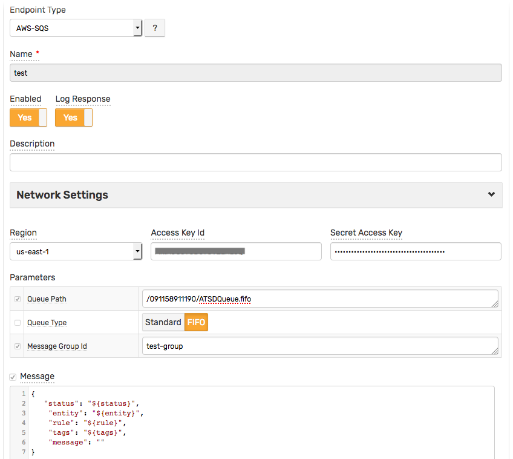
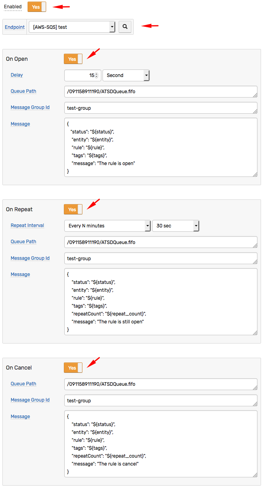
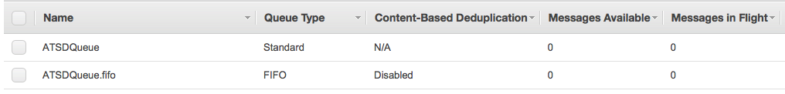
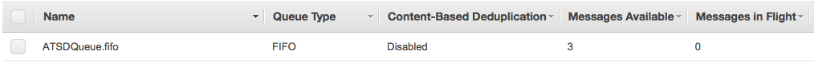
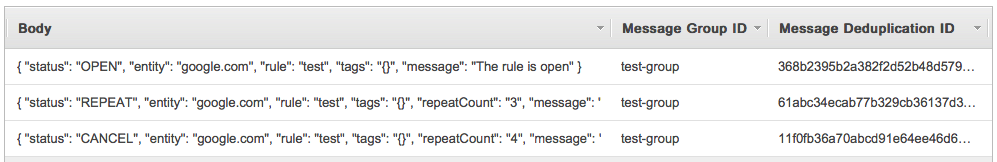

# FIFO Queue Type Example

Create an `AWS SQS` webhook with `Queue Type = FIFO`, for example:



Create a new rule and open the **Webhooks** tab.

Select `[AWS-SQS] test` from the **Endpoint** drop-down.

Enable the `OPEN`, `REPEAT`, and `CANCEL` triggers.

Customize the alert messages using [placeholders](../placeholders.md) as necessary, for example:

* `OPEN`

```json
       {
          "status": "${status}",
           "entity": "${entity}",
           "rule": "${rule}",
           "tags": "${tags}",
           "message": "The rule is open"
       }
```

* `REPEAT`

```json
       {
           "status": "${status}",
           "entity": "${entity}",
           "rule": "${rule}",
           "tags": "${tags}",
           "repeatCount": "${repeat_count}",
           "message": "The rule is still open"
       }
```

* `CANCEL`

```json
       {
           "status": "${status}",
           "entity": "${entity}",
           "rule": "${rule}",
           "tags": "${tags}",
           "repeatCount": "${repeat_count}",
           "message": "The rule is cancel"
       }
```

  

* Click **Save** to save the rule.

* The rule creates new windows when new commands are received by the database.

It can take a few seconds for the first commands to arrive and to trigger the notifications. You can open and refresh the **Alerts > Open Alerts** page to verify that an alert is open for your rule.

## Test

The AWS SQS Queues:



## Notifications examples

### Queue



### Messages


