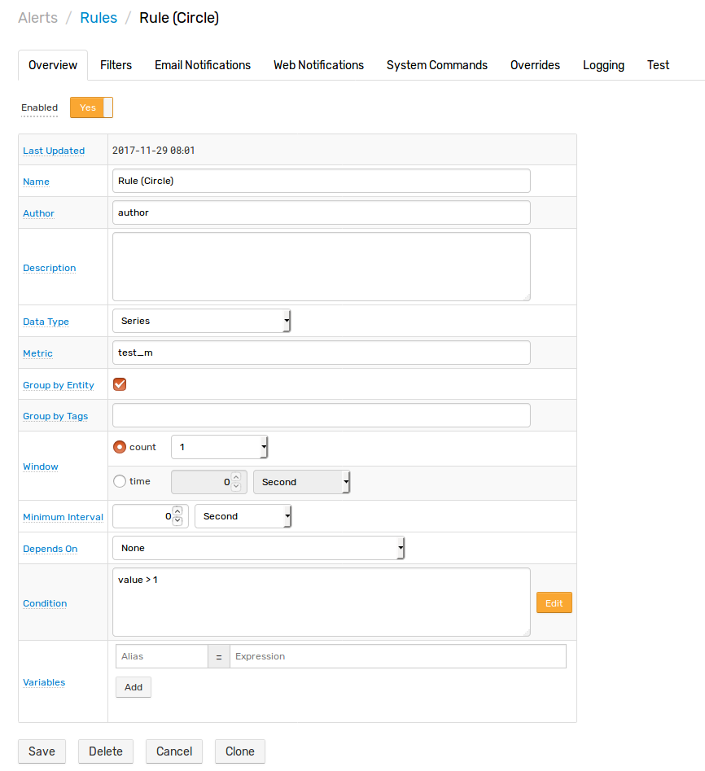
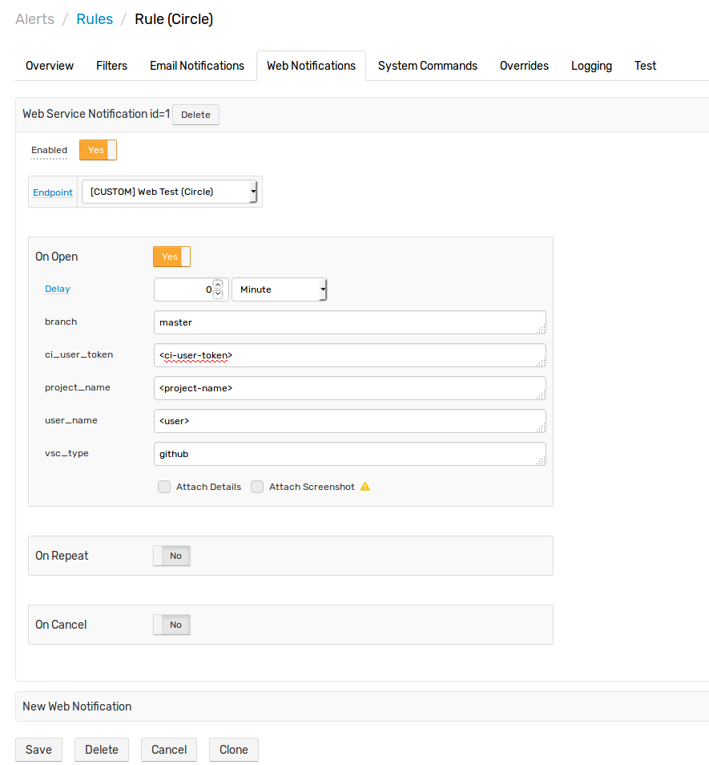
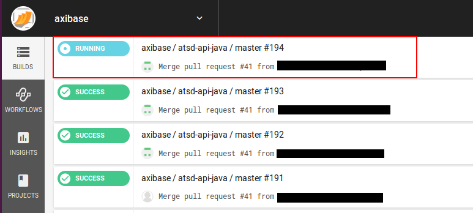

# CircleCI Integration

## Overview

The following documentation demonstrates starting CircleCI build using CircleCI HTTP API and ATSD custom web notifications

## Endpoint

[CircleCI API v1.1](https://circleci.com/docs/api/v1-reference/)

```
Name: Web Test (Circle)
Endpoint Type: CUSTOM
Method: POST
Content Type: application/x-www-form-urlencoded
Endpoint URL: https://circleci.com/api/v1.1/project/${vsc_type}/${user_name}/${project_name}/tree/${branch}?circle-token=${ci_user_token}
Headers:
    Accept: application/json
```


## Rule

Base test rule settings:

```
Name: Rule (Circle)
Metric: test_m
Condition: value > 1
```



Test rule notification settings:

```
Endpoint: [CUSTOM] Web Test (Circle)
branch: <github branch>
ci_user_token: <ci user token allowed to start build>
project_name: <github repository name>
user_name: <github user name>
vcs_type: github <github is used for this example, you can setup another repository>
```



## Test

In order to test rule, open and close it using following series commands:

```
series e:test_e m:test_m=2
series e:test_e m:test_m=1
```


Ensure that your build has been started at CircleCI

