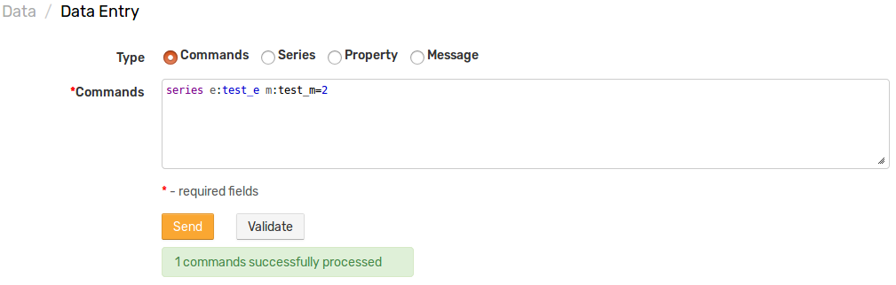

# CircleCI Integration

## Overview

The following example demonstrates how to trigger a [CircleCI](https://circleci.com) build for a GitHub project using a [`CUSTOM`](custom.md) webhook in the ATSD rule engine.

The integration relies on the [Circle CI API](https://circleci.com/docs/api/v1-reference/#new-build-branch) `new-build-branch` method for triggering a new build of the specified branch.

## Configuration

Create a new `CUSTOM` webhook from scratch or import the following [template](./resources/custom-circleci-notification.xml), used in this example. To import an XML template file, open **Alerts > Outgoing Webhooks**, select **Import** in the split-button located below the table and complete the upload form.

To create a new notification, open **Alerts > Outgoing Webhooks** and click **Create**.

### Parameters

Enter a name and specify the following parameters:

| **Name** | **Value** |
| :--- | :--- |
| Method | `POST`  |
| Content Type | `application/json` |
| Authentication | `Basic` |
| Username | `<CIRCLE_USER_TOKEN>` |
| Endpoint URL | `https://circleci.com/api/v1.1/project/github/<GITHUB_USER>/${project_name}/tree/${branch}` |
| Headers | `Accept: application/json` |

Modify the **Endpoint URL** by replacing the `<GITHUB_USER>` field with your GitHub user name.

Example Endpoint URL: `https://circleci.com/api/v1.1/project/github/axibase/${project_name}/tree/${branch}`

Enter the Circle CI user token into the `Username` field but leave the `Password` field empty.

Keep the `${project_name}` and `${branch}` placeholders in the URL path to ensure that they can be customized later in the rule editor. This allows you to trigger builds for different projects using the same webhook.

### Payload

The webhook can be configured to send a JSON document to the Circle CI endpoint to pass extended build parameters and the `Body` field can include the following text:

```json
{
  "parallel": "${parallel}",
  "build_parameters": {
    "RUN_EXTRA_TESTS": "${run_extra_tests}",
    "timezone": "${timezone}"
  }
}
```

Enclose fields with double quotes, if necessary.

Leave the `Body` field empty for non-parameterized projects.


## Rule

Create a new rule or import the [rule template](./resources/custom-circleci-rule.xml) used in this example. To import an XML template file, open the **Alerts > Rules** page, select **Import** in the split-button located below the table and complete the upload form.

To create a new rule, open the **Alerts > Rules** page and click **Create**.

Specify the key settings on the **Overview** tab.

| **Name** | **Value** |
| :-------- | :---- |
| Status | Enabled |
| Metric | test_m |
| Condition | `value > 1` |


Open the **Webhooks** tab.

Set **Enabled** to **Yes** and choose the previously created webhook from the **Endpoint** drop-down.

Enable **Open** and **Repeat** triggers. Set the **Repeat Interval** to **All**.

Specify the same settings for the **Open** and **Repeat** triggers:

| **Name** | **Value** |
| :-------- | :---- |
| `branch` | master |
| `parallel` | 4 |
| `project_name` | atsd-api-java |
| `run_extra_tests`  | `false` |
| `timezone`  | Etc/UTC |


Note that these parameters are visible in the rule editor because their placeholders are present in the **Endpoint URL** and JSON payload.

When the webhook is executed, all placeholders in the request URL and the payload is resolved as follows:

`https://circleci.com/api/v1.1/project/github/axibase/atsd-api-java/tree/master`

```json
{
  "parallel": "4",
  "build_parameters": {
    "RUN_EXTRA_TESTS": "false",
    "timezone": "Etc/UTC"
  }
}
```

If the placeholder is not found, the placeholder is replaced with an empty string.

## Test

Test the integration by submitting a sample `series` command on the **Data > Data Entry** page.

```ls
series e:test_e m:test_m=2
```



The value causes the condition to evaluate to `true`, which in turn triggers the notification.
To verify that an alert is raised, open the **Alerts > Open Alerts** page and check that an alert for the `test_m` metric is present in the **Alerts** table.


Check the **CircleCI** web interface to ensure the target build is triggered.


