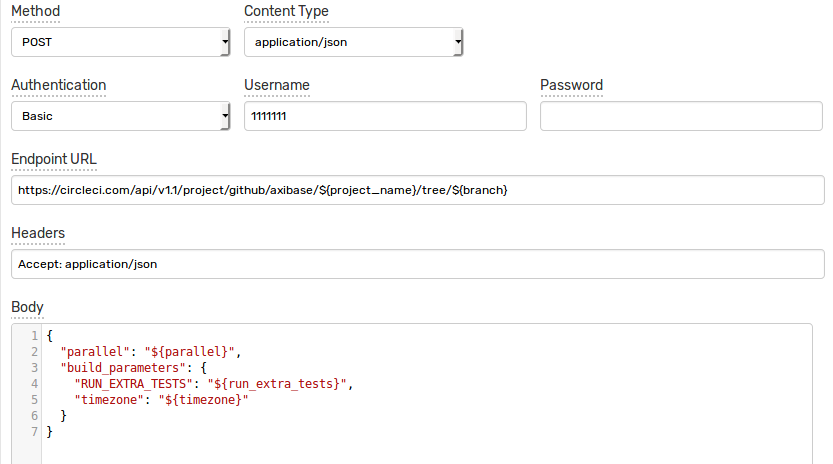

# CircleCI Integration

## Overview

The following documentation demonstrates starting CircleCI build using [CircleCI API](https://circleci.com/docs/api/v1-reference/) and ATSD custom web notifications.

[Documentation](https://circleci.com/docs/api/v1-reference/#new-build-branch) for method used in tutorial.

Web notification and rule configuration can be imported from following xml files

[Web Notification configuration](resources/custom-circleci-notification.xml)

[Rule configuration](resources/custom-circleci-rule.xml)

## Configuration

Replace \<CIRCLE_USER_TOKEN> in Endpoint URL with CircleCI user token


| Parameter | Value |
| :-------- | :---- |
| Method | POST  |
| Content Type | application/json |
| Endpoint URL | https://circleci.com/api/v1.1/project/github/axibase/${project_name}/tree/${branch}?circle-token=\<CIRCLE_USER_TOKEN> |
| Headers | Accept: application/json |

Body:

```
{
  "parallel": ${parallel},
  "build_parameters": { 
    "RUN_EXTRA_TESTS": ${run_extra_tests}
  }
}
```



## Rule

Base test rule settings:

| Parameter | Value |
| :-------- | :---- |
| Metric | test_m |
| Condition | value > 1 |


Enable **Web Notifications**

Enable **Open** and **Repeat**, set **Repeat Interval** to **All**

Set same settings for **Open** and **Repeat**:

| Parameter | Value |
| :-------- | :---- |
| branch | master |
| parallel | 4 |
| project_name | atsd-api-java |
| run_extra_tests  | true |


## Test

In order to test rule, open and close it using following series commands:

```
series e:test_e m:test_m=2
```


Ensure that your build has been started at CircleCI

