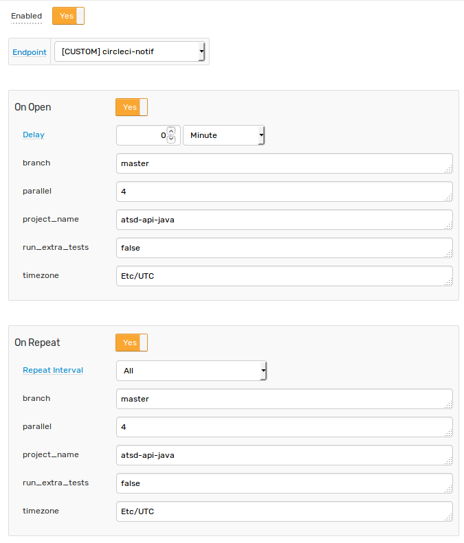

# CircleCI Integration

## Overview

The following documentation demonstrates starting CircleCI build using [CircleCI API](https://circleci.com/docs/api/v1-reference/) and ATSD custom web notifications

## Configuration

Replace \<CIRCLE USER TOKEN> in Endpoint URL with CircleCI user token

```
Method: POST
Content Type: application/x-www-form-urlencoded
Endpoint URL: https://circleci.com/api/v1.1/project/github/axibase/${project_name}/tree/${branch}?circle-token=<CIRCLE USER TOKEN>
Headers:
    Accept: application/json
```


## Rule

Base test rule settings:

```
Name: Rule (Circle)
Metric: test_m
Condition: value > 1
```


Test rule notification settings:

```
branch: master
project_name: atsd-api-java
```



## Test

In order to test rule, open and close it using following series commands:

```
series e:test_e m:test_m=2
series e:test_e m:test_m=1
```


Ensure that your build has been started at CircleCI

