# IFTTT Integration

## Overview

The following example demonstrates how to trigger an action in [IFTTT](https://ifttt.com/) using a [`CUSTOM`](custom.md) web notification in the ATSD rule engine.

The integration relies on the [IFTTT Webhook](https://ifttt.com/maker_webhooks) trigger.

## Create IFTTT Applet

Log in to [ifttt.com](https://ifttt.com) and go to **My Applets**


Click **New Applet**


Click **this** to create a trigger

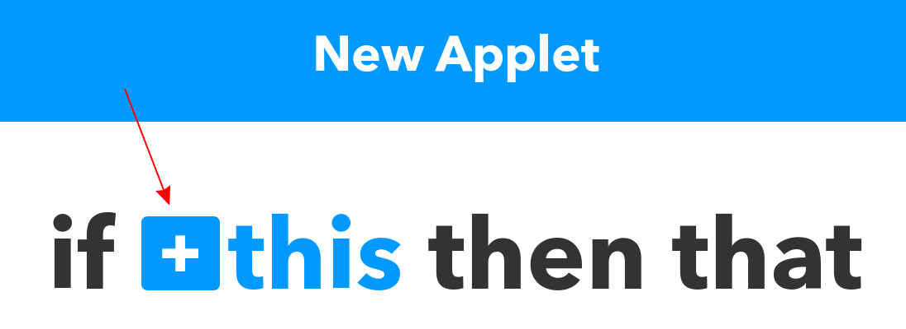

Search for **Webhooks** and select it

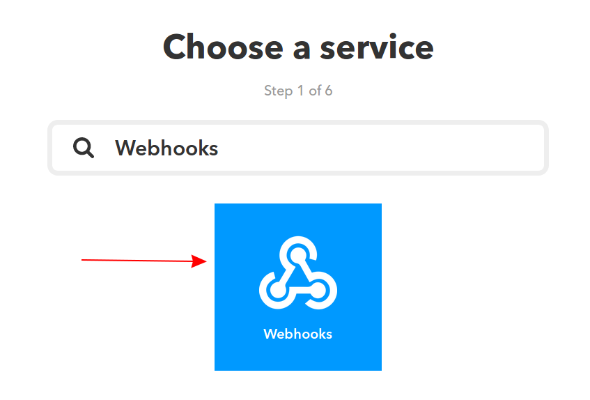

Click **Connect** to setup webhook trigger

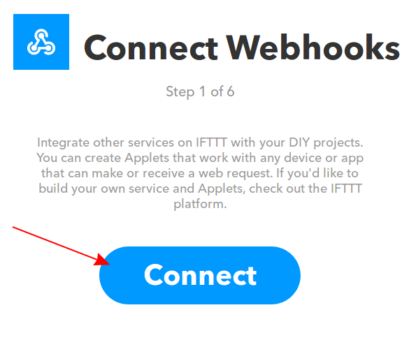

Choose **Receive a web request**

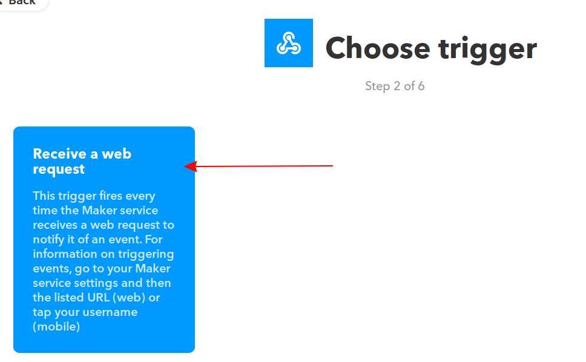

Enter event name **atsd_custom_trigger** and click **Create trigger**

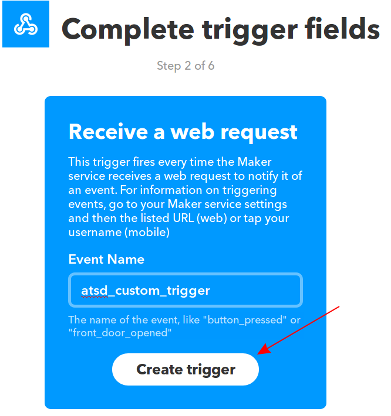

Click **that** to create a event


Search for **SMS** and select it

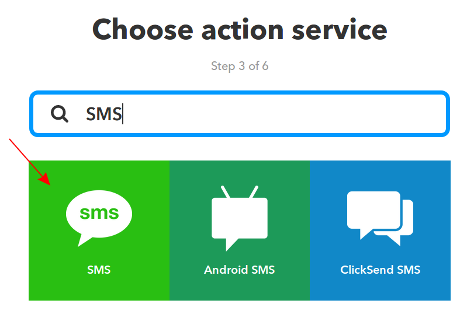

Click **Connect** to setup event

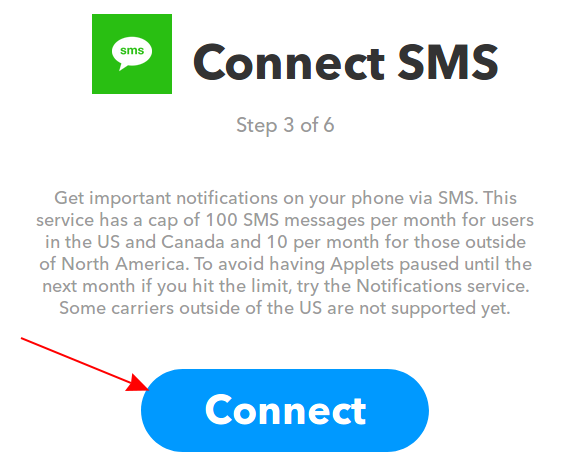

Enter phone number to receive messages from ATSD and click **Send PIN**. Enter received PIN and click **Connect**. For test purposes you can use virtual phone number (for example, [sms.sellaite.com](http://sms.sellaite.com/))

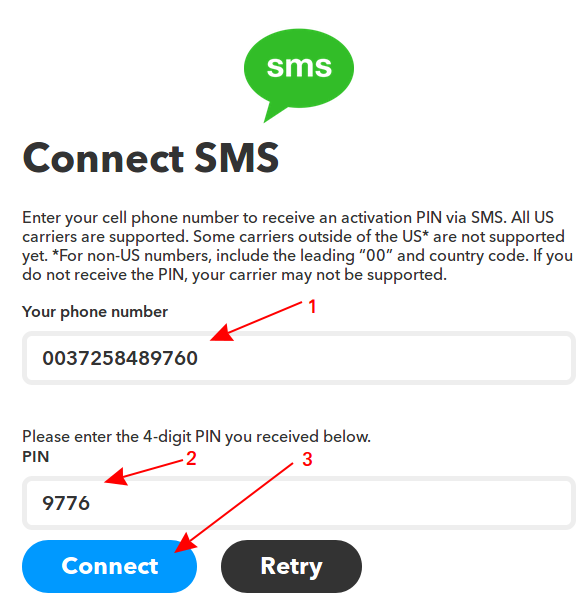

Choose **Send me an SMS**

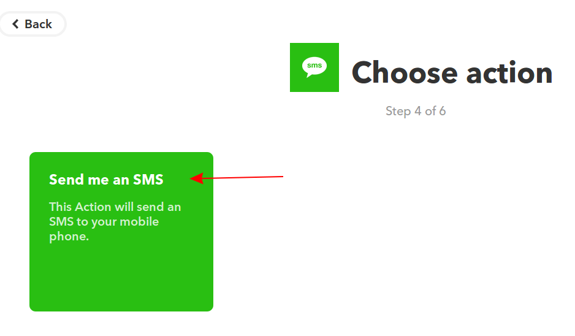

Enter following text into **Message** field and click **Create action**

```
[{{Value1}}] {{Value2}} for {{Value3}}
```

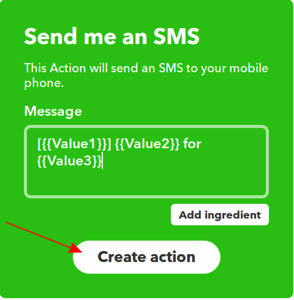

Review changes and click **Finish**

## Configuration

Create a new `CUSTOM` web notification or import the [template](resources/custom-ifttt-notification.xml) used in this example. To import the XML template file, open the **Alerts > Web Notifications** page, select **Import** in the multi-action button located below the table and follow the prompts.

To create a new notification, open the **Alerts > Web Notifications** page and click **Create**.

### Parameters

Enter a name and specify the following parameters:

| **Name** | **Value** |
| :--- | :--- |
| Method | `POST` |
| Content Type | `application/json` |
| Authentication | `None` |
| Endpoint URL | `https://maker.ifttt.com/trigger/${webhook_name}/with/key/<IFTTT_KEY>` |

Modify the `Endpoint URL` by replacing the `<IFTTT_KEY>` field with your github user name.

The `Endpoint URL` should look as follows: `https://maker.ifttt.com/trigger/${webhook_name}/with/key/111111`

Keep the `${webhook_name}` placeholder in the URL path so that it can be customized in the rule editor. This would allow you to send SMS from different applets using the same web notification.

You can find your IFTTT key in `Webhooks` examples. Go to [Webhooks](https://ifttt.com/maker_webhooks) and select **Documentation**

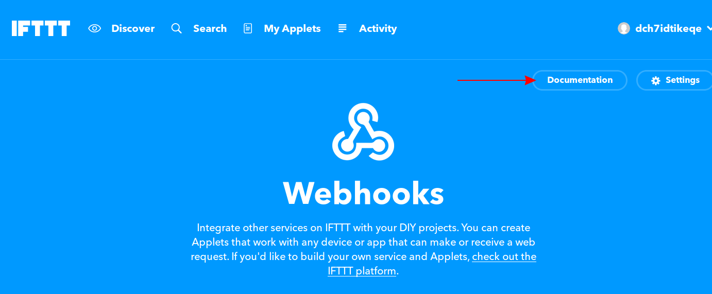

Here is your key


### Payload

Enter the following text into the `Body` field:

```
{
  "value1": "${status}",
  "value2": "${rule}",
  "value3": "${entity}"
}
```

The `body` text contains placeholders that will be substituted with actual values when the notification is triggered. 

The placeholders specified in the payload and the URL are visible as editable parameters in the rule editor.

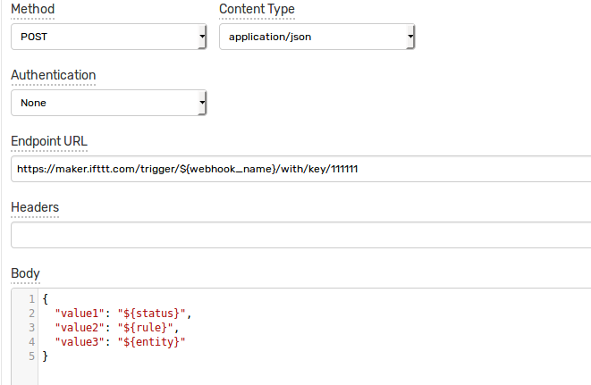

## Rule

Create a new rule or import the [rule template](resources/custom-ifttt-rule.xml) used in this example. To import the XML template file, open the **Alerts > Rules** page, select **Import** in the multi-action button located below the table and follow the prompts.

To create a new rule, open the **Alerts > Rules** page and click **Create**.

Specify the key settings on the **Overview** tab. 

| **Name** | **Value** |
| :-------- | :---- |
| Status | Enabled |
| Metric | test_m |
| Condition | `value > 1` |


Open the **Web Notifications** tab.

Set **Enabled** to **Yes** and choose the previously created web notification from the **Endpoint** drop-down.

Enable **Open**, **Repeat** and **Cancel** triggers. Set the **Repeat Interval** to **All**.

Specify the webhook identifier `atsd_custom_webhook` into the `webhook_name` parameter for all triggers.

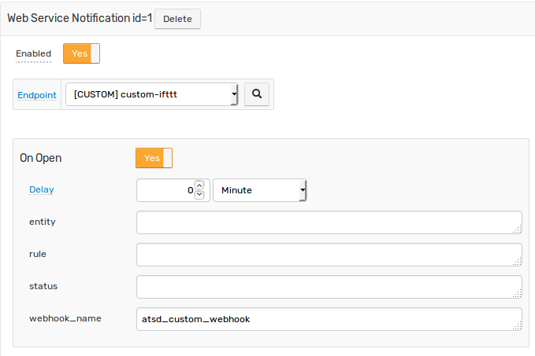

The `webhook_name` placeholder in the request URL as well as payload placeholders will be automatically resolved when the notification is triggered:

`https://maker.ifttt.com/trigger/atsd_custom_trigger/with/key/111111`

```
{
  "value1": "OPEN",
  "value2": "IFTTT",
  "value3": "test_e"
}
```

## Test

In order to test the integration, submit sample data for the `test_m` metric into ATSD. For example, open the **Data > Data Entry** page and submit the following command:

```
  series e:test_e m:test_m=2
```


The value will cause the condition to evaluate to `true`, which in turn will trigger the notification.
To verify that an alert was raised, open **Alerts > Open Alerts** page and check that an alert for the `test_m` metric is present in the **Alerts** table.


Check the phone or virtual number to make sure the SMS was sent.

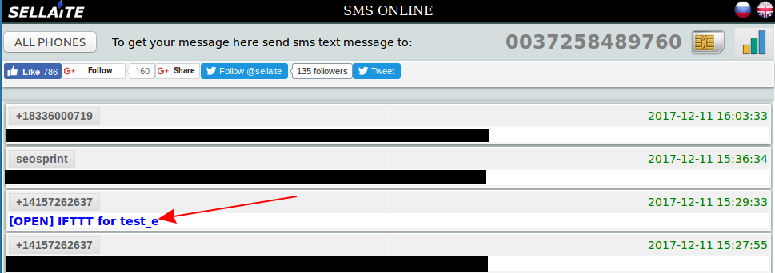
