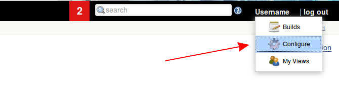
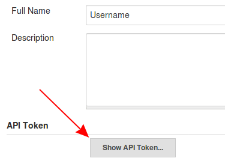
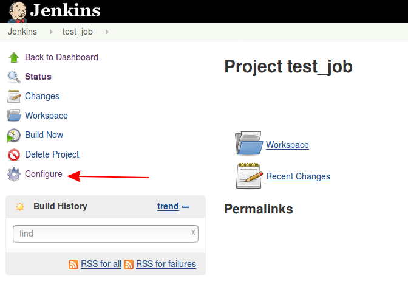
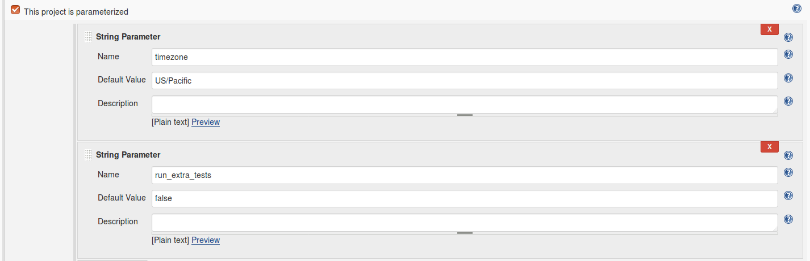
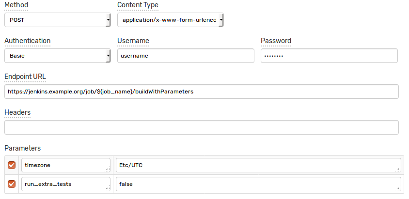
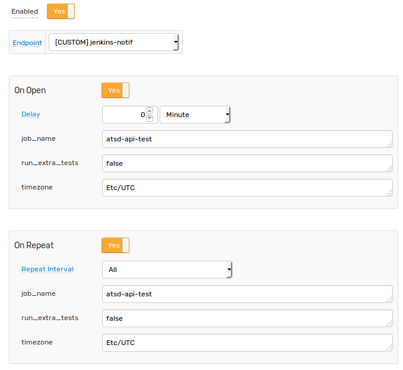
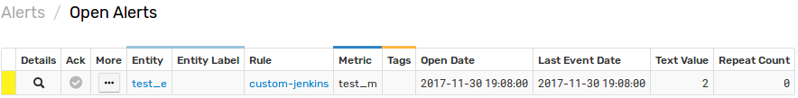
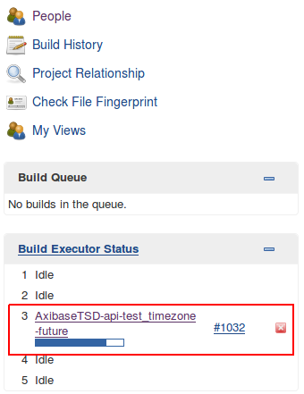

# Jenkins Integration

## Overview

The following example demonstrates how to trigger a [Jenkins](https://jenkins.io/) job using a [`CUSTOM`](custom.md) webhook in the ATSD rule engine.

The integration relies on the following [Jenkins API](https://wiki.jenkins.io/display/JENKINS/Remote+access+API) methods:

* `'Job with parameters'` method.
* `'Jobs without parameters'` method.

## Configuration

Create a new `CUSTOM` webhook from scratch or import the following [template](./resources/custom-jenkins-notification.xml), used in this example.

To import the XML template file, open the **Alerts > Outgoing Webhooks** page, select **Import** in the split button located below the table and follow the prompts.

To create a new notification, open the **Alerts > Outgoing Webhooks** page and click **Create**.

### Parameters

Enter a name and specify the following parameters:

| **Name** | **Value** |
| :--- | :--- |
| Method | `POST` |
| Content Type | `application/x-www-form-urlencoded` |
| Authentication | `Basic` |
| Username | `<JENKINS_USER_NAME>` |
| Password | `<JENKINS_USER_TOKEN>` |
| Endpoint URL | `https://jenkins.example.org/job/${job_name}/buildWithParameters` |

If the Jenkins job is not parameterized, use the `https://jenkins.example.org/job/${job_name}/build` url.

Replace `jenkins.example.org` in the `Endpoint URL` parameter with the actual Jenkins address.

Keep the `${job_name}` placeholder in the URL path so that the job name can be customized in the rule editor. This allows you to trigger different jobs using the same webhook.

Enter the Jenkins user name into the `Username` field and the User API token into the `Password` field.

The API token can be located on the `User Configuration` page in the Jenkins web interface.



Click **Show API Token**.



Your token is displayed in the `API Token` field.


### Payload

If your Jenkins job is parameterized, you can send the additional parameters in the request payload.

To inspect which parameters are exposed by the project, open the job configuration page in Jenkins.



The parameters are displayed if `This project is parameterized` checkbox is enabled.



The webhook can be configured to send a `x-www-form-urlencoded` data to the Jenkins server to pass extended parameters.

In this case, add parameters names to the `Parameters` and enable their checkboxes to customize them in the rule editor.



Leave the `Parameters` table empty for non-parameterized jobs.

## Rule

Create a new rule or import the [rule template](./resources/custom-jenkins-rule.xml) used in this example. To import the XML template file, open the **Alerts > Rules** page, select **Import** in the split button located below the table and follow the prompts.

To create a new rule, open the **Alerts > Rules** page and click **Create**.

Specify the key settings on the **Overview** tab.

| **Name** | **Value** |
| :-------- | :---- |
| Status | Enabled |
| Metric | test_m |
| Condition | `value > 1` |


Open the **Webhooks** tab.

Set **Enabled** to **Yes** and choose the previously created webhook from the **Endpoint** drop-down.

Enable **Open** and **Repeat** triggers. Set the **Repeat Interval** to **All**.

Specify the same settings for the **Open** and **Repeat** triggers:

| **Name** | **Value** |
| :-------- | :---- |
| `job_name`  | atsd-api-test |
| `run_extra_tests`  | `false` |
| `timezone` | Etc/UTC |



Note that these three parameters are visible in the rule editor because their placeholders are present in the `Endpoint URL` and `Parameters` are marked as editable.

When the notification is executed, all placeholders are resolved as follows:

`https://jenkins.example.org/job/atsd-api-test/buildWithParameters`

```txt
timezone=Etc/UTC
run_extra_tests=false
```

If the placeholder is not found, the placeholder is replaced with an empty string.

## Test

Test the integration by submitting a sample `series` command on the **Data > Data Entry** page.

```ls
  series e:test_e m:test_m=2
```


The value causes the condition to evaluate to `true`, which in turn triggers the notification.
To verify that an alert was raised, open **Alerts > Open Alerts** page and check that an alert for the `test_m` metric is present in the **Alerts** table.



Check the Jenkins user interface to make sure the target build was triggered.


