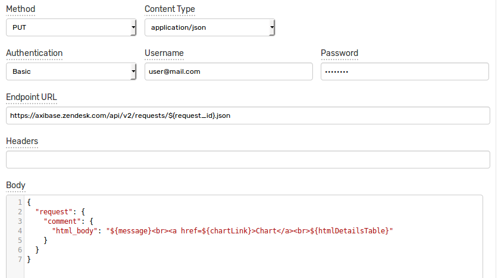
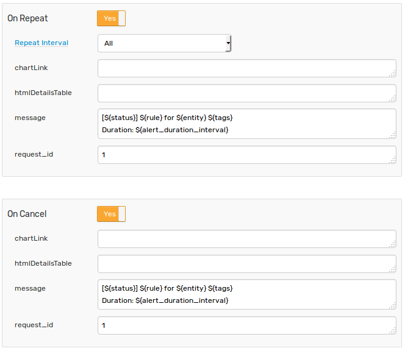
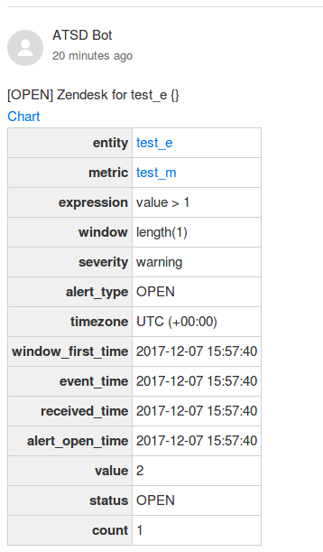

# Zendesk Integration

## Overview

The following example demonstrates how to add a comment to an existing request at [Zendesk](https://www.zendesk.com/) using a [`CUSTOM`](custom.md) web notification in the ATSD rule engine.

The integration relies on the [Zendesk API](https://developer.zendesk.com/rest_api/docs/core/requests#update-request) `update-request` method for adding a single comment to a specified request.

## Configuration

Create a new `CUSTOM` web notification from scratch or import the [template](resources/custom-zendesk-notification.xml) used in this example. To import the XML template file, open the **Alerts > Web Notifications** page, select **Import** in the multi-action button located below the table and follow the prompts.

To create a new notification, open the **Alerts > Web Notifications** page and click **Create**.

### Parameters

Enter a name and specify the following parameters:

| **Name** | **Value** |
| :--- | :--- |
| Method | `PUT` |
| Content Type | `application/json` |
| Authentication | `Basic` |
| Username | `<ZENDESK_USER>` |
| Password | `<ZENDESK_PASSWORD>` |
| Endpoint URL | `https://<COMPANY_NAME>.zendesk.com/api/v2/requests/${request_id}.json` |

Modify the `Endpoint URL` by replacing the `<COMPANY_NAME>` field with your zendesk company name.

The `Endpoint URL` should look as follows: `https://axibase.zendesk.com/api/v2/requests/${request_id}.json`

Keep the `${request_id}` placeholder in the URL path so that one can customize it in the rule editor. This would allow you to add a comments for different requests using the same web notification.

### Payload

The web notification can be configured to send a JSON document to the Zendesk endpoint in order to add a comment and the `Body` field can include the following text:

```
{
  "request": {
    "comment": {
      "html_body": "${message}<br><a href=${chartLink}>Chart</a><br>${alertTable}"
    }
  }
}
```

Make sure that you enclose fields with double quotes, if necessary.



## Rule

Create a new rule or import the [rule template](resources/custom-zendesk-rule.xml) used in this example. To import the XML template file, open the **Alerts > Rules** page, select **Import** in the multi-action button located below the table and follow the prompts.

To create a new rule, open the **Alerts > Rules** page and click **Create**.

Specify the key settings on the **Overview** tab. 

| **Name** | **Value** |
| :-------- | :---- |
| Status | Enabled |
| Metric | test_m |
| Condition | `value > 1` |


Open the **Web Notifications** tab.

Set **Enabled** to **Yes** and choose the previously created web notification from the **Endpoint** drop-down.

Enable **Open**, **Repeat** and **Close** triggers. Set the **Repeat Interval** to **All**.

Specify the following settings for **Open** trigger:

| **Name** | **Value** |
| :-------- | :---- |
| alertTable  | `${htmlDetailsTable}` |
| chartLink | `${chartLink}` |
| request_id | `1` |
| message | `[${status}] ${rule} for ${entity} ${tags}` |


For **Repeat** and **Cancel** triggers:

| **Name** | **Value** |
| :-------- | :---- |
| alertTable  | `${htmlDetailsTable}` |
| chartLink | `${chartLink}` |
| issue_id | `1` |
| message | `[${status}] ${rule} for ${entity} ${tags}`<br>`Duration: ${alert_duration_interval}` |



Note that these parameters are visible in the rule editor because their placeholders are present in the `Endpoint URL` and the JSON payload.

When the notification is executed, all placeholders in the request URL will be resolved as follows:

`https://axibase.zendesk.com/api/v2/requests/1.json`

Request body parameters will be resolved in the same way.

If the placeholder is not found, it will be substituted with an empty string.

## Test

In order to test the integration, submit sample data for the `test_m` metric into ATSD. For example, open the **Data > Data Entry** page and submit the following command:

```
  series e:test_e m:test_m=2
```


The value will cause the condition to evaluate to `true`, which in turn will trigger the notification.
To verify that an alert was raised, open **Alerts > Open Alerts** page and check that an alert for the `test_m` metric is present in the **Alerts** table.


Check the Zendesk request to make sure the new comment was added.


