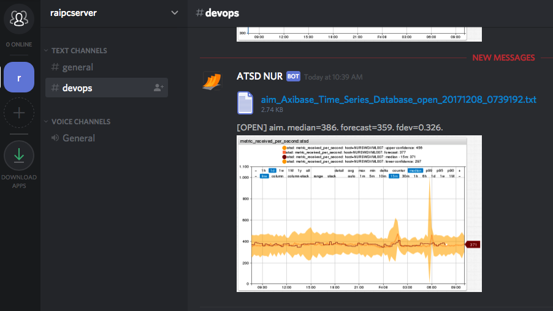
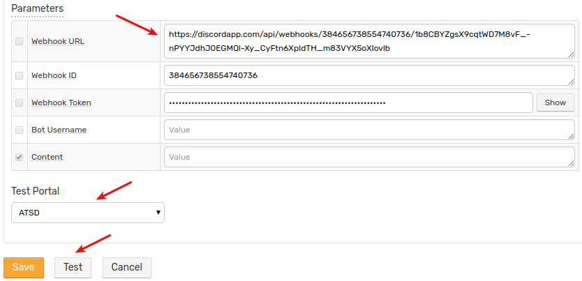

# Discord Notifications

## Overview

`DISCORD` [webhook](../notifications/README.md) sends alert messages, alert detail tables, and charts into Discord channels. This integration is based on the [Discord Webhook API](https://discordapp.com/developers/docs/resources/webhook).



## Security

::: danger
* Note that image and file attachments in Discord messages cannot be securely shared at this time (API v6).
* The attachments, even if sent to a private server, are accessible by any unauthorized user via the URL.
:::

## Prerequisites

Install and configure the [Web Driver](web-driver.md) to send chart screenshots into Discord.

## Create Discord Server

Configure a new Discord server, if necessary.

* Click the **plus** icon in the left panel.

     

* Click **Create a Server**.

     

* Specify **Server Name**. Click **Create**.

     

* Configure the server for [private](https://support.discordapp.com/hc/en-us/articles/206143407-How-do-I-set-up-private-servers-without-passwords-) access.

* Invite new members to the server, click **Done**.

## Create Channel

* Click **Create Channel**.

     

* Specify **Channel name**, select **Text Channel**, and click **Create Channel**.

     

* Click **Edit channel**.

     

* Open the **Permissions** tab and review the settings.

     

On the **Invite** tab, create an invitation link and distribute it to new users.

To join a server, click **Create new server**, select **Join** and paste the received invitation link.

## Create Webhook in Discord

* Open the **Webhook** tab, click **Create Webhook**, enter a name and select a channel.

    

* Copy the Webhook URL for future reference and click **Save**.

## Create Webhook in ATSD

* Open the **Alerts > Outgoing Webhooks** page.
* Click an existing `DISCORD` template, or click **Create** and select the `DISCORD` type.
* Specify the unique `Name` of the notification.

    

* Copy the **Webhook URL** from the Discord client to the **Webhook URL** field in the configuration form.
* **Webhook ID** and **Webhook Token** are filled automatically when you finish editing the **Webhook URL** field.
* Select **Test Portal** to test the screenshot.

    

* Click **Test**.

   

* If test is passed, set the status **Enabled** and click **Save**.

## Proxy Settings

If the Discord API server is not accessible from the ATSD server, open the **Network Settings** and specify [proxy parameters](../notifications/README.md#network-settings).

NGINX API Gateway Path for Discord:

```ls
location /api/webhooks {
  proxy_pass https://discordapp.com/api/webhooks;
}
```

## Webhook Parameters

|**Parameter**|**Description**|
|---|---|
|Webhook URL|Webhook URL generated on the **Webhook** tab in channel settings.<br>The URL is cleared when the configuration is saved.|
|Webhook ID|The ID of the webhook.<br>Automatically resolved from Webhook URL.|
|Webhook Token|The secure token of the webhook.<br>Automatically resolved from Webhook URL.|
|Bot Username|Overwrite your bot user name.|
|Content|Message text to be sent.<br>Leave this field blank to make the field editable in the rule editor.|

## Testing

### Create or Import a Rule

* Create a new rule or import an existing rule for a built-in metric as described below.
* Download the file [rules.xml](./resources/rules.xml).
* Open the **Alerts > Rules > Import** page.
* Check **Auto-enable New Rules**, attach the `rules.xml` file, click **Import**.

### Configure Webhook

* Open the **Alerts > Rules** page and select the imported rule.
* Open the **Webhooks** tab.
* Select Discord from the **Endpoint** drop-down.
* Enable the `OPEN`, `REPEAT`, and `CANCEL` triggers.
* Customize the alert message using [placeholders](../placeholders.md) as necessary, for example:

```bash
OPEN = [${status}] ${rule} for ${entity} ${tags}. ${ruleLink}
REPEAT = [${status}] ${rule} for ${entity} ${tags}. Duration: ${alert_duration_interval}. ${ruleLink}
CANCEL = [${status}] ${rule} for ${entity} ${tags}. Duration: ${alert_duration_interval}. ${ruleLink}
```

* Click **Save**.

    

* The rule creates new windows when new commands are received by the database.

It can take a few seconds for the first commands to arrive and trigger notifications. Open and refresh the **Alerts > Open Alerts** page to verify that an alert is open for your rule.

## Examples

   

   Content of `atsd.jvm.low_memory_atsd_open_20171127_1408043.txt`:

   
