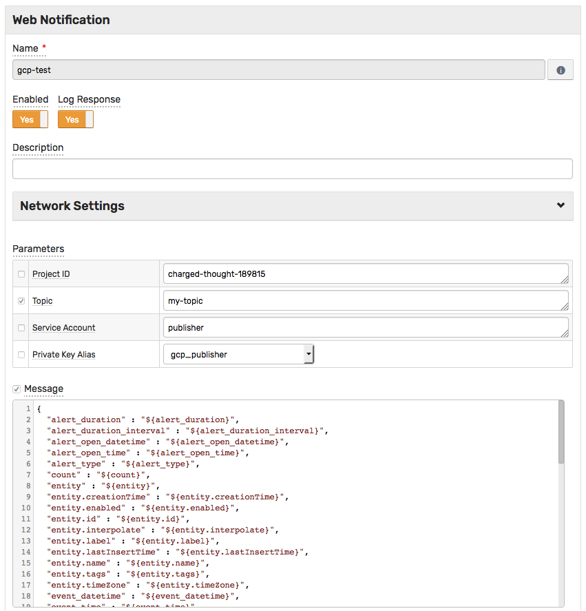
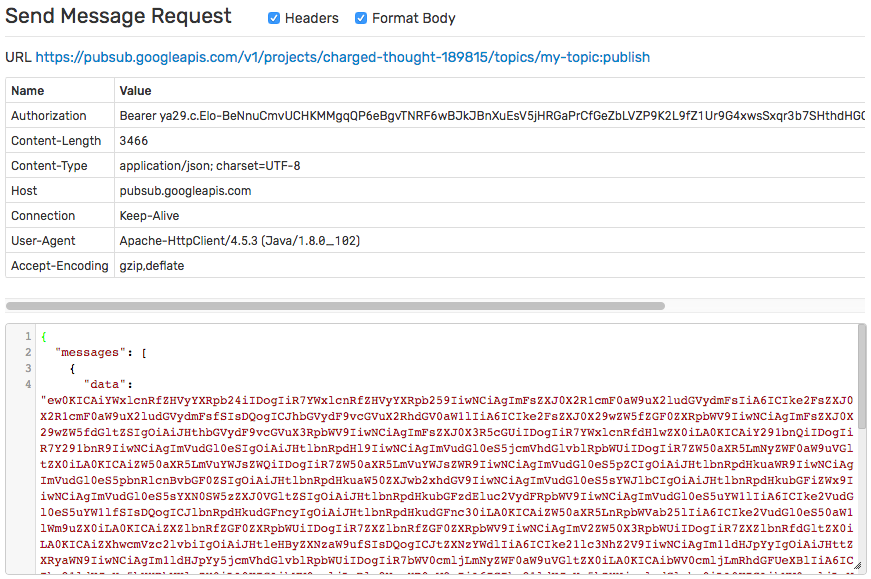

# Google Cloud Pub/Sub Webhook

## Overview

`GCP Pub/Sub` [webhook](../notifications/README.md) send messages to a [Google Cloud Pub/Sub](https://cloud.google.com/pubsub/docs/reference/rest/v1/projects.topics/publish) topic upon window status events.

## Webhook Settings

|**Setting**|**Description**|
|---|---|
|Project ID|The ID of the project.|
|Topic|The name of the receiving topic.|
|Service Account|The account that belongs to the application instead of to an individual end user. Create account as described [here](gcp-service-account-key.md#create-service-account)|
|Private Key Alias|The alias of the imported account private key as described by [GCP Service Account Key Documentation](./gcp-service-account-key.md#import-private-key)|
|Message|Default message text.|

## Message

Each window status event can produce only one message.

The message is submitted to the specified Google Cloud Pub/Sub endpoint using the `POST` method with `application/json` content type. The request uses [OAuth 2.0 authorization](https://developers.google.com/identity/protocols/OAuth2ServiceAccount).

The default message includes all fields, including entity and metric metadata.

## Response

The response status code and response content is recorded in `atsd.log` if the **Log Response** setting is enabled.

## Configure GCP Pub/Sub Webhook

* Open **Alerts > Outgoing Webhooks** page.
* Click **Create** and select the `GCP-PS` type.
* Fill out the **Name** field.
* Enter the **Project ID**, **Topic**, **Service Account** and select **Private Key Alias**.

  

* Click **Test**.

   

   

* If tests are passing OK, check **Enable**, click **Save**.

To test the actual payload, create a sample rule, and enable the `GCP Pub/Sub` webhook on the **Webhooks** tab.

## Examples

* [Send a message to the topic](gcp-ps-message.md)
