# HipChat Data Center Notifications

## Overview

The `HIPCHAT` [notification](../web-notifications.md) allows sending alert messages, alert detail tables, and charts into HipChat channels. The integration is based on the [HipChat API v2](https://www.hipchat.com/docs/apiv2).

## Prerequisites

* Install and configure the [Web Driver](web-driver.md) in order to enable sending chart screenshots into HipChat.

## Create Bot

* Log in to HipChat as admin.
* Click **System**.

    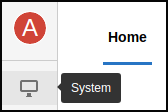

* Go to **Team Info**.
* Navigate to invite URL, click **Enable**.

    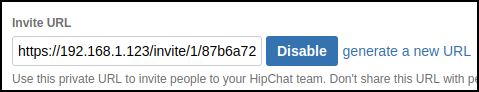

* Copy the link.
* Sign out (right upper corner).

    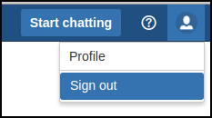

* Paste link to browser, press **Enter**.
* Fill in the fields, click **Sign Up**.

    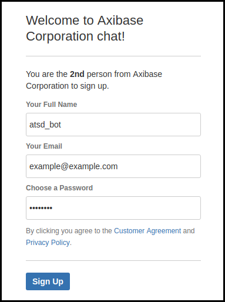
    
## Generate Tokens

* Click on bot icon (right upper corner).

    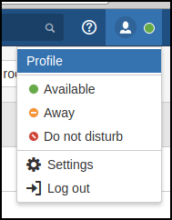
    
* Click **Profile**.
* Go to **API tokens**.

> Make sure you are using API v2: there should be no warnings

* Select **Send Message** and **Send Notification** from the **Scopes** field.
* Fill in the **Label** field.
* Click **Create**.

    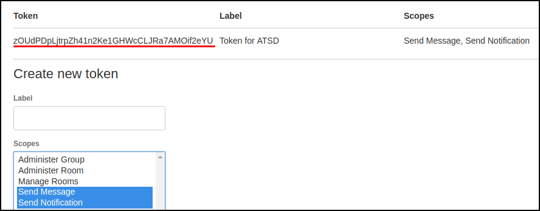

* Copy the token for future reference.
* Log out.

## Create Room

* Log in to HipChat as admin.
* Click **Start chatting**.
* Click **Create a room**.
    
    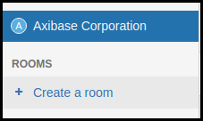
    
* Fill in the fields, check (enable) **Private room**, click **Create room**.

    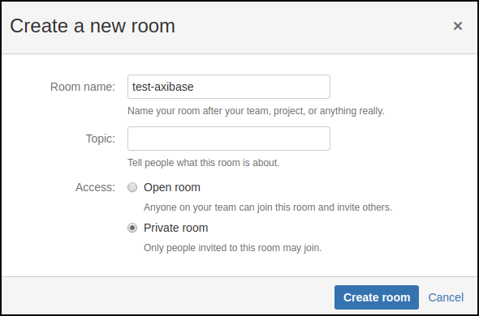
    
* Enter members to receive notifications from ATSD (you can do it later), enter bot user, click **Invite people**.

    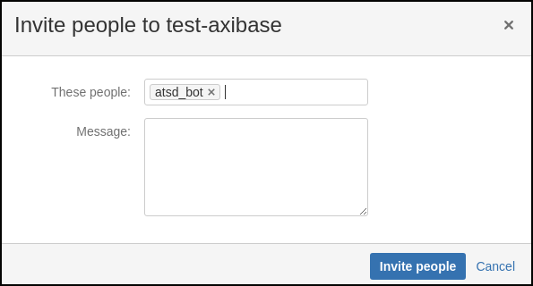

## Get Room Id

* Click on team name.
    
    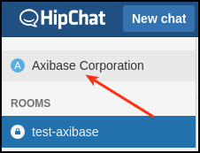
    
* Click on recently created room.
    
    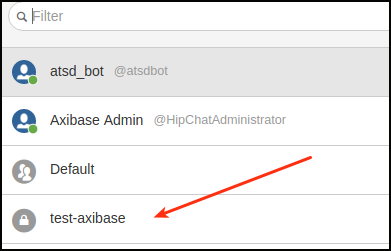
    
* Look at URL, last number is the room id.
    
    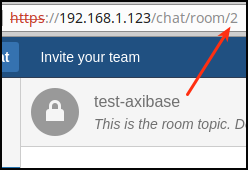 

In addition, you can use room name as room id, for example `test-axibase`.
    
## Create HipChat Notification in ATSD

* Open the **Alerts > Web Notifications** page.
* Click on an existing `HIPCHAT` template, or click the **Create** button and switch the type to `HIPCHAT`.
* Copy the `Token` from the HipChat Data Center client into the `Auth Token` field in the configuration form.
* Copy the `Room ID` from the HipChat client into the `Room ID` field in the configuration form. 

    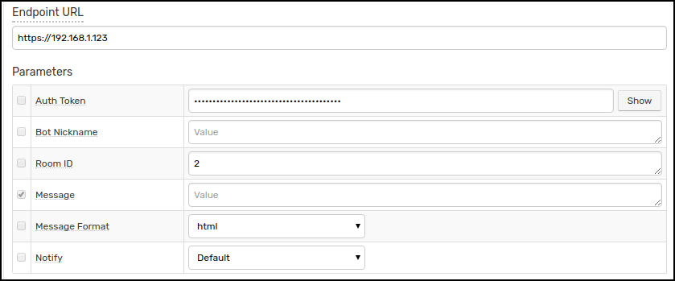

* Click **Test**.

   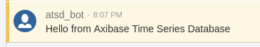

* Select **Test Portal** to test the screenshot.

   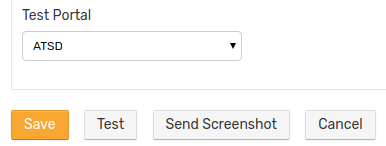   

* Click **Send Screenshot**.

   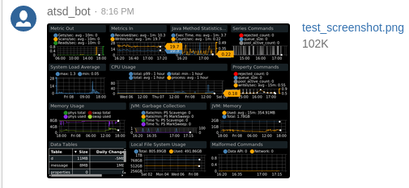
   
* If tests are OK, set the status **Enabled** and click **Save**.  

## Notification Parameters

|**Parameter**|**Description**|
|---|---|
|Auth Token|Auth Token bearing 'message' and 'notifications' scopes.|
|Bot Nickname|Append a phrase to your bot's username.|
|Room ID|ID or name of the room.|
|Message|Message text to be sent. This field should be left blank so it can be customized in the rule editor.|
|Message Format|Change how messages are formatted. See [message_format](https://www.hipchat.com/docs/apiv2/method/send_room_notification).|
|Notify|Notify users when bot sends a message.|


## Testing Notification

### Create/import rule

* Create a new rule or import an existing rule for a built-in metric as described below.
* Download the file [rules.xml](resources/rules.xml).
* Open the **Alerts > Rules > Import** page.
* Check (enable) **Auto-enable New Rules**, attach the `rules.xml` file, click **Import**.

### Configure notification

* Open **Alerts > Rules** page and select a rule.
* Open the **Web Notifications** tab.
* Select HipChat from the **Endpoint** drop-down.
* Enable the `OPEN`, `REPEAT`, and `CANCEL` triggers.
* Customize the alert message using [placeholders](../placeholders.md) as necessary, for example:

```ls
    OPEN = [${status}] ${rule} for ${entity} ${tags}. ${ruleLink}
    REPEAT = [${status}] ${rule} for ${entity} ${tags}. Duration: ${alert_duration_interval}. ${ruleLink}
    CANCEL = [${status}] ${rule} for ${entity} ${tags}. Duration: ${alert_duration_interval}. ${ruleLink}
```

* Save the rule by clicking on the **Save** button.

    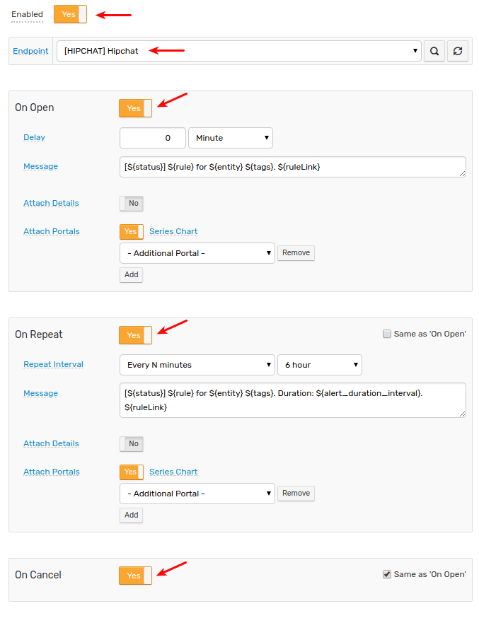
    
* The rule will create new windows based on incoming data. It may take a few seconds for the first commands to arrive and to trigger the notifications. You can open and refresh the **Alerts > Open Alerts** page to verify that an alert is open for your rule.

## Example

Notification's color depends on alert severity level specified at **Logging** tab. 

**Warning**:

   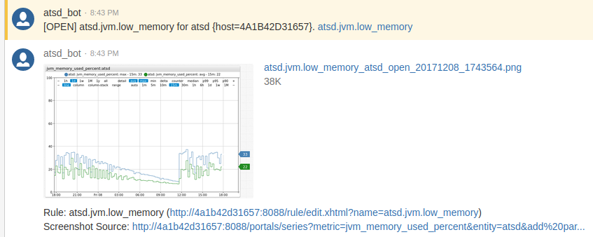
   
**Critical**:

   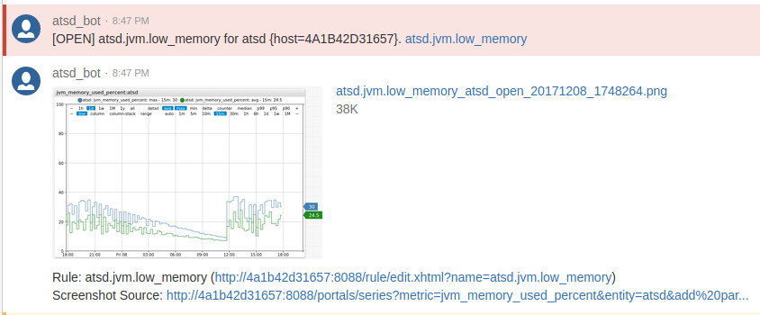


