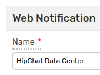
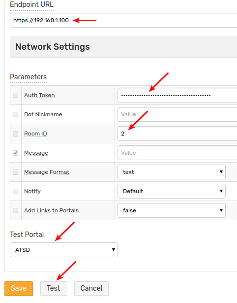
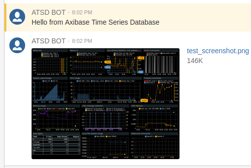
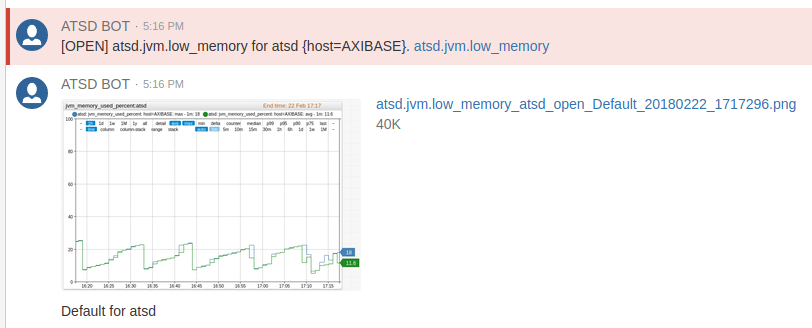

# HipChat Data Center Notifications

## Overview

`HIPCHAT` [webhook](../notifications/README.md) sends alert messages, alert detail tables, and charts into [HipChat Data Center](https://www.atlassian.com/software/hipchat/enterprise/data-center) channels. The integration is based on the [HipChat API v2](https://www.hipchat.com/docs/apiv2).

## Prerequisites

* Install and configure the [Web Driver](web-driver.md) to send chart screenshots into HipChat.

## Create Bot

* Log in to HipChat as an administrator.
* Click **System**.

    

* Open **Team Info**.
* Open the invitation URL, click **Enable**.

    

* Copy the link.
* Sign out.

    

* Paste the above link into the browser address bar, click **Enter**.
* Fill in the fields, click **Sign Up**.

    

## Generate Tokens

* Click the bot icon in the upper right corner.

    

* Click **Profile**.
* Open **API tokens**. Ensure that you are using API **v2** to avoid a warning message from the system.

* Choose **Send Message** and the **Send Notification** options from the **Scopes** field.
* Fill in the **Label** field.
* Click **Create**.

    

* Copy the token for future reference.
* Log out.

## Create Room

* Log in to HipChat again as an administrator.
* Click **Start chatting**.
* Click **Create a room**.

    

* Fill in the fields, check **Private room**, click **Create room**.

    

* Specify members to receive notifications from ATSD, including the above bot user. Click **Invite people**.

    

## Look Up Room ID

* Click the team name.

    

* Click the newly created room.

    

* Check the URL. The last number is the room ID.

    

In addition to the room ID, you can search by room name, for example `test-axibase`, when sending messages.

## Create Webhook in ATSD

* Open the **Alerts > Outgoing Webhooks** page.
* Click an existing `HIPCHAT` template, or click **Create** and select the `HIPCHAT` type.
* Specify the unique `Name` of the notification.

    

* Specify the **Endpoint URL**.
* Copy the **Token** from the HipChat Data Center client into the **Auth Token** field of the configuration form.
* Copy the room ID or room name from the HipChat Data Center client into the **Room ID** field in the configuration form.
* Select **Test Portal** to test the screenshot.

    

* Click **Test**.

   

* If test is passed, set the status to **Enabled** and click **Save**.

## Proxy Settings

If the HipChat API server is not accessible from the ATSD server, open the **Network Settings** and specify [proxy parameters](../notifications/README.md#network-settings).

## Webhook Settings

|**Name**|**Description**|
|---|---|
|Auth Token|Authorization Token with `message` and `notifications` scopes.|
|Bot Nickname|Set a name for the bot.|
|Room ID|ID or name of the room.|
|Message|Message text to be sent. Leave the field blank to make the field editable in the rule editor.|
|Message Format|Change how messages are formatted. See [message_format](https://www.hipchat.com/docs/apiv2/method/send_room_notification). To ensure that the references returned by the [link placeholders](../links.md#reference) and the [link functions](../functions-link.md#reference) are automatically inlined, specify `html` format.|
|Notify|Notify users when bot sends a message.|
|Add Links to Portals|Send a follow up message with chart links after each message containing portal screenshots.|

## Testing

### Create/import Rule

* Create a new rule or import an existing rule for a built-in metric as described below.
* Download the file [rules.xml](./resources/rules.xml).
* Open the **Alerts > Rules > Import** page.
* Check (enable) **Auto-enable New Rules**, attach the `rules.xml` file, click **Import**.

### Configure Webhook

* Open **Alerts > Rules** page and select a rule.
* Open the **Webhooks** tab.
* Select HipChat from the **Endpoint** drop-down.
* Enable the `OPEN`, `REPEAT`, and `CANCEL` triggers.
* Customize the alert message using [placeholders](../placeholders.md) as necessary, for example:

```bash
OPEN = [${status}] ${rule} for ${entity} ${tags}. ${ruleLink}
REPEAT = [${status}] ${rule} for ${entity} ${tags}. Duration: ${alert_duration_interval}. ${ruleLink}
CANCEL = [${status}] ${rule} for ${entity} ${tags}. Duration: ${alert_duration_interval}. ${ruleLink}
```

* Click **Save** to save the rule.

    

* The rule creates new windows when new commands are received by the database.

It can take a few seconds for the first commands to arrive and to trigger notifications. Refresh the **Alerts > Open Alerts** page to verify that an alert is open for your rule.

## Examples

The alert color depends on the severity level specified in the **Logging** tab.

* Warning alert:

   

* Critical alert:

   
