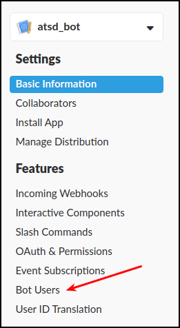
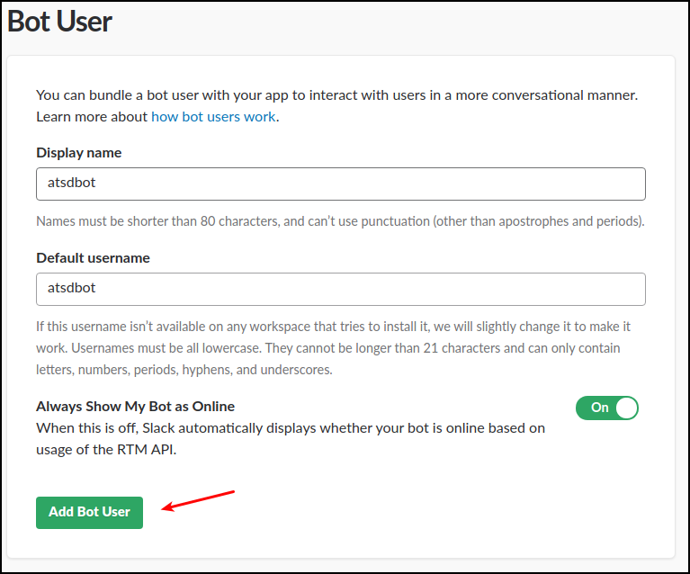
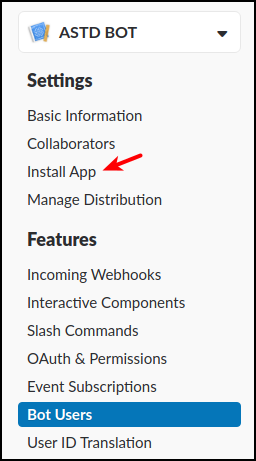
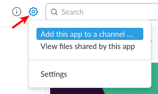
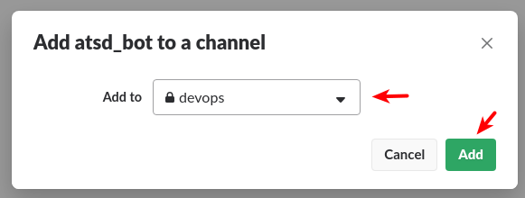
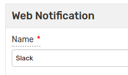
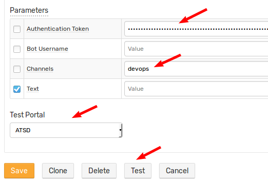
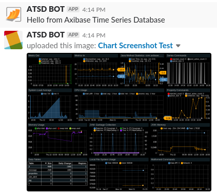
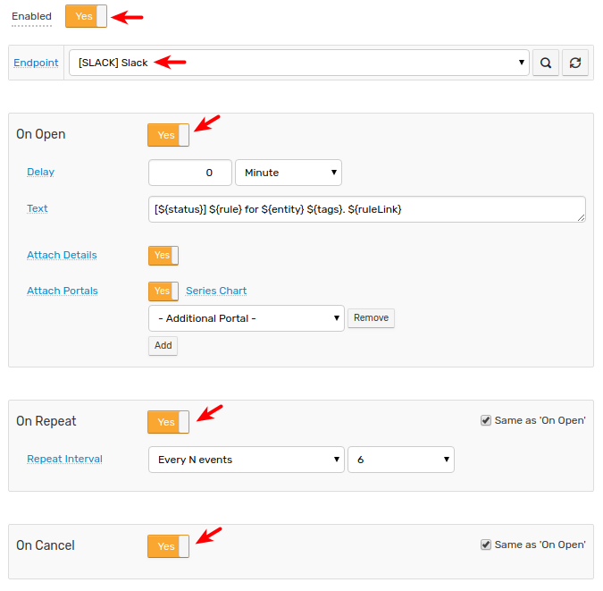
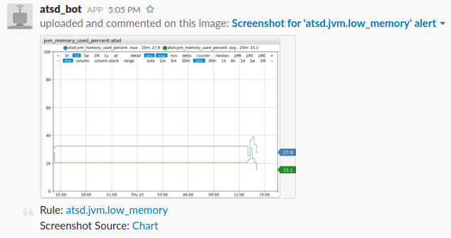

# Slack Notifications

## Overview

`SLACK` [webhook](../notifications/README.md) provides a capability to send alert messages, alert detail tables, and charts into Slack channels. The integration is based on the [Slack Bot API](https://api.slack.com/bot-users).

## Reference

* [Prerequisites](#prerequisites)
* [Create Workspace](#create-workspace)
* [Create Channel](#create-channel)
* [Create Bot](#create-bot)
* [Add Bot to Channel](#add-bot-to-channel)
* [Get Channel Id](#get-channel-id)
* [Configure Webhook in ATSD](#configure-webhook-in-atsd)
* [Proxy Settings](#proxy-settings)
* [Webhook Settings](#webhook-settings)
* [Reacting to Bot Messages](#reacting-to-bot-messages)
* [Testing Rule](#testing-rule)
* [Examples](#examples)

## Prerequisites

Install and configure the [Web Driver](web-driver.md) to send chart screenshots into Slack.

## Create Workspace

Create a Slack [workspace](https://slack.com/create), if necessary.

## Create Channel

If necessary, create new channel as described [here](https://get.slack.help/hc/en-us/articles/201402297-Create-a-channel).

## Create Bot

Slack Bot is a special account created for automation purposes.

* Open [Slack Apps](https://api.slack.com/apps)

   

* Select an existing app or create a new one.

* Create a bot user.

  * Click **Bot Users**.

       

  * Click **Add a Bot User**.

       

  * Review Settings, click **Add Bot User**.

       

  * Click **Save Changes**.

## Add Bot to Channel

* Click **Install App**.

    

* Click **Install App to Workspace**.

   

* Review permissions, click **Authorize**.

   

* Copy the **Bot User OAuth Access Token** for future reference.

   

* Open Slack [workspace](https://my.slack.com/), click bot name in the **Apps** section.

   

* Click **Conversation Settings**  and **Add this app to a channel ...**.

    

* Select the channel, click **Add**.

    

## Get Channel Id

* Click the target IM/public/private channel to display the channel URL, for example `messages/D822261LK/team/U81D8UY64/`.

     

* Copy the channel ID, which is specified between the `messages/` and `/team` parts, for example `D822261LK`.

When sending messages to either a public or private channel you can just use the name of the channel instead of its ID, for example `devops` or `general`.

## Configure Webhook in ATSD

* Open the **Alerts > Outgoing Webhooks** page.
* Click an existing `SLACK` template, or click **Create** below and select the `SLACK` type.
* Specify the unique **Name** of the notification.

    

* Specify the **Auth Token** and **Channels** parameters. See parameter descriptions below.
* Select **Test Portal** to verify screenshot delivery.

    

* Click **Test**

   

* If test is passed, check **Enable**, then click **Save**.

## Proxy Settings

If the Slack API server is not accessible from the ATSD server, open the **Network Settings** section and specify [proxy parameters](../notifications/README.md#network-settings).

NGINX API Gateway Path for Slack:

```ls
location /api/chat.postMessage {
    proxy_pass https://slack.com/api/chat.postMessage;
}
location /api/files.upload {
    proxy_pass https://slack.com/api/files.upload;
}
```

## Webhook Settings

|**Setting**|**Description**|
|---|---|
|`Auth Token`|Bot API authentication token (see above).|
|`Bot Username`|Set your bot user name.|
|`Channels`|Comma-separated list of channels, private groups, or IM channels to send message to. Each entry can be a name or an encoded ID.|
|`Text`|Message text to be sent. Leave the field blank to make the field editable in the rule editor.|
|`Parse Mode`|Change how messages are formatted. See [Basic message formatting](https://api.slack.com/docs/message-formatting) for more information.|
|`Names as Links`|Find and link channel names and usernames.|

## Reacting to Bot Messages

The bot account can be used both to deliver notifications to end users, as well as to react to messages received by the bot itself.

To process incoming messages, configure an [outgoing webhook](outgoing-webhook-slack.md). The [webhook](outgoing-webhook-slack.md) integration requires ATSD server to be reachable from Slack API servers.

## Testing Rule

### Create/import rule

* Create a new rule or import an existing rule for a built-in metric as described below.
* Download the file [rules.xml](./resources/rules.xml).
* Open the **Alerts > Rules > Import** page.
* Check (enable) **Auto-enable New Rules**, attach the `rules.xml` file, click **Import**.

### Configure Webhook

* Open the **Alerts > Rules** page and select a rule.
* Open the **Webhooks** tab.
* Select Slack from the **Endpoint** drop-down.
* Enable the `OPEN`, `REPEAT`, and `CANCEL` triggers.
* Customize the alert message using [placeholders](../placeholders.md) as necessary, for example:

```bash
[${status}] ${rule} for ${entity} ${tags}. ${ruleLink}
```

* Save the rule by clicking **Save**.

  

* The rule creates new windows when new commands are received by the database.

It can take a few seconds for the first commands to arrive and to trigger the webhook. Refresh the **Alerts > Open Alerts** page to verify that an alert is open for your rule.

## Examples



