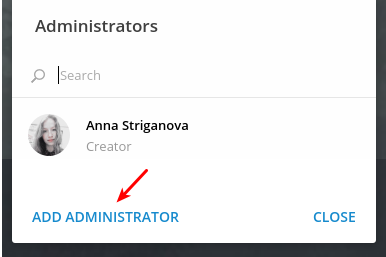

# Add Bot to Telegram Channel

* Click **Channel Settings > Manage Channel**.

   

* In the **Manage Channel** window, click **Administrators**.

   

* In the **Administrators** window, click **ADD ADMINISTRATOR**.

   

* Specify the name of the newly created bot, for example, `@atsd_bot`.

   

* Click the bot name and confirm.

   

* Review the settings, make sure _Post messages_ is enabled and click **Save > Close > Cancel**.

   