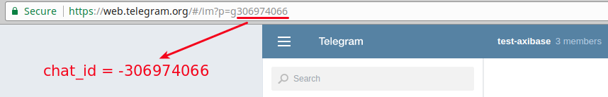
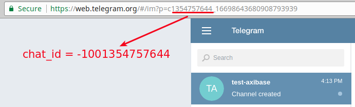
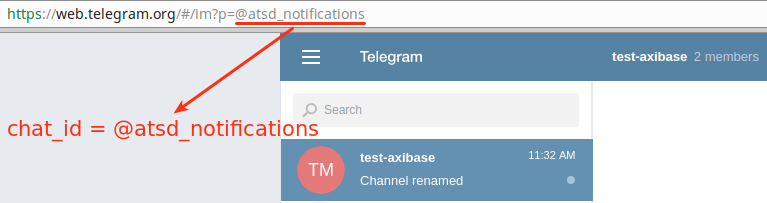

# Get Chat ID using Telegram Web

This option is applicable only for groups and channels.

Log in to [Telegram Web](https://web.telegram.org) and follow the appropriate instruction.

## For Group

* Click on the group name and check its URL, for example `/#/im?p=g306974066`.

     

* Substitute the `g` character with the minus sign, for example `-306974066`.

## For Private Channel

* Click on the channel name and check its URL, for example `/#/im?p=c1354757644_16698643680908793939`

     

* Copy numbers before the underscore and replace `c` with `-100`, for example `-1001354757644`.

## For Public Channel

* Click on the channel name and check its URL, for example `/#/im?p=@atsd_notifications`

     

* Copy symbols after `=`, for example `@atsd_notifications`