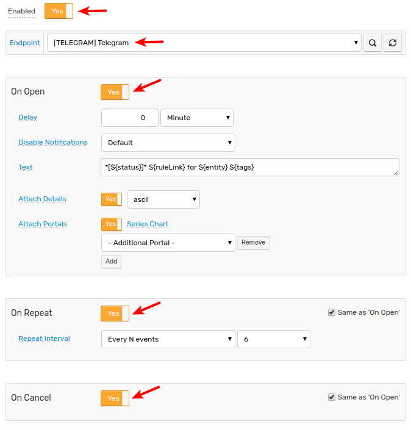
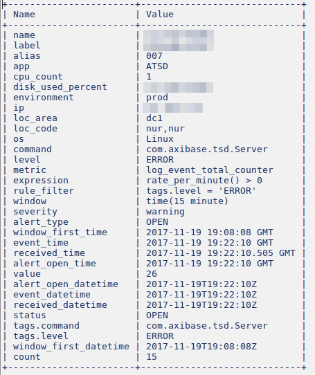

# Telegram Notifications

## Overview

`TELEGRAM` webhook allows sending text messages and chart screenshots to Telegram groups and channels using the [Telegram Bot API](https://core.telegram.org/bots/api).

## Reference

* [Prerequisites](#prerequisites)
* [Bot API Token](#bot-api-token)
* [Sending Messages to User](#sending-messages-to-user)
* [Sending Messages to Group](#sending-messages-to-group)
* [Sending Messages to Private Channel](#sending-messages-to-private-channel)
* [Sending Messages to Public Channel](#sending-messages-to-public-channel)
* [Configure Webhook in ATSD](#configure-webhook-in-atsd)
* [Proxy Settings](#proxy-settings)
* [Webhook Settings](#webhook-settings)
* [Reacting to Bot Messages](#reacting-to-bot-messages)
* [Testing Rule](#testing-rule)
* [Examples](#examples)

## Prerequisites

Configure the [Web Driver](web-driver.md) to be able to send chart screenshots.

## Bot API Token

* Start a conversation with the built-in [BotFather](https://telegram.me/botfather) user.
* Send the `/mybots` command to view existing bots and their API tokens.
* Alternatively, create a new bot with the `/newbot` command.
* Take note of the bot API token.

## Sending Messages to User

* Open `https://api.telegram.org/bot<BOT_API_TOKEN>/getUpdates` link.
* Send a direct message to the bot, or ask another user to message the bot.
* Refresh the `getUpdates` link above and take note of `chat.id` for the user's private conversation with the bot.

  

## Sending Messages to Group

* Click **Group Settings > Add Members**.
* Enter the bot name, select the bot, click **Invite**.
* Open `https://api.telegram.org/bot<BOT_API_TOKEN>/getUpdates` link.
* Send a message to the group.
* Refresh the `getUpdates` link above and take note of `chat.id` for the group. The chat id for groups is a negative number.

  

## Sending Messages to Private Channel

* Click **Channel Settings > Manage Channel**.
* In the **Manage Channel** window, click **Administrators > ADD ADMINISTRATOR**.
* Enter the bot name, and confirm the action.
* Review permissions, ensure that only **Post messages** is enabled.

  

* Open `https://api.telegram.org/bot<BOT_API_TOKEN>/getUpdates` link.
* Send a message to the private channel.
* Refresh the `getUpdates` link above and take note of `chat.id` for the channel. The chat id for private channels is a negative number.

  

## Sending Messages to Public Channel

* Click **Channel Settings > Manage Channel**.
* In the **Manage Channel** window, click **Administrators > ADD ADMINISTRATOR**.
* Enter the bot name, and confirm the action.
* Review permissions, ensure that only **Post messages** is enabled.

  

## Configure Webhook in ATSD

* Open the **Rule Engine > Outgoing Webhooks** page.
* Click an existing `TELEGRAM` template, or click **Create** and select `TELEGRAM`.
* Specify the unique `Name` of the notification.

    

* Enter the `BOT_TOKEN` value into the **Bot API Token** field.
* Specify **Chat ID**:
  * Enter channel name as `@channel_name` for public channels

    

  * Enter chat id for private channels, groups, and users

    

* Click **Test** to send a sample message.
* If [Web Driver](web-driver.md) is installed, select **Test Portal** to verify chart delivery.

  

* Click **Save**.

## Proxy Settings

If the Telegram API server is inaccessible from the ATSD server, open the **Network Settings** section and specify [proxy parameters](../notifications/README.md#network-settings).

NGINX API Gateway Path for Telegram:

```ls
location /bot {
    proxy_pass https://api.telegram.org/bot;
}
```

## Webhook Settings

|**Setting**|**Description**|
|---|---|
|Bot API Token|Unique authentication token assigned to the bot.|
|Chat ID|Chat id in case of group, user, or private channel.<br>Channel name with `@` prefix in case of public channel. |
|Text|Message text to be sent. Leave the field blank to make the field editable in the rule editor.|
|Notifications|If enabled, delivers the message with an audio notification.|
|Web Page Preview|If enabled, displays short previews for URLs in the message.|
|Details Table Format|The default format for the alerts detail table.|

:::tip Markdown
Parse mode is set to [markdown](https://core.telegram.org/bots/api#markdown-style) by default.
:::

## Reacting to Bot Messages

Use the bot account to deliver notifications to end users and react to messages addressed to the bot itself.

To process incoming messages, configure an [outgoing webhook](outgoing-webhook-telegram.md) or set **Receive Updates** setting to `yes` and **Method** to `Polling`. The [webhook](outgoing-webhook-telegram.md) integration requires ATSD server to be reachable from Telegram API servers.

## Testing Rule

### Create/import rule

* Create a new rule or [import an existing rule](https://axibase.com/use-cases/tutorials/shared/import-rule.html) for a built-in metric as described below.
* Download [`rules.xml`](./resources/rules.xml).
* Open the **Alerts > Rules > Import** page.
* Check **Auto-enable New Rules**, attach the `rules.xml` file, click **Import**.

### Configure Webhook

* Open the **Alerts > Rules** page and select a rule.
* Open the **Webhooks** tab.
* Select Telegram from the **Endpoint** drop-down list.
* Enable the `OPEN`, `REPEAT`, and `CANCEL` triggers.
* Customize the alert message using [placeholders](../placeholders.md) if needed, for example:

```bash
*[${status}]* ${ruleLink} for ${entity} ${tags}
```

* Click **Save**.

  

* The rule creates a new window when commands are received by the database.

It can take a few seconds for the first commands to arrive and to trigger the webhook. Open and refresh the **Alerts > Open Alerts** page to verify that an alert is open for your rule.

### Test

* Check channel messages.


Sample alert table file.


## Examples





