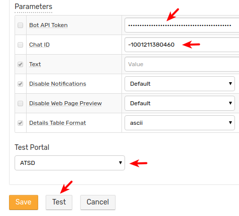
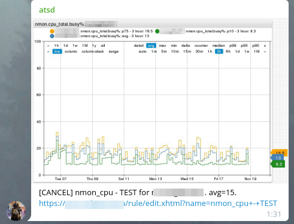

# Telegram Notifications

## Overview

`TELEGRAM` [webhook](../notifications/README.md) provides a built-in capability to send alert messages, alert detail tables, and charts to Telegram groups and channels. The integration is based on the [Telegram Bot API](https://core.telegram.org/bots/api).

## Reference

* [Prerequisites](#prerequisites)
* [Create Bot](#create-bot)
* [Add Bot to Group or Channel](#add-bot-to-group-or-channel)
* [Get Chat Id](#get-chat-id)
* [Configure Webhook in ATSD](#configure-webhook-in-atsd)
* [Proxy Settings](#proxy-settings)
* [Webhook Settings](#webhook-settings)
* [Reacting to Bot Messages](#reacting-to-bot-messages)
* [Testing Rule](#testing-rule)
* [Examples](#examples)

## Prerequisites

Install and configure the [Web Driver](web-driver.md) to send chart screenshots into Telegram.

## Create Bot

* Search for the `BotFather` user in the Telegram client.
* Start a conversation with the [BotFather](https://telegram.me/botfather) user.

    

* Send the `/newbot` command and complete the guided process to create a bot user and obtain its access token. The bot username must end with `_bot` and cannot contain dash `-` symbol.

```txt
Use this token to access the HTTP API:
5555555555:AAHrB1gmYKaSvzsXjhbyDypOJlfu_FgdwrE
```

* Store the API token for future reference.

## Add Bot to Group or Channel

If necessary, create a new [group](https://telegram.org/faq#q-how-do-i-create-a-grou) or [channel](https://telegram.org/faq_channels#q-what-39s-a-channel).

### Add Bot to Group

* Click **Group Settings > Add Members**.

   

* Specify the name of the newly created bot, for example, `@atsd_bot`.

   

* Select the bot and click **Invite**.

To add bot to private or public channel refer to these [Instructions](telegram-add-bot-to-channel.md).

## Get Chat ID

Chat ID is required for the outgoing Telegram webhook to function properly.

There are two options to obtain Chat ID:

* [`getUpdates` API method](#view-updates)
* [Telegram Web](telegram-get-chat-id.md)

### View Updates

* Send any message to the channel or start conversation with the bot via direct message chat. No action is required for the group.
* Open `https://api.telegram.org/botBOT_TOKEN/getUpdates` link, replace `BOT_TOKEN` parameter with actual access token value.
* Review the **Chat Object** and copy the `id` value.

    

## Configure Webhook in ATSD

* Open the **Alerts > Outgoing Webhooks** page.
* Click an existing `TELEGRAM` template, or click **Create** and select `TELEGRAM`.
* Specify the unique `Name` of the notification.

    

* Enter the `BOT_TOKEN` value into the **Bot API Token** field.
* Enter the chat id into the **Chat ID** field.
* Select **Test Portal** to verify screenshot delivery.

  

* Click **Test**.

  

* If the test succeeds, check **Enable** and click **Save**.

## Proxy Settings

If the Telegram API server is inaccessible from the ATSD server, open the **Network Settings** and specify [proxy parameters](../notifications/README.md#network-settings).

NGINX API Gateway Path for Telegram:

```ls
location /bot {
    proxy_pass https://api.telegram.org/bot;
}
```

## Webhook Settings

|**Setting**|**Description**|
|---|---|
|Bot API Token|Unique authentication token assigned to the bot.|
|Chat ID|Unique identifier for the target chat or the target channel.|
|Text|Message text to be sent. Leave the field blank to make the field editable in the rule editor.|
|Notifications|If enabled, delivers the message with an audio notification.|
|Web Page Preview|If enabled, displays short previews for URLs in the message.|
|Details Table Format|The default format for the alerts detail table.|

:::tip Markdown
Parse mode is set to [markdown](https://core.telegram.org/bots/api#markdown-style) by default.
:::

## Reacting to Bot Messages

Use the bot account to deliver notifications to end users and react to messages addressed to the bot itself.

To process incoming messages, configure an [outgoing webhook](outgoing-webhook-telegram.md) or set **Receive Updates** setting to `yes` and **Method** to `Polling`. The [webhook](outgoing-webhook-telegram.md) integration requires ATSD server to be reachable from Telegram API servers.

## Testing Rule

### Create/import rule

* Create a new rule or [import an existing rule](https://axibase.com/use-cases/tutorials/shared/import-rule.html) for a built-in metric as described below.
* Download [`rules.xml`](./resources/rules.xml).
* Open the **Alerts > Rules > Import** page.
* Check **Auto-enable New Rules**, attach the `rules.xml` file, click **Import**.

### Configure Webhook

* Open **Alerts > Rules** page and select a rule.
* Open the **Webhooks** tab.
* Select Telegram from the **Endpoint** drop-down list.
* Enable the `OPEN`, `REPEAT`, and `CANCEL` triggers.
* Customize the alert message using [placeholders](../placeholders.md) if needed, for example:

```bash
*[${status}]* ${ruleLink} for ${entity} ${tags}
```

* Click **Save**.

  

* The rule creates a new window when commands are received by the database.

It can take a few seconds for the first commands to arrive and to trigger the webhook. Open and refresh the **Alerts > Open Alerts** page to verify that an alert is open for your rule.

### Test

* Check channel messages.


Sample alert table file.


## Examples




