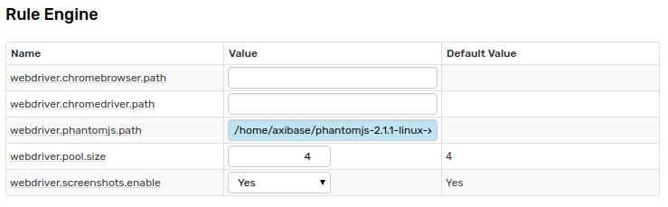
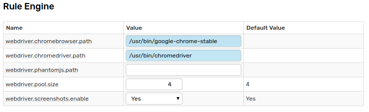
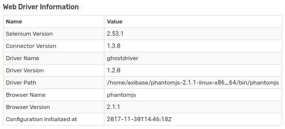

# Web Driver Installation

## Overview

The database supports two types of web drivers: [PhantomJS](http://phantomjs.org/) and [Chrome](https://sites.google.com/a/chromium.org/chromedriver/). Web driver is a programmable browser that allows emulating user actions and capturing web pages as if there are displayed to a real user.

:::warning Linux Container
If you are installing the web driver in a Linux container, log in as `root` and install `wget` prior to switching to the `axibase` user.

```elm
docker exec -it -u root atsd bash
apt-get update && apt-get install wget
su axibase
```

:::

## Option 1: PhantomJS

* Download and install PhantomJS

```sh
cd /home/axibase
```

```sh
wget https://axibase.com/public/phantomjs-2.1.1-linux-x86_64.tar.gz
```

```sh
tar xzf phantomjs-2.1.1-linux-x86_64.tar.gz
```

* Ensure that `axibase` user is allowed to execute the binary

```sh
ls -all /home/axibase | grep phantomjs-2.1.1-linux-x86_64
```

```txt
drwxr-xr-x 4 axibase axibase     4096 Jan 25  2016 phantomjs-2.1.1-linux-x86_64
```

* Set path to `/home/axibase/phantomjs-2.1.1-linux-x86_64/bin/phantomjs` in **Settings > Server Properties** `webdriver.phantomjs.path`.

    

## Option 2: Chrome Driver

* Install Chrome from Google Linux Repositories.

Ubuntu:

```sh
sudo apt-get update && sudo apt-get install wget
```

```sh
wget https://dl.google.com/linux/direct/google-chrome-stable_current_amd64.deb
```

```sh
sudo dpkg -i google-chrome-stable_current_amd64.deb
```

```sh
sudo apt-get install -f --no-install-recommends
```

RedHat, CentOS:

```sh
wget https://dl.google.com/linux/direct/google-chrome-stable_current_x86_64.rpm
```

```sh
sudo yum install ./google-chrome-stable_current_*.rpm
```

* Install `chromedriver`

Ubuntu:

```sh
sudo apt-get install unzip
```

```sh
wget https://chromedriver.storage.googleapis.com/2.33/chromedriver_linux64.zip
```

```sh
unzip chromedriver_linux64.zip
```

```sh
sudo mv chromedriver /usr/bin/chromedriver
```

RedHat, CentOS:

```sh
sudo yum install unzip
```

```sh
wget https://chromedriver.storage.googleapis.com/2.33/chromedriver_linux64.zip
```

```sh
unzip chromedriver_linux64.zip
```

```sh
sudo mv chromedriver /usr/bin/chromedriver
```

* Set path to `/usr/bin/chromedriver` and `/usr/bin/google-chrome-stable` in **Settings > Server Properties** `webdriver.chromedriver.path` and `webdriver.chromebrowser.path`.

    

## Test Web Driver

* Review web driver settings on the **Settings > System Information** page. Verify that no error is displayed.

    

* Open the **Alerts > Outgoing Webhooks** page.

* Create an outgoing webhook that supports sending screenshots such as [Telegram](telegram.md) or [Slack](slack.md). Verify that a screenshot is successfully delivered to the chat client.

* Alternatively, enable the [Mail Client](../../administration/mail-client.md).

* Create a sample rule in the Rule Engine and attach a portal on the [Email](../email.md#portals) tab. Verify that the delivered email message contains the portal screenshot.
