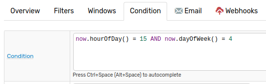
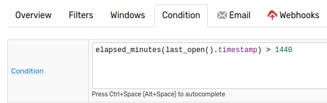
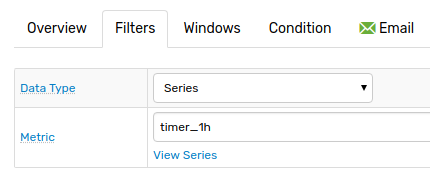

# Scheduled Rules

## Overview

ATSD Rule Engine is **event driven** thus, a condition specified by a rule is evaluated when a new command is added or an old command is removed from a window.

To evaluate a rule on a schedule instead of based on an event use `timer` metrics, which cause the rule to be triggered regularly by the database itself.

**Metric Name** | **Frequency**
---|:---
`timer_15s` | 15 seconds.
`timer_1m` | 1 minute.
`timer_15m` | 15 minutes.
`timer_1h` | 1 hour.

By reacting to a `timer` metric, a rule is evaluated at the specified frequency for example, every 15 minutes:


## Analyzing Data

To analyze data for a specific metric and not the `timer` metric itself, use [database](functions-series.md) and [lookup](functions-lookup.md) functions.

**Example**:

The condition is `true` if the average value for the given series exceeds the threshold.

```javascript
db_statistic('avg', '3 hour', 'temperature', 'sensor-01') > 50
```

**Example**:

The condition is `true` if one of the entities collecting `jmx.zookeeper.tick` metric no longer inserts data.

```javascript
getEntityCount('jmx.zookeeper.tick', 'now - 1*DAY', 'now - 1*HOUR', '') > 0
```

## Calendar Filter

To restrict the times of the day when the rule is active, evaluate the `now` field as part of the condition.

[`now`](window-fields.md#date-fields) represents current server time as a [`DateTime`](object-datetime.md) object. Use [date functions](./functions-date.md) to specify a day based on `dayOfWeek` value, which begins with `1` on Monday.

```javascript
now.hourOfDay() = 15 AND now.dayOfWeek() = 4
```



To restrict the frequency of rule alerts, use the [`last_open`](./functions-alert-history.md#last-open) function to examine the most recent `true` evaluation and control alert behavior on subsequent `true` evaluations.

Use this function to prevent message flooding for frequently evaluated rules.

```javascript
elapsed_minutes(last_open().timestamp) > 1440
```

`timestamp` is a `RuleAlert` object which represents the number of minutes since the rule last attained `OPEN` status. The `Condition` specifies that the elapsed time since the last occurrence of alert was greater than one day ago.



Alternatively, use `elapsed_time` to define `timestamp` in milliseconds.

```javascript
elapsed_time(last_open().timestamp) > 86400000
```

## Time-Based Rules

Create a `Condition` which evaluates server time and date and triggers rules on a schedule.

**Example**:

A rule which fires each morning at 9:00. Use the metric `timer_1h`, and the `Condition` defining the 24-hour time when the rule is triggered by the database.



```javascript
now.hourOfDay() == 9
```

Refer to [Integration Use Cases](https://axibase.com/use-cases/integrations/github/pr-report.html) to deploy a similarly configured rule which delivers daily reports on open Pull Requests for a collection of repositories which belong to a specified GitHub organization.

**Example**:

A rule which fires at 18:00 on the evening of the final working day of each week. This rule references a [Workday Calendar](./workday-calendar.md) to evaluate whether the following day is a working day, a weekend non-working day, or a holiday non-working day.

```javascript
now.hourOfDay = 18 AND
now.is_workday() AND NOT now.add(1, 'day').is_workday()
```

Typically, this rule is triggered by the database each Friday evening, but fires instead on Thursday when Friday is a scheduled holiday based on a built-in or custom Workday Calendar.

Use the `timer_1h` metric under **Filters**


By default the database contains predefined 2018 workday calendars for [several countries](../workday-calendar.md#built-in-calendars) but also supports the addition of [custom calendars](./workday-calendar.md#custom-calendars).

**Example**:

A rule which fires at 9:00 and 17:00 each Wednesday. Use [date functions](./functions-date.md) to specify a day based on `dayOfWeek` value, which begins with `1` on Monday.

```javascript
now.dayOfWeek == 3 && now.hourOfDay == 9 OR now.hourOfDay == 17
```

Use the `timer_1h` metric under **Filters**.

