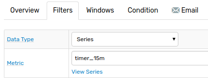

# Scheduled Rules

## Overview

As an event driven system, Rule Engine evaluates conditions when commands are **added** to or **removed** from the current window.

To check conditions on a _fixed schedule_, regardless of incoming commands, use built-in `timer` metrics which are generated by the database internally.

**Metric Name** | **Frequency**
---|:---
`timer_15s` | 15 seconds.
`timer_1m` | 1 minute.
`timer_15m` | 15 minutes.
`timer_1h` | 1 hour.

By reacting to a `timer` metric, a rule is evaluated at the specified frequency, for example, every 15 minutes.



## Analyzing Data

When using `timer` metrics, the current window contains `timer` samples instead of data to be analyzed. To analyze the data of a separate metric and not the `timer` metric itself, use [database](functions-series.md), [value](functions-value.md), and [lookup](functions-lookup.md) functions.

**Example**:

The condition evaluates to `true` if the average value for `temperature` series exceeds the threshold.

```javascript
db_statistic('avg', '1 hour', 'temperature', 'sensor-01') > 50
```

**Example**:

The condition evaluates to `true` if one of the sensors collecting `temperature` metric no longer performs data inserts.

```javascript
getEntityCount('temperature', 'now - 1*DAY', 'now - 1*HOUR', '') > 0
```

## Custom Schedule

To check the rule condition during specific times of the day, refer to the [`now`](window-fields.md#date-fields) field in the condition.

[`now`](window-fields.md#date-fields) represents current server time as a [`DateTime`](object-datetime.md) object which provides access to calendar properties such as a hour of the day or day of week.

**Daily Task Example**.

```javascript
// Runs between 15:00 and 16:00
now.hourOfDay = 15 &&
db_statistic('avg', '1 hour', 'temperature', 'sensor-01') > 50
```

The above condition is checked once a day, at `15:00`, if the metric is set to `timer_1h`.

Using metric `timer_15m`, the condition is checked four times a day: `15:00`, `15:15`, `15:30`, and `15:45`.

## Examples

### Weekly Task

The condition below is checked 1,440 times each Thursday, at `00:00`, `00:01` etc. when using metric `timer_1m`.

```javascript
// Runs on Thursdays
now.dayOfWeek = 'Thursday' &&
db_statistic('avg', '1 hour', 'temperature', 'sensor-01') > 50
```

### Holiday Calendar

The condition below is checked on days that precede a non-working day, such as weekend or observed holiday, in the United States.

```javascript
// Returns true before non-working days: weekends and observed holidays
now.is_workday('USA') &&
NOT now.add(1, 'day').is_workday('USA')
```

Typically, this rule is triggered by the database each Friday evening, but fires on Thursday instead when Friday is an observed holiday based on the observed built-in or custom [Workday Calendar](./workday-calendar.md).

By default the database contains predefined 2018 Workday Calendars for [several countries](./workday-calendar.md#built-in-calendars) but also supports the addition of [custom calendars](./workday-calendar.md#custom-calendars).

### Previous Alerts

Use the [`last_open`](./functions-alert-history.md#last_open) function to compare the time of the most recent `OPEN` or `REPEAT` status event for the current window.

```javascript
// Check if OPEN / REPEAT occured more than 1 day ago
elapsed_minutes(last_open().command_time) > 24*60
```
