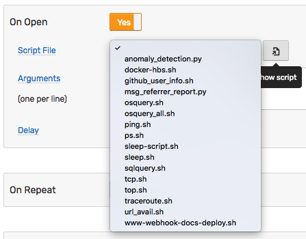
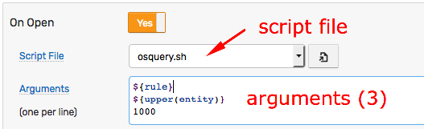
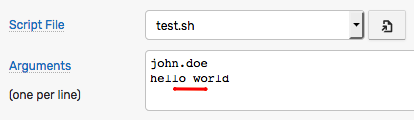
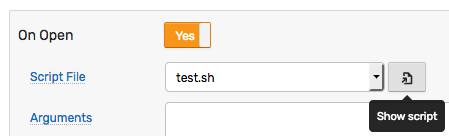
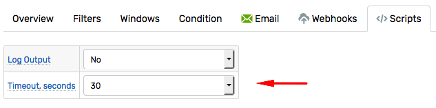
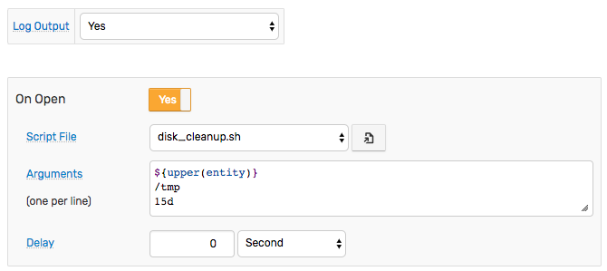
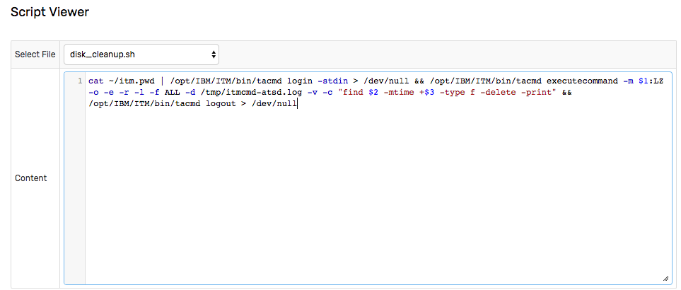

# Script

## Overview

Script actions execute pre-defined scripts on the ATSD server to complete advanced processing and integration tasks.

## Configuration

### Script File

To configure a script action, create a script file in the `/opt/atsd/atsd/conf/script` directory. Grant script `execute` permission (`u+x`) to the `axibase` user.

The list of files in the `./conf/script` directory is displayed in the **Script File** drop-down list on the **Scripts** tab.



To view the script text, click the **Show script** icon.

Select the script file to execute, for example `disk_cleanup.sh`, from the **Scripts** tab.

### Working Directory

The working directory is `/opt/atsd/atsd/conf/script`.

### Script Arguments

Specify optional arguments passed to the script, **one argument per line**.

Arguments can include [placeholders](placeholders.md) containing [window fields](window.md#window-fields) and calculated values, for example `${tags.location}`, `${upper(entity)}`, or `${avg()/100}`. If the placeholder is not found, the placeholder is replaced with an empty string.



Arguments containing space or quote characters are automatically quoted.

The below example displays two arguments, one of which contains space characters. The configuration is executed as `./test.sh john.doe "hello world"`.



### Environment Variables

As an alternative to passing arguments, access [window fields](window.md#window-fields) and user-defined [variables](variables.md) as environment variables.

* `bash` script

```bash
#!/usr/bin/env bash

# access window fields by name
ent=${entity}

# use awk to access variables that contain special characters
dsk=$(awk 'BEGIN {print ENVIRON["tags.disk"]}')

echo "entity = ${ent}"
echo "disk   = ${dsk}"
echo "-------------"
printenv | sort
```

```txt
entity = nursvgvml007
disk   = sda1
-------------
HOME=/home/axibase
JAVA_HOME=/usr/lib/jvm/java-8-openjdk-amd64/
...
alert_duration=00:00:10:49
alert_duration_interval=10m:49s
...
tags.disk=sda1
value=10.0
...
```

* Python script

```python
#!/usr/bin/env python
import os

# use os.getenv to access environment variables
ent=os.getenv("entity")
dsk=os.getenv("tags.disk")

print("entity={}".format(ent))
print("disk={}".format(dsk))

print("\n-------------")
for key, value in sorted(os.environ.items()):
    print("{}={}".format(key, value))
```

* Sample environment variables

```elm
alert_duration=00:00:00:29
alert_duration_interval=29s
alert_message=
open_time=2018-07-03T09:38:00Z[Etc/UTC]
alert_type=REPEAT
entity=atsd
entity_tags=app=ATSD;environment=dev;loc_area=NUR
command_time=2018-09-13T12:17:45Z[Etc/UTC]
condition=value >= 0
message=
metric=timer_15s
min_interval_expired=
# user-defined variable
mx=0.42857142857142855
open_value=0
properties=
update_time=2018-09-13T12:03Z[Etc/UTC]
repeat_count=2
repeat_interval=14
rule_expression=value >= 0
rule_filter=
rule_name=script-check
rule=script-check
schedule=
severity=warning
status=REPEAT
tags=host=NURSWGVML007;disk=/
tags.host=NURSWGVML007
value=0
command_first_time=2018-09-13T12:03Z[Etc/UTC]
window=length(5)
```

### Creating a Test Script

```bash
nano /opt/atsd/atsd/conf/script/test.sh
```

```bash
#!/usr/bin/env bash

out=/tmp/atsd/test.out

# print all arguments to temporary file /tmp/atsd/test.out
echo "All arguments: $@" > $out
echo "1st argument: $1" >> $out
echo "----------------" >> $out
printenv | sort >> $out
```

```bash
chmod u+x /opt/atsd/atsd/conf/script/test.sh
```

The script is now displayed on the **Scripts** tab.



## Execution

A script can run on `OPEN`, `CANCEL` and `REPEAT` status changes. To execute the script, enable the trigger and select the script file from the drop-down list or click **Same as 'On Open'** to re-use the configuration.

Only **one** script can be executed for each trigger. If you need to execute multiple scripts, create a wrapper script.

### Timeout

The script must complete within the specified timeout. The default timeout is set with the `system.commands.timeout.seconds` property on the [**Settings > Server Properties**](../administration/server-properties.md) page. The limit is **15 seconds** by default.

To customize the timeout for scripts invoked by this rule, adjust the **Timeout, seconds** drop-down list on the **Scripts** tab. The limit applies to all scripts launched by the rule: the named scripts and scripts executed with the [`scriptOut`](functions-script.md) function.



If the script fails to exit within the specified limit, the script process is stopped with `SIGTERM` signal, the process returns code `143` and the following text is appended to the output:

```txt
Script terminated on timeout: {current timeout value}
```

### Security

Only scripts in the `/opt/atsd/atsd/conf/script` are executable. Script text can be modified **only by editing the file on the file system**. Modifying scripts from within the database web interface is not supported.

Scripts are executed under the `axibase` user context.

Ensure that the `axibase` user has permissions to execute the script and that the script has the `+x` execution bit.

To disable script execution in the rule engine, set `system.commands.enabled` property to `No` on the [**Settings > Server Properties**](../administration/server-properties.md) page.

### Logging

If **Log Output** option is enabled, both `system.out` and `system.err` outputs are logged to the `atsd.log` file for each script execution.

The output is limited to 10,240 characters.

```txt
2017-11-30 13:32:26,597;INFO;Exec Default Executor;com.axibase.tsd.service.rule.ExecutionAlertEndpoint;

KUIEXC001I: Content of the response file /tmp/itmcmd-atsd.log is:
------Command-------
find /opt/atsd/atsd/backup/* -mtime +15 -type f
------Command Result-------
0
------Standard Error-------
------Standard Output-------
/opt/atsd/atsd/backup/entities_20171111233000.xml
/opt/atsd/atsd/backup/entity-groups_20171111233000.xml
/opt/atsd/atsd/backup/entity-views_20171111233000.xml

KUIEXC000I: Executecommand request was performed successfully. The return value of the command run on the remote systems is 0

2017-11-30 13:32:26,597;INFO;Exec Default Executor;com.axibase.tsd.service.rule.ExecutionAlertEndpoint;Script successful: exit code = 0, cmd: '[/opt/atsd/atsd/conf/script/disk_cleanup.sh, NURSWGVML007, /tmp, 15d]'
```

## Examples

### Clean up disk on a remote system using `tacmd`

#### Description

If disk space is low, the script reads user credentials from the `itm.pwd` file located in the `axibase` user home directory. After a successful login to the ITM hub server, [`tacmd executecommand`](https://www.ibm.com/support/knowledgecenter/en/SS3JRN_7.2.0/com.ibm.itm.doc_6.2.2fp2/tacmd.htm) is launched on the remote server where old files in `/tmp` directory (older than 15 days) are deleted with logging. Finally, the process logs out from the ITM hub server.

On `OPEN` status, the script executes the disk cleanup procedure on the system where the disk space rule alert is raised, identified with `${upper(entity)}:LZ` placeholder.

A follow-up action on `REPEAT` status, can be configured to cleanup other directories, to further reduce disk space usage.

#### Prerequisites

Tivoli Enterprise Services User Interface Extensions must be installed on the ATSD server. To install this component, launch the `install.sh` script and select the `KUE` module from the list.

```txt
... installing "Tivoli Enterprise Services User Interface Extensions  V06.30.06.00 for Linux x86_64 R2.6, R3.0 (64 bit)"; please wait.
=> installed "Tivoli Enterprise Services User Interface Extensions  V06.30.06.00 for Linux x86_64 R2.6, R3.0 (64 bit)".
... Initializing component Tivoli Enterprise Services User Interface Extensions  V06.30.06.00 for Linux x86_64 R2.6, R3.0 (64 bit).
... Tivoli Enterprise Services User Interface Extensions  V06.30.06.00 for Linux x86_64 R2.6, R3.0 (64 bit) initialized.
```

Modify the Hub TEMS configuration file `/opt/IBM/ITM/config/ms.config` and set the following parameter.

```elm
KT1_TEMS_SECURE='YES'
```

`TEMS` restart is required to activate this setting.

#### Configuration
  
* Create the `disk_cleanup.sh` file in `/opt/atsd/atsd/conf/script` directory.

```bash
cat ~/itm.pwd | /opt/IBM/ITM/bin/tacmd login -stdin > /dev/null && \
/opt/IBM/ITM/bin/tacmd executecommand -m $1:LZ -o -e -r -l -f ALL -d /tmp/itmcmd-atsd.log -v -c "find $2 -mtime +$3 -type f -delete -print" && \
/opt/IBM/ITM/bin/tacmd logout > /dev/null
```

* Make the script executable.

```bash
sudo chmod +x /opt/atsd/atsd/conf/script/disk_cleanup.sh
```

* The script is now displayed in the **Script File** drop-down list, and the content is visible on the **Show Script** page.





#### Arguments

```bash
${upper(entity)}
/tmp
15d
```

#### Output Log

```txt
2017-11-30 14:23:28,647;INFO;Exec Default Executor;com.axibase.tsd.service.rule.ExecutionAlertEndpoint;

KUIEXC001I: Content of the response file /tmp/itmcmd-atsd.log is:
------Command-------
find /tmp -mtime +15 -type f -delete -print
------Command Result-------
0
------Standard Error-------
------Standard Output-------
/tmp/hsperfdata_root/7640

KUIEXC000I: Executecommand request was performed successfully. The return value of the command run on the remote systems is 0

2017-11-30 14:23:28,647;INFO;Exec Default Executor;com.axibase.tsd.service.rule.ExecutionAlertEndpoint;Script successful: exit code = 0, cmd: '[/opt/atsd/atsd/conf/script/disk_cleanup.sh, NURSWGVML007, /tmp, 15d]'
```