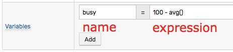
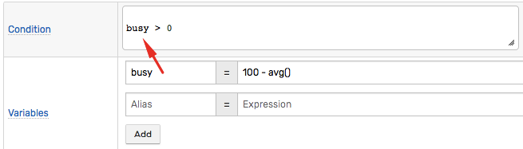
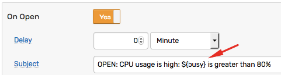
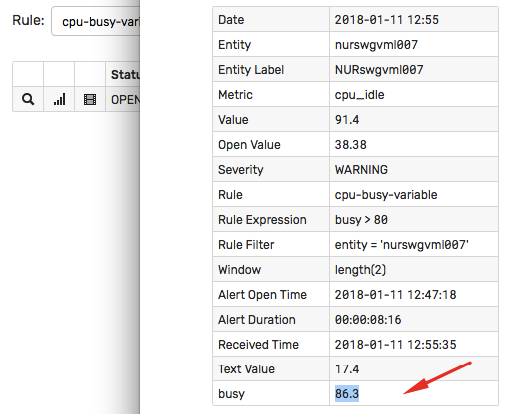

# Variables

## Overview

Variables are custom fields defined by the rule author on the **Condition** tab. Each variable consists of a unique name and an expression.



## Usage

### Condition

The user-defined variables can be referenced in the rule [condition](condition.md).



### Response Actions

Similar to the built-in window [fields](window.md#window-fields), variables can be included by name in the notifications messages, scripts, and logging messages using [placeholders](placeholders.md):

```bash
${busy}
```



### Filter

Variables **cannot** be included in a [filter](filters.md) expression because filters are evaluated prior to the command being added to a window.

## Data Types

### double

```javascript
pival = 3.14
```

### integer

```javascript
kb = 1024
```

### long

```javascript
curtime = 1515758392702
```

<!-- markdownlint-enable MD032 -->
:::tip Big Integers
Define large integers as Long (64-bit integer) or floating numbers to avoid 32-bit integer overflow. The range of values that a 32-bit integer can hold is limited to `[-2147483647, 2147483648]`.
:::
<!-- markdownlint-disable MD032 -->


### string

Use single or double **quotes** when declaring a string variable.

```javascript
state = 'CA'
```

Inner quotes can be escaped with backslash.

```javascript
sqlQuery = 'SELECT value AS used_mb FROM "fs.rw" WHERE entity = \'' + entity + '\''
```

```javascript
sqlQuery = "SELECT value AS used_mb FROM \"fs.rw\" WHERE entity = '" + entity + "'"
```

### collection

```javascript
errorCodes = [401, 403, 404]
```

A collection can include elements of different types.

Both single and double quotes can be used to specify elements of string type.

```javascript
stateList = ['CA', 'WA']
```

```javascript
stateList = ["CA", "WA"]
```

To check the size of the collection, use the `.size()` method.

To access the n-th element in the collection, use square brackets `[index]` or the `get(index)` method (starting with `0` for the first element).

```javascript
// define variable 'authors'
authors = split(tags.authors, ',')
// define variable 'author'
author  = authors.size() == 0 ? 'n/a' : authors[0]
```

### map

```javascript
stateMap = ['CA': 0.8, 'WA': 0.2]
```

```javascript
countryMap = ['USA': 'North America', 'Brazil': 'South America']
```

Use single quotes to enclose keys and values.

### function

```javascript
last_msg = db_message_last('1 week', 'alert', 'rule-engine')
```

```javascript
since_start = formatIntervalShort(elapsedTime(property('dkr.state::started')))
```

```javascript
server = upper(keepBefore(entity, ':'))
```

### expression

```javascript
annotation = tags.note == null ? 'N/A' : tags.note
```

## Cross-Reference

The variables can refer to other variables declared in the same rule.


Variables can be included in a condition.


## Execution

Depending on the sequence of boolean checks in the condition which refers to a variable, such variable can be evaluated for **each** command.

If such variable invokes an external function such as [`scriptOut`](functions-script.md), such function must execute quickly, within a few seconds. Avoid calling long-running functions in variables.

The current value of a variable can be accessed on the **Window Details** page.



