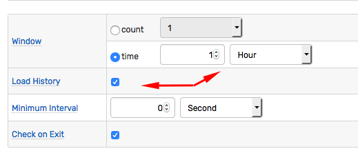

# Window

## Overview

A window is an in-memory structure created by the rule engine for each unique combination of metric, entity, and grouping tags extracted from incoming commands.

Windows are displayed on the **Alerts > Rule Windows** page.

## Count-based Windows

Count-based windows accumulate up to the specified number of time-value samples. Samples are sorted **by command timestamp**, with the most recent sample placed at the end of the array. When the window becomes full, the first sample (**oldest** by command time) is removed from the window to free up space for an incoming sample.

Example: Count-based window with 3 samples

Once the window reaches the limit of 3 samples, its size remains constant.

## Time-based Windows

Time-based windows store all samples received within the specified time interval and are referred to as **sliding** windows. There is no limit to the number of samples stored in such windows.

Old commands are automatically removed from the window once their timestamp is earlier than the window start time.

Example: 5-second window with variable sample count.

The number of samples is not limited and varies over time from one to four. Such windows can become empty if no commands arrive within a certain period of time.

<!-- markdownlint-enable MD032 -->
:::tip End Time
The **start time** of the window is initially set to **current time** minus the interval duration, and is constantly incremented as time passes. If the timestamp of the incoming command is equal to or greater than the window start time, the command is added to the window. Otherwise, the command is ignored.

The **end time** in time-based windows is not bound. As such, the window accepts commands with future timestamps unless they are discarded with the [Time filter](filters.md#time-offset-filter) or [filter expression](filters.md#filter-expression) such as `timestamp <= now.getMillis() + 60000`.
:::
<!-- markdownlint-disable MD031 MD032 -->

## Window Status

Response actions are triggered on window status changes.

As new data is received and old data is removed from the window, the rule engine re-evaluates the condition which can cause the status of the current window to change, triggering response actions.

### Initial Status

New windows are created based on incoming data, no historical data is loaded from the database unless the **Load History** setting is turned on.

The window for the given [grouping](grouping.md) key is created when the first matching command is received by the rule engine.

New windows are assigned initial status of `CANCEL` which is then updated based on the results of a boolean condition, either `true` or `false`.

### Triggers

Response actions can be triggered whenever window status changes as well as at scheduled intervals when the status is `REPEAT`. Triggers for each action type are configured and executed separately.

### Status Events

| Previous Status | New Status | Previous Condition Value | New Condition Value | Trigger Name |
| --- | --- | --- | --- | --- |
| `CANCEL` | `OPEN` | `false` | `true` | `On Open` |
| `OPEN`  | `REPEAT` | `true` | `true` | `On Repeat` |
| `REPEAT` | `REPEAT` | `true` | `true` | `On Repeat` |
| `OPEN` | `CANCEL` | `true` | `false` | `On Cancel` |
| `REPEAT` | `CANCEL` | `true` | `false` | `On Cancel` |
| `CANCEL` | `CANCEL` | `false` | `false` | Not available |

### `OPEN` Status

The window is assigned `OPEN` status when the condition value changes from `false` to `true`.

### `REPEAT` Status

The window is assigned `REPEAT` status when the condition value remains `true` upon subsequent evaluation. `REPEAT` status requires at least two `true` consecutive evaluations.

When the window is in `REPEAT` status, response actions can be executed with the frequency specified in the rule editor, for example, every ten evaluations or every five minutes.

### `CANCEL` Status

`CANCEL` is the initial status assigned to new windows. The `CANCEL` status is also assigned to the window when the condition changes from `true` to `false` or when the window is destroyed on rule modification.

Windows in `CANCEL` status do not trigger `repeat` actions upon subsequent `false` evaluations. Emulate this behavior by creating a rule with a negated expression which returns `true` instead of `false` for the same condition.

A window assumes the `CANCEL` status when the condition changes from `true` to `false` as well as when the rule is modified, deleted, or the database is orderly shutdown. `On Cancel` triggers are not invoked, even if enabled, when the rule is modified, deleted, or in case of shutdown.  This behavior is controlled with `cancel.on.rule.change` server property.

## Life Cycle

When a rule is deleted or modified with the rule editor, all windows for the given rule are dropped. Windows are re-created when new matching commands are received by the database.

Newly created windows contain only **new commands**, unless **Load History** setting is enabled. Such windows load historical values received over the same interval as the window duration, or the same number of commands as the window length.

## Timers

The condition is re-evaluated each time a new matching command is added to or removed from the window.

To evaluate the rule on schedule, regardless of external commands, create rules based on `timer` metrics:

* `timer_15s`: Command is received every 15 seconds.
* `timer_1m`: Command is received every 1 minute.
* `timer_15m`: Command is received every 15 minutes.
* `timer_1h`: Command is received every 1 hour.

[`timer`](scheduled-rules.md) metrics are produced by the built-in database scheduler and are always available.

## Window Fields

Windows expose a set of continuously updated [window fields](window-fields.md) which can be included in the [condition](condition.md) expression, the [filter](filters.md) expression and user-defined [variables](variables.md).

## Window Diagrams

### Count-based Window Diagram

### Time-based Window Diagram

