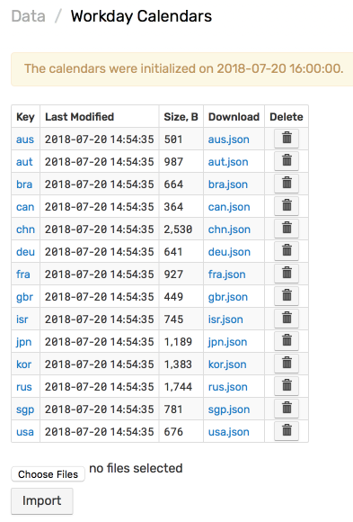

# Workday Calendar

## Overview

Workday Calendar contains a list of dates which are exceptions to the regular workday calendar such as observed holidays and weekend working days.

The list can be associated with a country, a region, a specific organization, such as a stock exchange or a school district.

Each calendar is assigned a unique key which can be accessed in the rule engine or via SQL queries to check if the given day is a working day based on the actual observed calendar.

## Usage

### Rule Engine

* [`is_workday`](object-datetime.md#is_workday-function) function
* [`is_weekday`](object-datetime.md#is_weekday-function) function
* [`is_weekend`](object-datetime.md#is_weekend-function) function
* [`DateTime`](object-datetime.md#fields) fields: `next_workday`, `previous_workday`, `next_non_working_day`, and `previous_non_working_day`.

```javascript
now.is_workday()
```

```javascript
!tomorrow.is_workday('kor')
```

> The function raises an error if no dates are found in the specified calendar for the given year. Update the calendar by adding dates to resolve this problem.

### SQL Queries

* [`IS_WORKDAY`](../sql/README.md#is_workday) SQL function

```sql
SELECT date_format(time, 'yyyy-MM-dd'), SUM(value)
  FROM visitor_count
WHERE time >= current_year
  AND date_format(time, 'u') < 6 AND NOT IS_WORKDAY(time)
```

* [`IS_WEEKDAY`](../sql/README.md#is_weekday) SQL function

## Built-in Calendars

By default, the database contains pre-defined 2018 workday calendars for several countries.

Calendars can be modified and maintained by appending dates for prior and future years without database restart.

 **Country** | **Calendar Key** | **Download**
----|----|----
Australia | `aus` | [download](https://raw.githubusercontent.com/axibase/atsd/master/rule-engine/resources/calendars/aus.json)
Austria| `aut` | [download](https://raw.githubusercontent.com/axibase/atsd/master/rule-engine/resources/calendars/aut.json)
Brazil | `bra` | [download](https://raw.githubusercontent.com/axibase/atsd/master/rule-engine/resources/calendars/bra.json)
Canada | `can` | [download](https://raw.githubusercontent.com/axibase/atsd/master/rule-engine/resources/calendars/can.json)
China | `chn` | [download](https://raw.githubusercontent.com/axibase/atsd/master/rule-engine/resources/calendars/chn.json)
Germany | `deu` | [download](https://raw.githubusercontent.com/axibase/atsd/master/rule-engine/resources/calendars/deu.json)
France | `fra` | [download](https://raw.githubusercontent.com/axibase/atsd/master/rule-engine/resources/calendars/fra.json)
Great Britain | `gbr` | [download](https://raw.githubusercontent.com/axibase/atsd/master/rule-engine/resources/calendars/gbr.json)
Israel | `isr` | [download](https://raw.githubusercontent.com/axibase/atsd/master/rule-engine/resources/calendars/isr.json)
Japan | `jpn` | [download](https://raw.githubusercontent.com/axibase/atsd/master/rule-engine/resources/calendars/jpn.json)
Korea | `kor` | [download](https://raw.githubusercontent.com/axibase/atsd/master/rule-engine/resources/calendars/kor.json)
Russia | `rus` | [download](https://raw.githubusercontent.com/axibase/atsd/master/rule-engine/resources/calendars/rus.json)
Singapore | `sgp` | [download](https://raw.githubusercontent.com/axibase/atsd/master/rule-engine/resources/calendars/sgp.json)
USA | `usa` | [download](https://raw.githubusercontent.com/axibase/atsd/master/rule-engine/resources/calendars/usa.json)

## Custom Calendars

### Schema

Define new calendars in JSON format according to [Workday Calendar Schema](workday-calendar-schema.md).

```json
{
  "country": "USA",
  "data": [
    { "date": "2019-01-01", "type": "Holiday" },
    { "date": "2019-01-05", "type": "Workday" },
    ...
  ]
}
```

Country name is specified as the [ISO-3166 alpha-3](https://en.wikipedia.org/wiki/ISO_3166-1_alpha-3) country code.

Each exception in the list is classified as either a `Holiday` or `Workday`:

* A `Holiday` is assigned when the regular working day becomes a non-working day based on observance.
* A regular weekend day which is changed to a working day due to calendar optimizations is classified as a `Workday`.

Once loaded into the database, a calendar is accessible via the calendar key which is based on the file name excluding `.json` extension.

The calendar file can include days for any number of years.

### Importing Calendar

Navigate to **Data Entry > Workday Calendars**. Attach a JSON file and click **Import**.



Uploaded files are copied to `/opt/atsd/atsd/conf/calendars` and changes apply instantly. Database restart is not required.

### Example

The example below illustrates a custom workday calendar for the [New York Stock Exchange](https://www.nyse.com/markets/hours-calendars).

The calendar is named `nyse.json` and can be accessed under the `nyse` key, for example `now.is_workday('nyse')`.

```json
{
  "country": "USA",
  "data": [
    { "date": "2018-01-01", "type": "Holiday", "description": "New Years Day" },
    { "date": "2018-01-15", "type": "Holiday", "description": "Martin Luther King, Jr. Day" },
    { "date": "2018-02-19", "type": "Holiday", "description": "Washington's Birthday" },
    { "date": "2018-03-30", "type": "Holiday", "description": "Good Friday" },
    { "date": "2018-05-28", "type": "Holiday", "description": "Memorial Day" },
    { "date": "2018-07-04", "type": "Holiday", "description": "Independence Day" },
    { "date": "2018-09-03", "type": "Holiday", "description": "Labor Day" },
    { "date": "2018-11-22", "type": "Holiday", "description": "Thanksgiving Day" },
    { "date": "2018-12-25", "type": "Holiday", "description": "Christmas" }
  ]
}
```