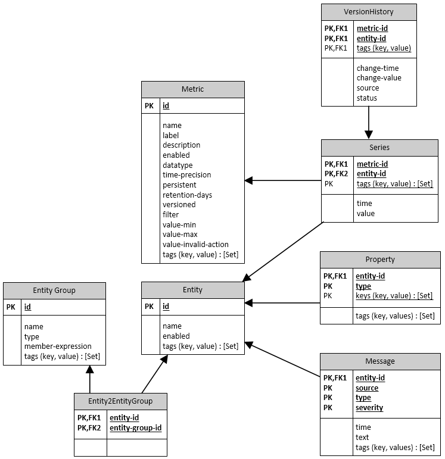

# Schema

The table schema supports the following record types:

* Series
* Messages
* Properties

Records are always associated with an `entity`: a generic class, which represents a physical or logical object being monitored such as `Br1740` (a bioreactor), or `eia.gov` (an institution).



## Series

Time Series is a time-indexed array of measurements, each described by a timestamp and numeric value or text annotation.

```elm
date         time       value   annotation
2018-05-20   00:15:00   17.4
2018-05-20   00:20:00   18.0
2018-05-20   00:15:00    0.0    invalid reading
2018-05-20   00:20:00   17.6
```

Each series is uniquely identified by a composite key consisting of `metric`, `entity`, and optional key-value pairs called `tags`.

* `Metric` represents the name of a measurable numeric attribute such as `temperature`.
* `Entity` is the name of a physical or logical object being monitored.
* `Tags` are metadata and provide an additional level of detail about the observation, for example `part = Enclosure`.

The above sample series can be identified as follows:

```elm
metric: Temperature
entity: Br1740
tags:   part=Enclosure
```

Series values change over time and their history can be analyzed with SQL and visualized with graphs.

[](https://apps.axibase.com/chartlab/075941a0/2/)

The [Selecting Series Overview](./portals/selecting-series.md) contains additional examples on how to retrieve series from the database for visualization purposes.

## Messages

Messages are timestamped text events also referred to as logs.

```elm
date         time       type   source    message
2018-05-20   00:00:00   etl    cp-data   backup job started
2018-05-20   00:42:00   etl    cp-data   backup job completed
```

[](https://apps.axibase.com/chartlab/007721aa)

## Properties

`Property` is a collection of arbitrary key-value pairs describing a given entity, grouped by user-defined `type`. The property record is uniquely identified by type, entity, and optional keys. Unlike series, the property record stores only the most recent values. The values are stored as text.

For example, `disk_info` type for an entity can store properties such as `disk_type`, `disk_model` etc.  The property schema is similar to the following relational representation:

```sql
CREATE TABLE disk_info (
  entity VARCHAR(64),
  TIME TIMESTAMP,
  disk_name VARCHAR(64),
  disk_type VARCHAR(64),
  disk_status VARCHAR(64),
  disk_model VARCHAR(64),
  disk_size VARCHAR(64),
  PRIMARY KEY (entity, disk_name)
);
```

[](https://apps.axibase.com/chartlab/6d918310/2)

## Resources

* [Getting Started](./tutorials/getting-started.md) tutorial