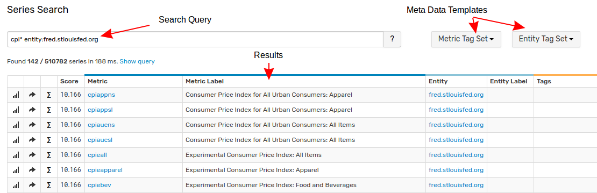

# Search

## Overview

The search interface finds series by matching keywords against series fields.



## Syntax

Queries consists of search terms and boolean operators. There are two types of search terms: keywords and phrases.

A **keyword** term is a single word such as `location` or `nur`.

A **phrase** is a group of words surrounded by double quotes such as `"location nur"`.

Multiple terms can be combined together using boolean operators to form a more complex query.

A keyword can be prefixed with a field name to narrow the scope of the search to a particular series property, for example `entity:nurswgvml007`.

If no field is specified, the search queries all fields.

### Fields

| **Field** | **Description** | **Example** |
|---|---|---|
| `entity` | Entity name. | `entity:nurswgvml007` |
| `entity.label` | Entity label. | `entity.label:nur*007` |
| `metric` | Metric name. | `metric:mpstat.cpu_busy` |
| `metric.label` | Metric label. | `metric.label:"cpu busy"` |
| `date` | Last insert date `yyyy-MM-dd`. | `date:2017-06-25` |
| `{tag.name}` | Series/metric/entity tag name. | `location:nur` |
| `contents` | All fields. | `nurswgvml007` or `contents:nurswgvml007` |

### Operators

To combine multiple terms, use boolean operators `AND`, `OR`, and `NOT`. Operators must be specified with uppercase letters.

```ls
entity:nurswgvml007* AND mount_point:\/opt
```

The default operator used to combine multiple keywords is `OR`. The following expressions are equivalent:

```ls
location OR nur
location nur
```

| **Operator** | **Description** | **Example** |
|---|---|---|
| `AND` | Both conditions must be satisfied. | `location AND nur` |
| `OR` | One of the conditions must be satisfied. | `location OR nur` |
| `NOT` | The condition must not be satisfied. | `location NOT nur` |

> An expression cannot begin with the `NOT` operator.

### Wildcards

Keywords support both single and multiple character wildcards.

* "*" symbol matches multiple characters.

```ls
he*
```

* "?" symbol matches one character.

```ls
h?llo
```

> Wildcards can be used at the end or in the middle of a keyword.

### Reserved Characters

The following characters are reserved: `+ - && || ! ( ) { } [ ] ^ " ~ * ? : \ /`.

To escape reserved characters use double quotes or a backslash:

```ls
mount_point:"/opt"
```

```ls
mount_point:\/opt
```

### Case Sensitivity

Search is **case-insensitive**.

## Synonyms

[Synonym search](synonyms.md) is supported by adding keyword mappings to the `conf/synonym.conf` file.

## Examples

```ls
/* Search for 'nurswgvml007' entity */
entity:nurswgvml007

/* Search for entities starting with 'nurswgvml' */
entity:nurswgvml*

/* Search for entities starting with 'nur' and ending with '007' */
entity:nur*007

/* Search for 'mpstat.cpu_busy' metric */
metric:mpstat.cpu_busy

/* Search for metrics starting with 'mpstat.cpu' */
metric:mpstat.cpu*

/* Search for metrics starting with 'mpstat.' and containing 'cpu' */
metric:mpstat.*cpu*

/* Search for any field name or value containing the keyword 'location' */
location

/* Search for any field name or value starting with 'location' */
location*

/* Search for any field name or value containing keywords 'location' or 'Baltimore' */
location baltimore

/* Search for any field name or value containing both keywords 'location' and 'baltimore' */
location AND baltimore

/* Search for series with series tag, metric tag or entity tag named 'location' containing the keyword 'baltimore' */
location:baltimore

/* Search for series with series tag, metric tag or entity tag named 'location' starting with 'balt' */
location:balt*

/* Search for series with last insert date of June 15, 2017  */
date:2017-06-15

/* Search for series with last insert date in June, 2017  */
date:2017-06-*
```

### Scheduling

The search index is continuously refreshed on schedule and as such does not reflect the latest changes such as a new series or modifications to an existing series that have occurred since the most recent refresh.

The interval between the incremental refreshes can be controlled with the `search.indexing.incremental.interval` setting. Each refresh operation takes up to ten seconds.

The frequency of rebuild tasks can be controlled with the `search.indexing.full.schedule` setting. The full rebuild takes up to ten minutes.

Administrators can refresh the index manually on the **Settings > Diagnostics > Search Index** page.

### Monitoring

The database collects the following measurements to facilitate monitoring of background index tasks:

* Metrics

```ls
series e:atsd t:host={hostname} m:index.build_time={time in millis} type=incremental OR full
series e:atsd t:host={hostname} m:index.directory_size={disk size in megabytes}
series e:atsd t:host={hostname} m:index.series_count={number of series}
```

* Control Messages

```ls
message e:atsd t:host={hostname} t:type=search t:source={scheduled | manual} t:task=re-index t:scope={full | incremental} m:"Starting search re-indexing."
message e:atsd t:host={hostname} t:type=search t:source={scheduled | manual} t:task=re-index t:scope={full | incremental} m:"Completed search re-indexing in {time in millis} ms."
```
