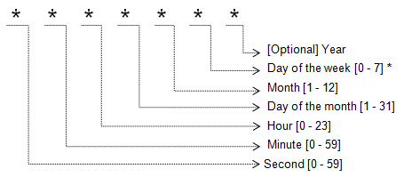

# Scheduling

Forecasts, SQL queries, data export jobs, and administrative tasks can be run on schedule according to a `cron` expression. The schedules are listed on the **Settings > Server Properties** page.

## Syntax

Fields in a `cron` expression have the following order:

* seconds
* minutes
* hours
* day-of-month
* month
* day-of-week

For example, `0 0 8 * * ?` means that the task is executed at `08:00:00` every day.

```txt
seconds minutes hours day-of-month month day-of-week
   0       0      8        *         *        ?
```

Either `0` or `7` can be used for Sunday in the `day-of-week` field.



Field Control Symbols:

| **Name** | **Description** |
|---|---|
| * | Any value |
| ? | No specific value |
| R | Random value within allowed value range |
| , | Value list separator |
| - | Range of values |
| / | Step values |

For example, `0 0 8 * * ?` executes at `08:00:00` every day.

Field Constraints:

| **Name** | **Allowed Values** |
|:---|:---|
| `second` | `0-59`, `R` |
| `minute` | `0-59`, `R` |
| `hour` | `0-23`, `R` |
| `day-of-month` | `1-31`, `?` |
| `month` | `1-12` or `JAN-DEC` |
| `day-of-week` | `1-7` or `MON-SUN`, `?`  |

* If a value is set in `day-of-week`, `day-of-month` must be set to `?`. For example `0 0 6 ? * MON`.
* If a value is set in `day-of-month`, `day-of-week` must be set to `?`. For example `0 0 6 */2 * ?`.

Second, minute, and hour fields support **R** (random) symbol to randomize execution time.

## Time Zone

The `cron` expression is evaluated based on the time zone of the server where the database is running.

The time zone is displayed on the **Settings > System Information** page.

## Examples

| **Expression** | **Second** | **Minute** | **Hour** | **Day of Month** | **Month** | **Day of Week** | **Description** |
|:---|---:|---:|---:|---:|---:|---:|:---|
| `0 0/15 * * * ?` | `0` | `0/15` | `*` | `*` | `*` | `?` | Every 15 minutes. |
| `0 5 4 * * ?`    | `0` | `5` | `4` | `*` | `*` | `?` | At 04:05 every day. |
| `0/10 * * * * ?` | `0/10` | `*` | `*` | `*` | `*` | `?` | Every ten seconds. |
| `0 0/1 * * * ?`  | `0` | `0/1` | `*` | `*` | `*` | `?` | Every minute. |
| `0 0 0 * * ?`    | `0` | `0` | `0` | `*` | `*` | `?` | Every day at 00:00. |
| `R 0/5 * * * ?`  | `R` | `0/5` | `*` | `*` | `*` | `?` | Every five minutes at a random second. |
| `R R 2 * * ?`    | `R` | `R` | `1` | `*` | `*` | `?` | At a random minute and second past the second hour. |
| `0 5,35 * * * ?` | `0` | `5,35` | `*` | `*` | `*` | `?` | Every hour at the fifth and thirty-fifth minute. |
| `0 0 6 ? * MON`  | `0` | `0` | `6` | `?` | `*` | `MON` | Every Monday at 06:00. |
| `0 5 0 * 8 ?`    | `0` | `5` | `0` | `*` | `8` | `?` | At 00:05 every day in August. |
| `30 15 14 1 * ?` | `30`| `15`| `14`| `1` | `*` | `?` | At 14:15:30 on the first of every month. |
| `0 0 22 ? * 1-5` | `0` | `0` | `22`| `?` | `*` | `1-5` | At 22:00 on Mon, Tue, Wed, Thu and Fri. |
| `0 5 0-10/2 * * ?` | `0` | `5` | `0-10/2` | `*` | `*` | `?` | At every ninth minute past the zero, second, fourth, sixth, eighth, and 10th hour. |
| `0 0 0,12 1 */2 ?` | `0` | `0` | `0,12`| `1` | `*/2` | `?` | At 00:00 and 12:00 on the first in <br/>January, March, May, July, September and November. |