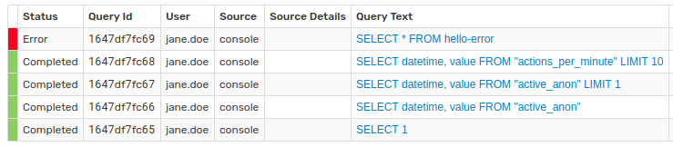

# Query Statistics

The **Query Statistics** page displays the most recent **1,000** queries in memory submitted to the database.

The queries shown on the **Query Statistics** page are reset each time the database is restarted.

Query statistics are persisted by the database across restarts and accessible on the **Messages** pages.

Use the filtering fields to display `sql` type messages. Optionally define other query features.

## Filters

The page contains several drop-down lists to filter queries.

### Status

Filter queries for the execution status:

* `New`: Submitted queries waiting to be executed.
* `Running`: The query is executing.
* `Completed`: The query is finished.
* `Error`: The query is unable to complete because of a problem.
* `Cancelled`: The query is stopped by the client.

### Source

Filter queries by the origin of the query.

* `api`: Queries received by the [`/api/sql`](api.md) endpoint.
* `console`: Queries executed from the [**SQL Console**](./sql-console.md).
* `scheduled`: [Scheduled](./scheduled-sql.md) queries executed by the database.
* `rule-engine`: Queries executed by the [`executeSqlQuery()`](../rule-engine/functions-sql.md#executesqlquery) function in the rule engine.

### Elapsed Time

Filter queries based on the execution time, measured in seconds from the time received by the database.

* `>` : Greater than.
* `<=` : Less than or equal to.

### Query

Display queries if the SQL statement contains the specified substring. The filter accepts single or multi-line text.

All queries which include the expression `FROM "actual_upload"` are included in the statistics.

To exclude queries, preface the substring with the negation operator (`!`).

This set of queries contains all those with `Completed` status, regardless of **Source**. Exclude those queries which contain certain [syntax](./README.md#syntax) with `!` negation.

All queries which contain `FROM a028.m` are excluded.

General expressions can be used as well. For example, exclude all queries which contain the `LOOKUP` function.

Exclude all queries which contain a `LIMIT` statement.

### Source Details

Supported if **Source** is `scheduled` or `rule-engine`:

* For `scheduled` queries, filter by [Scheduled SQL](./scheduled-sql.md) job name.
* For `rule-engine` queries, filter by rule name.

The above set of queries are all `scheduled` with status `Completed`. Each of the queries contains information in the `Source Details` column about the rule which triggered the query. Filter statistics by a specific rule.

Unwanted rules can be excluded using `!` negation syntax.

Exclude all `ALERT` queries.

### User Name

Filter query statistics based on the user who performed the query.

Search query statistics for all queries performed by `jane.doe`.

Queries performed by users other than `jane.doe` are filtered from query statistics.

Exclude queries by a particular user with the negation operator (`!`).

User `john.doe` is removed from search results.

