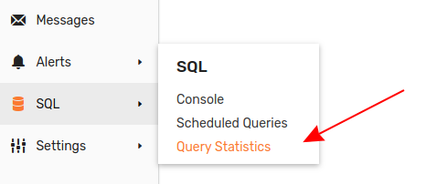

# Query Statistics

The **Query Statistics** page is located at **SQL > Query Statistics**.

This page tracks the most recent 1,000 queries submitted to the database. The list of queries is reset and refreshed each time the database stops.

The **Query Statistics** page contains several drop-down lists to filter query statistics.

* **Status**: The type of query.
  * `New`: Submitted queries which have not yet executed.
  * `Running`: The query is executing.
  * `Completed`: The query is finished.
  * `Error`: The query is unable to complete because of a problem.
  * `Cancelled`: A user stopped the query.

* **Source**: The point of origin for the query.
  * `api`: Queries executed from an integrated [API Client](../api/clients/README.md).
  * `console`: Queries executed from the [**SQL Console**](./sql-console.md)
  * `scheduled`: Queries executed by the database on a [schedule](./scheduled-sql.md).
  * `rule-engine`: Queries executed according to a rule containing the [`executeSqlQuery()`](../rule-engine/functions-sql.md#executesqlquery) function.

* **Elapsed Time**: Execution time comparison.
  * `>` : Greater than.
  * `<=` : Less than or equal to.
  * `sec`: Comparison time in seconds.

> The following fields support `!` negation syntax to exclude unwanted data. See [Examples](#examples).

* **Query**: Filter queries based on their contents. **Query** fields accepts single or multi-line queries.

* **Source Details**: `scheduled` and `rule-engine` queries are assigned source details, such as the rule with which the query is associated.

* **User Name**: Filter queries based on the user who performed them.

## Exclusion Examples

### Exclude Based on `Source Details`

The above set of queries are all `scheduled` with status `Completed`. Each of the queries contains information in the `Source Details` column about the rule which triggered the query. Unwanted rules may be excluded using `!` negation syntax.

Exclude all `ALERT` queries.

### Exclude Based on `User Name`

The above set of queries are all `Completed` from the `console` by different users. Exclude certain users with `!` negation syntax

Exclude user `sergei.rodionov` from search results.

### Exclude Based on `Query` Contents

This set of queries contains all those with `Completed` status, regardless of **Source**. Exclude those queries which contain certain [syntax](./README#syntax) with `!` negation.

All queries with contain `FROM` metric `a028.m` are excluded.

General expressions can be used as well. For example, exclude all queries which contain the `LOOKUP` function.

Exclude all queries which contain a `LIMIT` statement.

