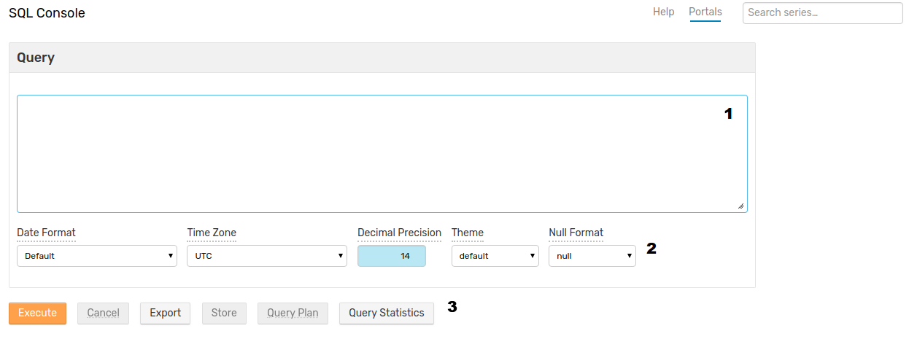
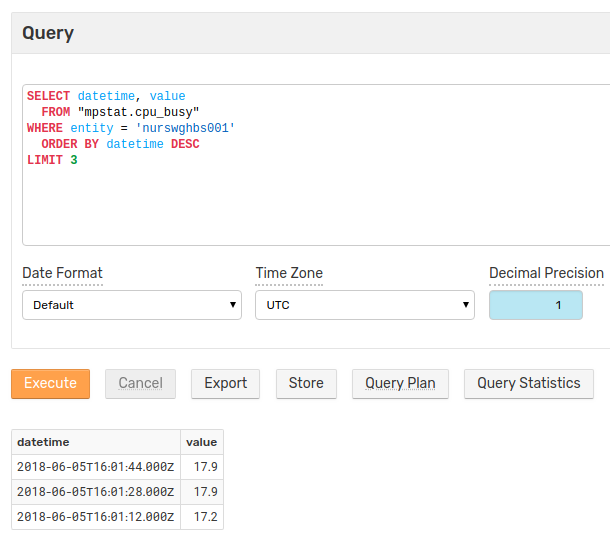
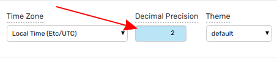
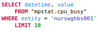
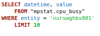
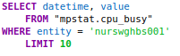
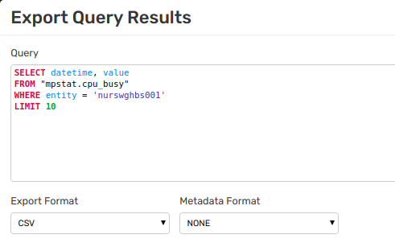
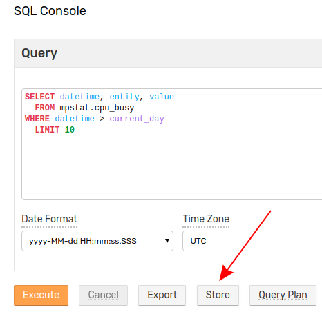
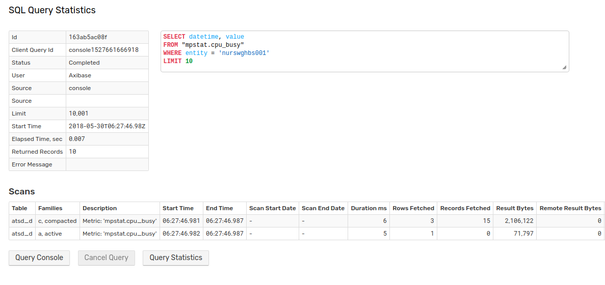

# SQL Console

## Overview

**SQL Console** is a web-based interface to submit [SQL queries](../sql/README.md) to the database and display the results. The results can be exported into CSV, JSON, and Excel files or [reinserted](#store)as a derived series in ad-hoc and continuous modes.

Open the console by clicking **Console** in the main **SQL** menu.

**SQL Console** has three components:

1. **Query** Window
2. [Format Settings](#format-settings)
3. [Action Controls](#action-controls)



Enter [`SELECT`](README.md#select-expression) queries in the **Query** window and view the results below.



## Format Settings

Format Settings apply custom formatting to dates, numbers, and [`NULL`](README.md#null) values. Changes apply instantly to the currently displayed records **without** re-submitting a query.

### Date Format / Time Zone

Use **Date Format** setting to modify the `datetime` column without applying the [`date_format`](examples/datetime-format.md) function in the `SELECT` expression.

Use **Time Zone** drop-down list to display dates in UTC or database [time zone](../administration/timezone.md).

The table below provides examples of how `2018-05-15 16:30 (UTC)` is displayed by **SQL Console** when the database is configured to Eastern Standard Time (EST):

**Date Format** | **Time zone: UTC** | **Time zone: Local**
---|---|---
`Default` | `2018-05-15T16:30:00.000Z` | `2018-05-15T12:30:00.000Z`
`yyyy-MM-ddT HH:mm:ss.SSSZ` | `2018-05-15T16:30:00.000Z` | `2018-05-15T12:30:00.000Z`
`yyyy-MM-ddT HH:mm:ssZ` | `2018-05-15T16:30:00Z` | `2018-05-15T12:30:00Z`
`yyyy-MM-ddT HH:mm:ss.SSS` | `2018-05-15 16:30:00.000` | `2018-05-15 12:30:00.000`
`yyyy-MM-ddT HH:mm:ss` | `2018-05-15 16:30:00` | `2018-05-15 12:30:00`
`yyyy-MM-dd` | `2018-05-15` | `2018-05-15`
`MMM-dd` | `May-15` | `May-15`
`MMM-dd, E` | `May-15, Tue` | `May-15, Tue`
`MMM-dd, EEEE` | `May-15, Tuesday` | `May-15, Tuesday`

> The database time zone can be [modified](../administration/timezone.md) by an administrator.

### Decimal Precision

The **Decimal Precision** setting rounds numeric values to the specified number of decimal places. Decimal precision applies to columns of decimal data types: `float`, `double`, and `decimal`.

To disable rounding, revert the setting to `-1` which is the default value. When set to a non-default value, the console highlights the setting in light blue.



```sql
SELECT MAX(value) AS mx, '123.456' AS num, COUNT(value) AS ct
  FROM mpstat.cpu_busy WHERE datetime > current_day
LIMIT 1
```

Decimal Precision | `mx` | `num` | `ct`
---:|---:|---:|---:
`-1` | 65.2 | 123.456 | 2279
`0` | 65 | 123.456 | 2279
`1` | 65.2 | 123.456 | 2279
`2` | 65.20 | 123.456 | 2279

In the above example, rounding applies only to the `mx` column which contains decimal values. The `num` and `ct` columns are not rounded because they contain string literals and integer values calculated by the [`COUNT`](README.md#aggregation-functions) function, respectively.

### Theme

Select a color scheme to apply to [reserved words](README.md#reserved-words) and [literal](README.md#literals) values in the query text.


 Default | Brick | Violet
---|---|---
  |  |  |

### `NULL` Format

Change the way **SQL Console** displays literal [`NULL`](README.md#null) values.

```sql
SELECT NULL
  FROM "mpstat.cpu_busy"
LIMIT 1
```

The following table shows each option applied to a `NULL` value:

Setting | NULL | null | N/A | Dash | Empty |
:------:|:----:|:----:|:---:|:----:|:-----:|
Value   |`NULL`|`null`|`N/A`|  `-` |       |

## Action Controls

### Execute

Perform the query specified in the **Query** window and view results in a tabular format below the controls.

### Cancel

Interrupt a running query. The database can take several seconds to gracefully stop a query.

### Export

Download the results of a query in CSV, JSON (objects), JSON (row), or XLSX format.

Click **Export** to open the **Export Query Results** dialog. Modify the query (for example, remove [`LIMIT`](README.md#limiting)), select a file format, and optionally include [metadata](scheduled-sql-metadata.md#sql-report-metadata).



### Store

Store results in the database as a new derived series. The query results are eligible for re-insertion if the `SELECT` expression contains the [required columns](scheduled-sql-store.md#required-columns).

Execute the query and click **Store** to open the **Store Query Results as Series** dialog.



The dialog window provides several tools to configure insertion:

* [**Check Last Time**](scheduled-sql-store.md#duplicates): if enabled, ignores rows with timestamps earlier than the last insert date for the derived series.

* [**Test**](scheduled-sql-store.md#validation): validates the first ten rows returned by the query without storing results and returns an error message if the results cannot be stored.

* **Store**: inserts valid commands into the database.

* **Schedule**: creates a [scheduled query](scheduled-sql.md) with the **Store** option set to **Enabled** based on the current query.

> Refer to [Scheduled Store documentation](scheduled-sql-store.md) for more details.

### Query Plan

Opens the **SQL Query Plan** page for the current query.

The plan includes query summary such as **Elapsed Time** (to perform query), **Returned Records**, and the **User** who performed the query, as well as detailed information such as the number of bytes transferred and records retrieved from storage.


