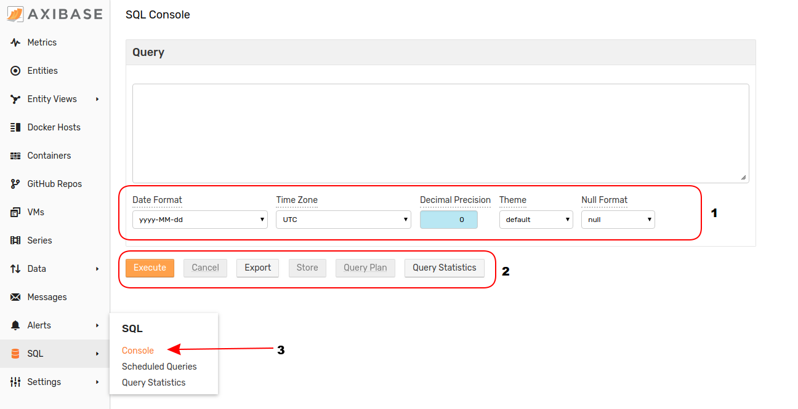

# SQL Console: Data Analysis in ATSD

## Overview

[ATSD](../README.md) includes an inline [SQL Console](../sql/README.md) which may query samples already stored in the database and export the results to a `CSV`, `JSON`, or `XLSX` file for external use, [reinsert a newly created series](#store) for immediate use within the ATSD environment, as well as [track usage statistics](#query-statistics) and historical queries for reference. This article explains the SQL interface from top to bottom.

## SQL Console



The SQL Console has three components:

1. [**Data Toolbar**](#data-toolbar)
2. [**Action Toolbar**](#action-toolbar)
3. **SQL** Menu

Queries are entered in the blank **Query Window**.

> Access **SQL Console** from anywhere in the ATSD interface by opening the **SQL** menu and clicking **Console**.

Consider the query:

```sql
SELECT datetime, value
FROM "mpstat.cpu_busy"
WHERE entity = 'nurswghbs001'
LIMIT 10
```

The result set for this query is shown here:

| datetime   | value |
|------------|-------|
| 2015-09-22 | 4.340 |
| 2015-09-22 | 0.080 |
| 2015-09-22 | 0.250 |
| 2015-09-22 | 0.080 |
| 2015-09-22 | 0.500 |
| 2015-09-22 | 1.170 |
| 2015-09-22 | 0.250 |
| 2015-09-22 | 2.000 |
| 2015-09-22 | 0.420 |
| 2015-09-29 | 6.590 |

## Data Toolbar

The **Data Toolbar** has five drop-down menus which modify return set data formatting or alter the appearance of the text entered into the **Query Window**.

### Date Format / Time Zone

**Date Format** drop-down menu may be used to modify result set data to one of the supported date formats without the use of inline [`date_format`](examples/datetime-format.md) function. **Time Zone** drop-down menu is used to select UTC or server local time for `datetime` output.

This table displays 12:45 (+45 seconds) PM, September 22, 2015 UTC (the timestamp of the first entry in the table above) using each of the options for time formatting:

**Date Format** | **UTC** | **Server Local Time**
---|---|---
`yyyy-MM-ddT HH:mm:ss.SSSZ` | `2015-09-22T12:45:41.000Z` | `2015-09-22T08:45:41.000Z`
`yyyy-MM-ddT HH:mm:ssZ` | `2015-09-22T12:45:41Z` | `2015-09-22T08:45:41Z`
`yyyy-MM-ddT HH:mm:ss.SSS` | `2015-09-22 12:45:41.000` | `2015-09-22 08:45:41.000`
`yyyy-MM-ddT HH:mm:ss` | `2015-09-22 12:45:41` | `2015-09-22 08:45:41`
`yyyy-MM-dd` | `2015-09-22` | `2015-09-22`
`MMM-dd` | `Sep-22` | `Sep-22`
`MMM-dd, E` | `Sep-22, Tue` | `Sep-22, Tue`
`MMM-dd, EEEE` | `Sep-22, Tuesday` | `Sep-22, Tuesday`
`Default` | `2015-09-22T12:45:41.000Z` | `2015-09-22T08:45:41.000Z`

> Note that server local time in this example is Eastern Standard Time (EST) but may be [configured](../administration/timezone.md).

### Decimal Precision

Modify decimal precision in the result set. Values represent decimal places beyond `0` which will be included. Value `-1` includes complete set of logged decimal values.


### Theme

SQL Console supports color customization for query text based on user preferences. [Reserved words](README.md#reserved-words), [literals](README.md#literals), and [syntactical expressions](README.md#syntax) will be affected.


### Null Format

Customize the way SQL Console returns [`NULL`](README.md#null) values. Setting will affect both displayed and exported result sets.

Selectable options are:

* `null`
* `NULL`
* `N/A`
* `-`
* Empty space

## Action Toolbar

The **Action Toolbar** is a row of buttons that initiate various event in SQL Console.

### Execute

Perform the query shown in the **Query Window**, results will be returned in a `CSV` table below the toolbar.

### Cancel

Interrupt long-running queries.

### Export

Download the results of the current query in `CSV`, `JSON (objects)`, `JSON (row)`, or `XLSX` formats. Clicking **Export** will open the **Export Window** tool where the query may be modified (for example applying [aliases](README.md#aliases) for more human-readable results), the download format may be selected, and the option to include [metadata](scheduled-sql-metadata.md#sql-report-metadata) information is given.


### Store

Query results may be immediately re-inserted into the database and stored as a new derived series. Execute the query, click **Store** to open the **Store Query Results as Series** tool.


Result set will be shown as it will be inserted into the database. [**Check Last Time**](scheduled-sql-store.md#duplicates) switch will verify that newly-inserted results' timestamps exceed existing samples, as a means of controlling how duplicate results are handled.

[**Test**](scheduled-sql-store.md#validation) button validates results before inserting them into ATSD.

The query may be [run on a schedule](scheduled-sql.md), clicking **Schedule** will open a new [**Scheduled Queries**](#scheduled-queries) page for the current query.

### Query Plan

Opens the **SQL Query Statistics** page for the specific SQL query shown in the **Query Window**. General query information is shown, such as **Elapsed Time** (to perform query), **Returned Records**, and **User** who performed the query, as well as more detailed information like **Results Bytes**, **RPC Calls** (between remote servers), and **Millis Between Next** (time between two samples in milliseconds).


The bottom row of buttons may be used to return to the SQL Console or navigate to the general **Query Statistics** page.

## Query Statistics

**Query Statistics** page tracks all queries performed since database start (up to 1000). The records are cleared each time the database is stopped, including restarts. This page is useful for analyzing scheduled queries on the fly, or returning to an earlier query. It may accessed directly from the **SQL** menu, from the [**Action Toolbar**](#action-toolbar) of the **SQL Console** page, or from the [**SQL Query Statistics**](#query-plan) page.


Historical query statistics may be filtered by many fields, such as the user who completed the query, its status, or by the query text itself.

## Scheduled Queries

Useful queries may be automated and performed [on a schedule](scheduled-sql.md) by ATSD. The **Scheduled Queries** page may be accessed from the **SQL** menu or the [**Store Query Results**](#store) page. For more information about **SQL Scheduler** see the complete [Documentation](scheduled-sql.md).