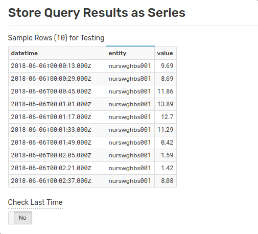
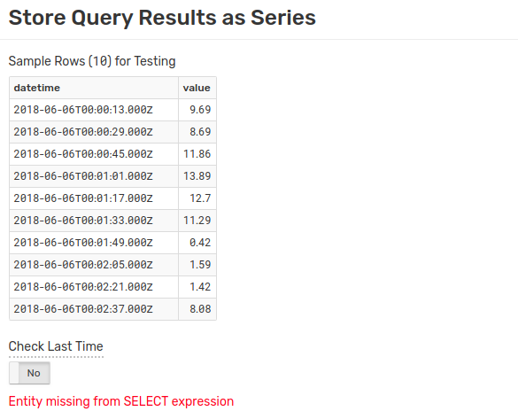

# SQL Console

## Overview

**SQL Console** is a web-based interface to submit [SQL queries](../sql/README.md) to the database and display the results. Export these results to `CSV`, `JSON`, and Excel files or [reinsert](#store) the results as a newly-created series. Open **SQL Console** from the **SQL** menu by clicking **Console**.


**SQL Console** has three components:

1. **Query** Window
2. [Format Settings](#format-settings)
3. [Action Controls](#action-controls)

Enter queries in the **Query** window and view the results under the controls.


## Format Settings

Format Settings apply custom formatting to dates, numbers, and `NULL` values. Changes apply instantly to the currently-displayed records **without** re-submitting a query.

### Date Format / Time Zone

Use **Date Format** drop-down list to modify the `datetime` column without including the [`date_format`](examples/datetime-format.md) function in the `SELECT` expression. Use **Time Zone** drop-down list to display dates in UTC or database [time zone](../administration/timezone.md).

The table below provides examples of how `2018-05-15 16:30 (UTC)` is displayed with each of the date formatting options when the database is configured to Eastern Standard Time (EST):

**Date Format** | **Timezone: UTC** | **Timezone: Local**
---|---|---
`Default` | `2018-05-15T16:30:00.000Z` | `2018-05-15T12:30:00.000Z`
`yyyy-MM-ddT HH:mm:ss.SSSZ` | `2018-05-15T16:30:00.000Z` | `2018-05-15T12:30:00.000Z`
`yyyy-MM-ddT HH:mm:ssZ` | `2018-05-15T16:30:00Z` | `2018-05-15T12:30:00Z`
`yyyy-MM-ddT HH:mm:ss.SSS` | `2018-05-15 16:30:00.000` | `2018-05-15 12:30:00.000`
`yyyy-MM-ddT HH:mm:ss` | `2018-05-15 16:30:00` | `2018-05-15 12:30:00`
`yyyy-MM-dd` | `2018-05-15` | `2018-05-15`
`MMM-dd` | `May-15` | `May-15`
`MMM-dd, E` | `May-15, Tue` | `May-15, Tue`
`MMM-dd, EEEE` | `May-15, Tuesday` | `May-15, Tuesday`

> The database time zone can be [configured](../administration/timezone.md) by an administrator.

### Decimal Precision

This setting rounds numeric values to the specified number of decimal places. Decimal precision applies to columns of decimal data types: `float`, `double`, and `decimal`. When enabled, **SQL Console** highlights the setting in light blue.

To disable rounding, revert the setting to `-1`.


```sql
SELECT MAX(value) AS mx, '123.456' AS num, COUNT(value) AS ct
  FROM mpstat.cpu_busy WHERE datetime > current_day
LIMIT 1
```

Decimal Precision | `mx` | `num` | `ct`
---:|---:|---:|---:
`-1` | 65.2 | 123.456 | 2279
`0` | 65 | 123.456 | 2279
`1` | 65.2 | 123.456 | 2279
`2` | 65.20 | 123.456 | 2279

In the above example, rounding applies only to the `mx` column because the `num` column contains string literals, and the `ct` column returns integer values calculated by the [`COUNT`](README.md#aggregation-functions) function.

### Theme

Select a color scheme to apply to [reserved words](README.md#reserved-words) and [literal](README.md#literals) values in the query text.


#### Default


#### Brick


#### Violet


### NULL Format

Change the way **SQL Console** displays literal [`NULL`](README.md#null) values.

```sql
SELECT NULL
  FROM "mpstat.cpu_busy"
LIMIT 1
```

The following table shows each option applied to a `NULL` value:

Setting | NULL | null | N/A | Dash | Empty |
:------:|:----:|:----:|:---:|:----:|:-----:|
Value   |`NULL`|`null`|`N/A`|  `-` |       |

## Action Controls

### Execute

Perform the query in the **Query** window and view results in a tabular format below the controls.

### Cancel

Interrupt a running query. The database may take several seconds to gracefully stop a query.

### Export

Download the results of a query in `CSV`, `JSON (objects)`, `JSON (row)`, or `XLSX` format. Click **Export** to open the **Export Query Results** window. Modify the query (for example, apply an [alias](README.md#aliases)), select a download format, and optionally include [metadata](scheduled-sql-metadata.md#sql-report-metadata).


### Store

Store results in the database as a new derived series. Execute the query and click **Store** to open the **Store Query Results as Series** window.


The **Store Query Results as Series** window displays the most recent data samples from the query.



There are several tools to configure insertion:

* [**Check Last Time**](scheduled-sql-store.md#duplicates): discard samples with timestamps earlier than the last insert date for the given series.

* [**Test**](scheduled-sql-store.md#validation): validate query results. To insert a query into the database, include at least the following parameters in the [`SELECT`](README.md#select-expression) expression:

  * `datetime`
  * `entity`
  * `value`
  * [`FROM`](README.md#syntax) query to define the metric.

  The database creates the following series commands from the above query:

  ```sh
  series e:nurswghbs001 d:2018-06-06T00:00:13.000Z m:value=9.69
  series e:nurswghbs001 d:2018-06-06T00:00:29.000Z m:value=8.69
  series e:nurswghbs001 d:2018-06-06T00:00:45.000Z m:value=11.86
  series e:nurswghbs001 d:2018-06-06T00:01:01.000Z m:value=13.89
  series e:nurswghbs001 d:2018-06-06T00:01:17.000Z m:value=12.7
  series e:nurswghbs001 d:2018-06-06T00:01:33.000Z m:value=11.29
  series e:nurswghbs001 d:2018-06-06T00:01:49.000Z m:value=0.42
  series e:nurswghbs001 d:2018-06-06T00:02:05.000Z m:value=1.59
  series e:nurswghbs001 d:2018-06-06T00:02:21.000Z m:value=1.42
  series e:nurswghbs001 d:2018-06-06T00:02:37.000Z m:value=8.08
  ```

  The database tests the first ten results for validity. The presence of invalid data results in a brief explanation of why the data is invalid, as seen below:

  

* **Store**: insert valid commands into the database. The database warns if there are invalid commands in the results and does not insert the series.

* **Schedule**: run the current query [on a schedule](scheduled-sql.md).

### Query Plan

Opens the **SQL Query Plan** page for the current query.

The plan includes query summary such as **Elapsed Time** (to perform query), **Returned Records**, and the **User** who performed the query, as well as detailed information like the number of bytes transferred and records retrieved from storage.

