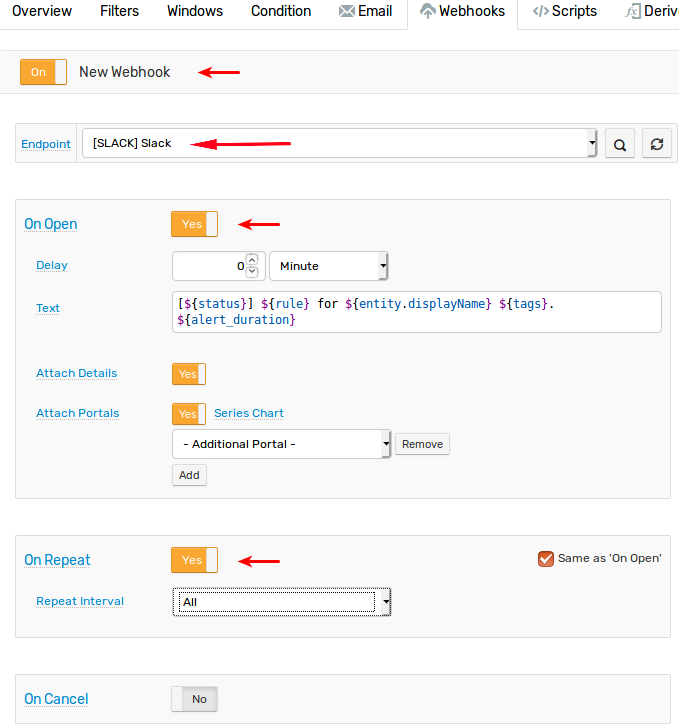

# Getting Started: Alerting

## Create Rule

Open the **Alerts > Rules** page and click **Create** to configure an alert rule for the `temperature` metric using the built-in [Rule Engine](../rule-engine/README.md).


The following [condition](/rule-engine/condition.md) evaluates to `true` and creates an alert if the average value for the last 3 samples exceeds `50`:

```java
avg() > 50
```


Open **Filter** tab in the rule editor to allow out-of-order values and to disable the time [filter](../rule-engine/filters.md#date-filter) by setting value field to `0`. Otherwise measurements older than `1 minute` will be ignored by the rule engine.

> Pro Tip. You can also import the rule from the XML file [temperature_rule.xml](./resources/temperature_rule.xml).

Return to **Data Entry** page and submit a few commands with the value greater than `50`.

```ls
series e:br-1905 m:temperature=55
```

Open **Alerts > Open Alerts** page in the main menu to view currently opened alerts.


Now insert some commands with low values so that the average of the last three commands is less than `50`.

```ls
series e:br-1905 m:temperature=20
```

Reload the **Alerts > Open Alerts** page to verify that the alert for `temperature-too-high` is closed.

## Email Alerts

To receive alert notifications via email, configure the [mail client](../administration/mail-client.md) on the **Settings > Mail Client** page.

Open the rule editor and enable [alerts](../rule-engine/email.md) on the **Email Notifications** tab as illustrated below.

> Pro Tip. To send screenshots of portals install and configure the [Web Driver](../rule-engine/notifications/web-driver.md).


Save the rule and insert high value samples on the **Data Entry** page again. You should receive the following message when the threshold is exceeded.


## Web Notifications Alerts

To receive alert notifications in [Slack](../rule-engine/notifications/slack.md) create a [bot](../rule-engine/notifications/slack.md#create-bot) and configure built-in [`SLACK`](../rule-engine/notifications/slack.md#configure-webhook-in-atsd) webhook.

Open the rule editor and enable alerts on the **Web Notifications** tab as illustrated below.



Save the rule and insert high value samples on the **Data Entry** page again. You should receive the following message when the threshold is exceeded.


Review the [Outgoing Webhooks](../rule-engine/notifications/README.md) document describing built-in ATSD notification integrations.

## Summary

Congratulations!

You have successfully completed the **Getting Started** guide to **Axibase Time Series Database**.