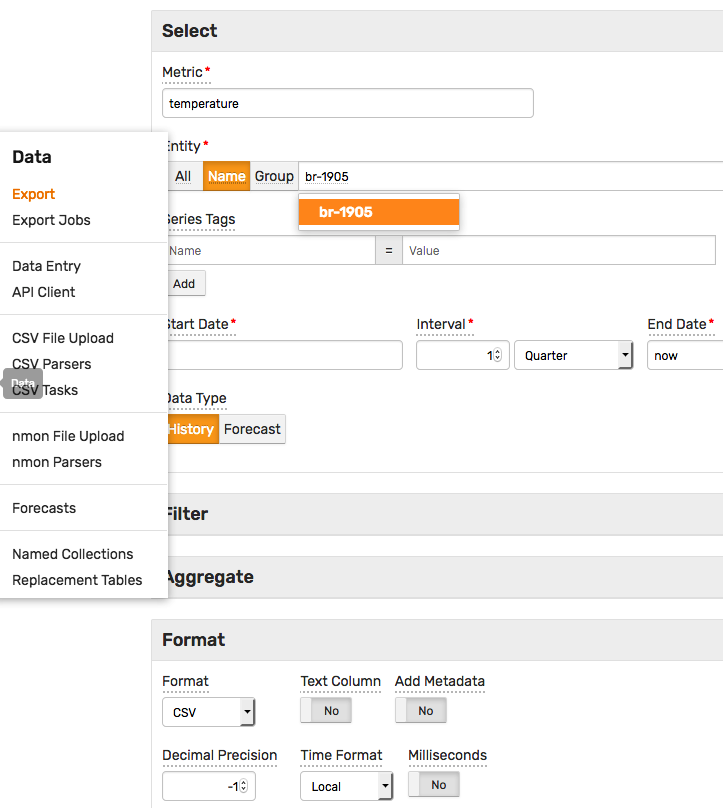

# Getting Started: Export Data

## Export Form

This section demonstrates how to retrieve data from the database using the interactive data export form.

Open **Data > Export** page.

Enter parameters to download data as a CSV file or to display it in HTML format.

* Enter `temperature` into the **Metric** field.
* Click **Name** and enter `br-1905` as the entity.
* Modify the **Date Interval** to `1 Quarter` to select values for a longer timespan.
* Select **CSV** in the **Format** section.
* Click **Submit**.



To export statistics instead of raw values, expand the **Aggregate** section and select one or multiple statistical functions from the **Statistics** drop-down list. Set the aggregation period to `1 Day`.


The results can also be exported [on schedule](../reporting/scheduled-exporting.md) to the local file system or distributed to email subscribers.


## API Client

The database provides a build-in API Client to test the REST API endpoints. This section shows how to export data using the [series query](../api/data/series/query.md) endpoint.

Open **Data > API Client** page.


Select **Series > Query Detailed** template.


Adjust `startDate` and `endDate` fields, replace `entity` and `metric` field values accordingly. The date fields support both `ISO 8601` dates as well as [calendar](../shared/calendar.md) keywords such as `now`.

```json
[{
  "startDate": "2018-06-01T00:00:00Z",
  "endDate":   "now",
  "entity": "br-1905",
  "metric": "temperature"
}]
```

The response document contains the series key and the array of `time:value` samples.

```json
 [
  {
    "entity": "br-1905",
    "metric": "temperature",
    "tags": {},
    "type": "HISTORY",
    "aggregate": {
      "type": "DETAIL"
    },
    "data": [
      { "d": "2018-06-01T20:10:00.000Z", "v": 15 },
      { "d": "2018-06-01T20:20:00.000Z", "v": 10.8 },
      { "d": "2018-06-01T20:30:00.000Z", "v": 24 }
    ]
  }
]
```

Execute another request to retrieve [interpolated](../api/data/series/interpolate.md) values for the above series.

```json
[{
  "startDate": "2018-06-01T00:00:00Z",
  "endDate":   "now",
  "entity": "br-1905",
  "metric": "temperature",
  "interpolate" : {
    "function": "LINEAR",
    "period": {"count": 1, "unit": "DAY"}
  }
}]
```


Continue to [Part 5: SQL](getting-started-sql.md).
