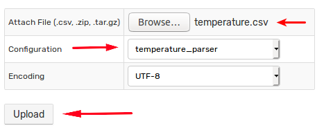

# Getting Started: Inserting Data

## Network Commands

In the previous section you inserted data manually using the built-in web interface forms. Proceed by inserting data via network command format.

[Network commands](../api/network/README.md) provide a compact [syntax](../api/network/README.md#syntax) to insert both time series data as well as metadata.

```elm
command_name field_prefix:[field_name=]field_value
```

Open command prompt and send these commands into ATSD.

```bash
echo -e "series e:br-1905 m:temperature=25" \
  > /dev/tcp/atsd_hostname/8081
```

```bash
echo -e "entity e:br-1905 t:serial_number=N12002" \
  > /dev/tcp/atsd_hostname/8081
```

Refresh the **Series Statistics** page and **Entity Editor** to verify that the temperature sample is received and the entity tag `series_number` is set by the database.


Insert and validate commands at **Data > Data Entry** for convenience.


## REST API

Unlike network commands, the REST API has endpoints to both insert data as well as query data via JSON requests.

### Sending Values at a Specific Time

Open command prompt and send a single value with a specific `datetime` into the [Series: Insert](../api/data/series/insert.md) endpoint. Replace `<username>` with your username.

```bash
curl https://atsd_hostname:8443/api/v1/series/insert \
  --insecure -w "%{http_code}\n" \
  --user <username> \
  --header "Content-Type: application/json" \
  --data '[{"entity": "br-1905", "metric": "temperature", "data": [{ "d": "2018-06-01T14:00:00Z", "v": 17.0 }]}]'
```

The payload transmitted to the database is a JSON document containing the series key and an array of `datetime:value` samples. The array `data` can contain any number of `d:v` objects.

```json
[{
  "entity": "br-1905",
  "metric": "temperature",
  "data": [
    { "d": "2018-06-01T14:00:00Z", "v": 17.0 }
  ]
}]
```

### Sending Values at the Current Time

Send a modified version, where the datetime is set to present time using the `date -u +"%Y-%m-%dT%H:%M:%SZ"` `bash` function.

```bash
curl https://atsd_hostname:8443/api/v1/series/insert \
  --insecure -w "%{http_code}\n" \
  --user <USER> \
  --header "Content-Type: application/json" \
  --data '[{"entity": "br-1905", "metric": "temperature", "data": [{ "d": "'$(date -u +"%Y-%m-%dT%H:%M:%SZ")'", "v": 19.0 }]}]'
```

Reload the **Series Statistics** page and observe new values.

### Sending Values Continuously

Replace `<username>:<password>` with user credentials in the `curl` command provided below to send random values between `20` and `40` into the database every five seconds.

```bash
for i in {1..100}; do \
RANDOM_TEMPERATURE=$((20 + RANDOM % 20)); echo "send ${RANDOM_TEMPERATURE}"; \
curl https://atsd_hostname:8443/api/v1/series/insert \
  --insecure -w "%{http_code}\n" \
  --user <username>:<password> \
  --header "Content-Type: application/json" \
  --data '[{"entity": "br-1905", "metric": "temperature", "data": [{ "d": "'$(date -u +"%Y-%m-%dT%H:%M:%SZ")'", "v": '"$RANDOM_TEMPERATURE"' }]}]'; \
sleep 0.5; \
done
```

Refer to [API Documentation](../api/data/series/insert.md) and [examples](../api/data/series/insert.md#additional-examples) for more information.

## CSV Files

CSV is one of the most commonly used tabular formats. Despite widespread use, the format remains non-standardized. ATSD provides a flexible **CSV Parser** that converts CSV files of any composition into structured database records.

Create a CSV file `temperature.csv`.

```txt
date,asset,temperature
2018-Jun-01 00:00:00,BR-1905,32.5
2018-Jun-01 00:30:00,BR-1905,31.5
2018-Jun-01 01:00:00,BR-1905,30.0
2018-Jun-01 01:30:00,BR-1905,29.0
2018-Jun-01 02:00:00,BR-1905,25.0
```

Open **Data > CSV Parsers** and select **Import** from the split-button located at the bottom of the page.

Attach [`temperature_parser.xml`](./resources/temperature_parser.xml) and [import the parser](https://axibase.com/use-cases/tutorials/shared/import-csv-parser.html).

Open **Data > CSV File Upload**, attach the `temperature.csv` file and process it with the newly created `temperature_parser`.



Open **CSV Tasks** page and check the number of processed rows is `6`.


For this basic example, the parser maps file columns to series command fields based on column names specified in the header. The parser performs the following specific actions:

* `date` column is mapped to `datetime` field and parsed with `yyyy-MMM-dd HH:mm:ss` pattern in UTC time zone which is set explicitly.
* `asset` column is mapped to `entity` field.
* The remaining columns, including `temperature`, are automatically classified as metric columns.

```javascript
date = '2018-Jun-01 00:00:00' -> datetime = '2018-06-01T00:00:00Z'
asset = 'BR-1905'             -> entity = 'br-1905'
temperature = 32.5            -> metric (temperature) = 32.5
```

Refresh the **Series Statistics** page to check that the values from the CSV file are present in the database.

Refer to [CSV Parser Documentation](../parsers/csv/README.md) for more examples.

Continue to [Part 3: Portals](getting-started-portal.md).
