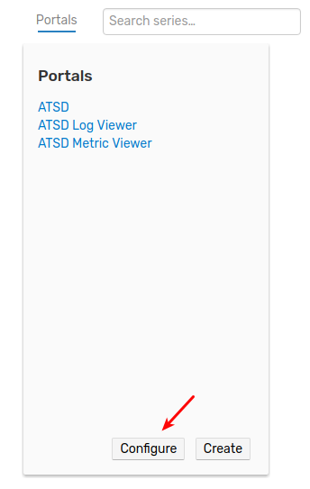
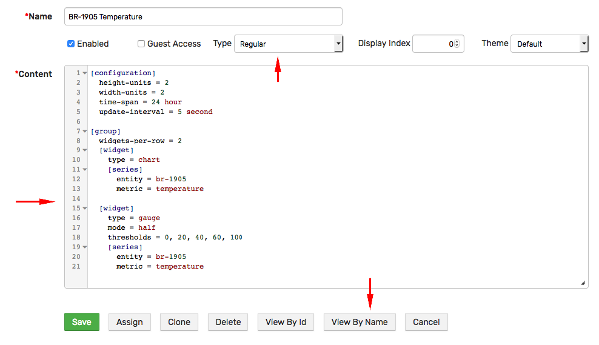
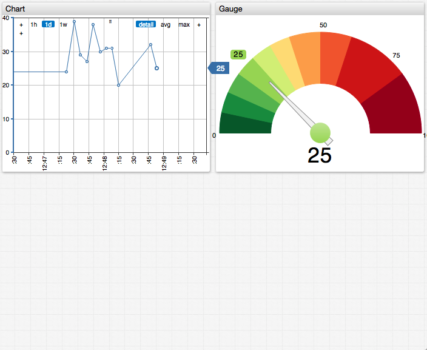
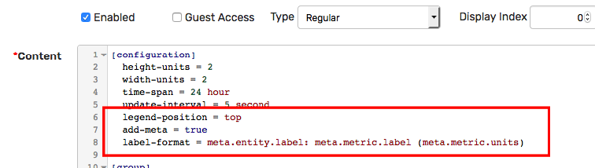
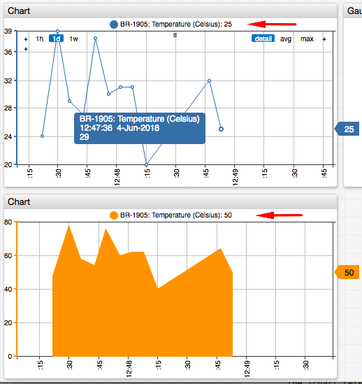

# Getting Started: Portals

## Create Portal

[Portal](../portals/README.md) is a collection of [widgets](https://axibase.com/products/axibase-time-series-database/visualization/widgets/) displayed on one page. 

The portal can be `generic` whereas it can display data for any entity of the given type (entity is often passed as parameter). The portal can also be `regular`, in which case the entity is defined in the configuration text. In this exercise we will create a **regular** portal for `br-1905` entity.

Click on **Portals** link in the top menu.

Click **Create**.



Set portal to **Regular** in the **Type** drop-down.

Copy the following configuration text into the **Content** area.

```ls
[configuration]
  height-units = 2
  width-units = 2
  time-span = 24 hour
  update-interval = 5 second

[group]
  widgets-per-row = 2
  [widget]
    type = chart
    [series]
      entity = br-1905
      metric = temperature

  [widget]
    type = gauge
    mode = half
    thresholds = 0, 20, 40, 60, 100
    [series]
      entity = br-1905
      metric = temperature
```

Specify a portal name.

Click **Save**.



The above portal contains two widgets: a 24-hour linear time chart and a gauge showing the last value.

To view the portal, click **View By Name**.



## Add Widget

Add the third time chart with a calculated series by appending the following text to **Content**:

```ls
[widget]
  type = chart
  mode = stack
  [series]
    entity = br-1905
    metric = temperature
    color = orange
    # multiply values by 2
    replace-value = value * 2
```

Reload the portal to view the new chart.

Start the [bash loop](./getting-started-insert.md#send-values-continuously) and observe how new data points appear in the portal.

Review the [syntax](../portals/selecting-series.md) used to select series and the [chart reference](https://axibase.com/products/axibase-time-series-database/visualization/) for more layout examples.

## Metadata

The chart syntax provides readily available settings and functions to add metadata to charts to eliminate manual coding.

Add the following settings to incorporate metadata into series legend.

```ls
  legend-position = top
  add-meta = true
  label-format = meta.entity.label: meta.metric.label (meta.metric.units)
```



Click **View By Name** to view the updated portal.



Continue to [Part 4: Export Data](getting-started-export.md).
