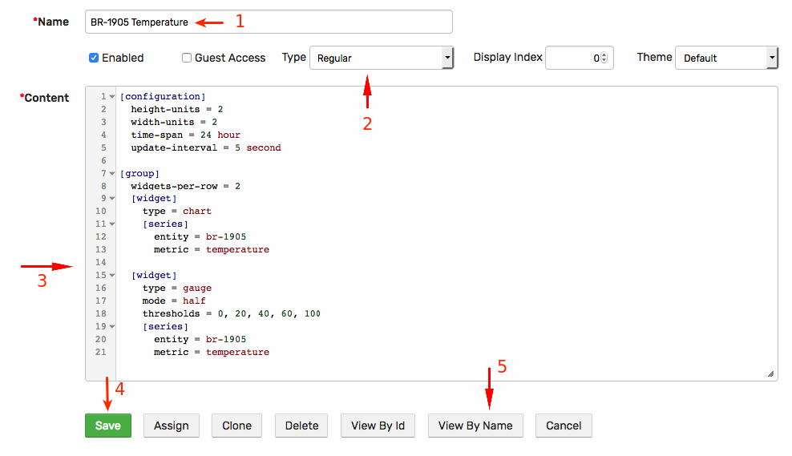

# Getting Started: Portals

## Create a Portal

A [portal](../portals/README.md) is a collection of [widgets](https://axibase.com/products/axibase-time-series-database/visualization/widgets/) displayed on one page.

The portal can be defined as a `template` portal to display data for a specific entity, passed as a parameter. The portal can also be `regular`, in which case the entity is defined in the configuration text by the user. This instructions detail the creation of a **regular** portal for `br-1905` entity.

Click **Portals** in the top menu.

Click **Create**.


Specify a portal name.

Select **Regular** in the portal **Type**.

Copy the following configuration text into the **Content** area.

```ls
[configuration]
  height-units = 2
  width-units = 2
  time-span = 24 hour
  update-interval = 5 second

[group]
  widgets-per-row = 2
  [widget]
    type = chart
    [series]
      entity = br-1905
      metric = temperature

  [widget]
    type = gauge
    mode = half
    thresholds = 0, 20, 40, 60, 100
    [series]
      entity = br-1905
      metric = temperature
```

The above portal contains two widgets: a 24-hour linear [time chart](https://axibase.com/products/axibase-time-series-database/visualization/widgets/time-chart/) and a [gauge](https://axibase.com/products/axibase-time-series-database/visualization/widgets/gauge-chart/) showing the last value.

Click **Save**.



To view the portal, click **View By Name**.


## Add Widget

Add the third time chart with a calculated series by appending the following text to **Content**:

```ls
[widget]
  type = chart
  mode = stack
  [series]
    entity = br-1905
    metric = temperature
    color = orange
    # multiply values by 2
    replace-value = value * 2
```

Reload the portal to view the new chart.

Start the [bash loop](./getting-started-insert.md#send-values-continuously) and observe how new data points appear in the portal.

Review the [Selecting Series Overview](../portals/selecting-series.md) and the [Charts Reference](https://axibase.com/products/axibase-time-series-database/visualization/) for more layout examples.

## Metadata

The Charts library provides settings and functions to [add metadata](https://axibase.com/products/axibase-time-series-database/visualization/widgets/metadata/) to charts to eliminate manual tagging and labeling.

Add the following settings at the `[configuration]` level to automatically embed entity and metric metadata into series legend.

```ls
legend-position = top
add-meta = true
label-format = meta.entity.label: meta.metric.label (meta.metric.units)
```


Click **View By Name** to view the updated portal.


Continue to [Part 4: Export Data](getting-started-export.md).
