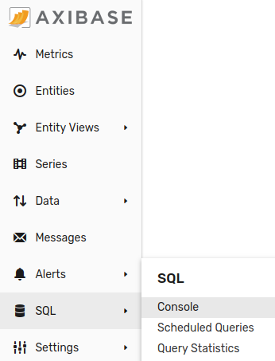
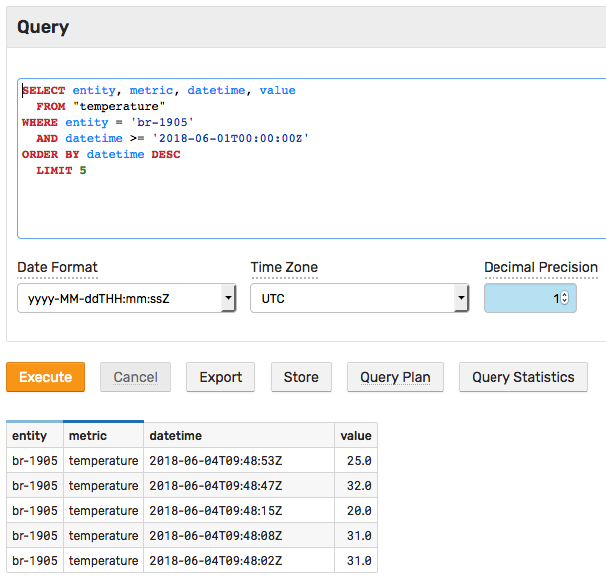

# Getting Started: SQL

## SQL Console

ATSD supports [SQL](../sql/README.md) syntax for flexible querying and analysis of time series data. One of the options available for executing ad hoc SQL queries is the built-in [SQL Console](../sql/sql-console.md).

Open the **SQL > SQL Console** tab in the main menu:



Retrieve the five most recent values for the `temperature` series.

```sql
SELECT entity, metric, datetime, value
  FROM "temperature"
WHERE entity = 'br-1905'
  AND datetime >= '2018-06-01T00:00:00Z'
ORDER BY datetime DESC
  LIMIT 5
```



You can export query results into CSV, Excel, and JSON by clicking **Export**.

Modify the query to include [metadata](../sql/README.md#columns) fields, tags, and to [format](../sql/README.md#date_format) the date:

```sql
SELECT entity.label AS "asset", entity.tags.model AS "model",
  metric, metric.units AS "units",
  date_format(time, 'yyyy-MM-dd HH:mm:ss', 'US/Pacific') AS "date", value
  FROM "temperature"
WHERE entity = 'br-1905'
  AND datetime >= '2018-06-01T00:00:00Z'
ORDER BY datetime DESC
  LIMIT 5
```

```txt
| asset    | model   | metric       | units    | date                 | value |
|----------|---------|--------------|----------|----------------------|-------|
| BR-1905  | 4520-1  | temperature  | Celsius  | 2018-06-04 02:48:53  | 25.0  |
| BR-1905  | 4520-1  | temperature  | Celsius  | 2018-06-04 02:48:47  | 32.0  |
| BR-1905  | 4520-1  | temperature  | Celsius  | 2018-06-04 02:48:15  | 20.0  |
| BR-1905  | 4520-1  | temperature  | Celsius  | 2018-06-04 02:48:08  | 31.0  |
| BR-1905  | 4520-1  | temperature  | Celsius  | 2018-06-04 02:48:02  | 31.0  |
```

[Regularize](../sql/README.md#regularization) the series using a step-like interpolation function:

```sql
SELECT entity.label AS "asset", entity.tags.model AS "model",
  metric, metric.units AS "units",
  date_format(time, 'yyyy-MM-dd HH:mm:ss', 'US/Pacific') AS "date", value
  FROM "temperature"
WHERE entity = 'br-1905'
  AND datetime >= '2018-06-01T00:00:00Z'
WITH INTERPOLATE(15 SECOND, PREVIOUS)
ORDER BY datetime DESC
  LIMIT 5
```

```txt
| asset    | model   | metric       | units    | date                 | value |
|----------|---------|--------------|----------|----------------------|-------|
| BR-1905  | 4520-1  | temperature  | Celsius  | 2018-06-04 02:49:00  | 25.0  |
| BR-1905  | 4520-1  | temperature  | Celsius  | 2018-06-04 02:48:45  | 20.0  |
| BR-1905  | 4520-1  | temperature  | Celsius  | 2018-06-04 02:48:30  | 20.0  |
| BR-1905  | 4520-1  | temperature  | Celsius  | 2018-06-04 02:48:15  | 20.0  |
| BR-1905  | 4520-1  | temperature  | Celsius  | 2018-06-04 02:48:00  | 30.0  |
```

Review the [SQL syntax](../sql/README.md) and experiment by executing your own queries based on available [examples](../sql/examples/README.md).

Continue to [Part 6: Alerting](getting-started-alert.md).