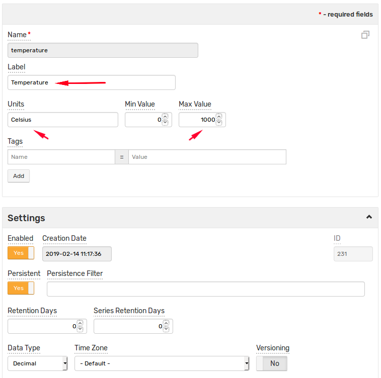

# Getting Started

This introduction guides you through the first steps of using Axibase Time Series Database (ATSD).

## Contents

1. Introduction
1. [Inserting Data](./getting-started-insert.md)
1. [Portals](./getting-started-portal.md)
1. [Exporting Data](./getting-started-export.md)
1. [SQL](./getting-started-sql.md)
1. [Alerting](./getting-started-alert.md)

## Preparation

* Log in to your ATSD instance at `https://atsd_hostname:8443/`.

## Introduction

The operations underlying this tutorial insert and analyze temperature measurements collected from a hypothetical bioreactor such as the **Parr** [Fixed Head Reactor](https://www.parrinst.com/products/stirred-reactors/series-4520-1-2l-bench-top-reactors/) pictured below.


In a real-world situation, such measurements are continuously gathered by specialized [controllers](https://www.parrinst.com/products/controllers/4871-process-controller/) as part of the factory-wide SCADA system.

To differentiate this equipment from other factory assets, the tutorial refers to the reactor using the identifier in the asset management system:

```elm
br-1905
```

## Writing Data

ATSD has numerous interfaces for data writing: API clients, CSV parsers, and REST API endpoints, but the simplest way to manually insert data is to submit samples as series command on **Data > Data Entry**.


Select **Series**.


Enter `br-1905` in the **Entity** field. As a universal database, ATSD uses `entity` as a generic term to refer to the monitored object. In this case, `entity` is synonymous with `device`.

Enter `temperature` in the **Metric** field.

The field **Time/Value** only requires that the right **Value** component be completed. Enter a hypothetical value. Optionally indicate time in [ISO format](../shared/date-format.md). When left blank, the timestamp is set to the current time by ATSD.


In a real manufacturing process, the temperature of the equipment itself is measured as `outer` or `jacket` temperature while the temperature of the compound inside the reactor is recorded as `product` temperature.

A sample `product` temperature chart is shown below:


Continue to enter numbers into the **Value** field and clicking **Send**, for example `20`, `22`, `30`, `22`. These records are now stored in the database as a series which contains multiple `time:value` observations.

## Viewing Statistics

Click the **Statistics** icon to view summary information about the series.


## Inserting Initial Data

To populate the database with initial temperature readings, open the **Commands** tab and submit multiple `series` commands created using an iterator.

```ls
<#list 1..20 as i>
series s:${(nowSeconds - i * 600)?c} e:br-1905 m:temperature=${(60 - 2*i)?c}
</#list>
```


## Visualizing Data

Click the **Portal** icon to view the default chart for the current `temperature` series.


Alternatively, enter `https://atsd_hostname:8443/portals/series?entity=br-1905&metric=temperature` in the address bar to view the portal.

The portal contains a time chart displaying average values for the last 24 hours.


In the upper right corner select **detail** data type to view detailed values inserted by the previous step.

Click **all** in the timespan control to view all available data or use the mouse wheel to zoom and pan the time axis to a shorter time interval.

Take a moment to become familiar with [Time Chart](https://axibase.com/docs/charts/widgets/time-chart/) controls.

The default portal consists of a single time chart for one series. You can create [portals](../portals/README.md) with a custom layout and any number of widgets.

## Adding Metadata

### Describing Equipment

At this stage, you have collected temperature observations from the chemical reactor `br-1905`. The measurements are stored in the database as a series object comprising a sequence of `time:value` samples which can be analyzed and graphed.

| Date                  | Value |
|-----------------------|-------|
| 2019-03-01T13:23:25Z  | 20    |
| 2019-03-01T13:23:59Z  | 22    |
| 2019-03-01T13:24:16Z  | 30    |
| 2019-03-01T13:24:24Z  | 22    |

To better organize the data, classify the `br-1905` entity and clarify what kind of temperature the device collects.

Open the **Entities** page from the left menu in the ATSD web interface and search for `br-1905`. The search bar supports [wildcards](../search/entity-search.md#wildcards) and partial matching.


Open the entity editor to describe entities using custom tags that are specific for the given domain or industry.

Set **Label** to `BR-1905`, time zone to `US/Pacific` and set some custom tags:

```elm
type = bioreactor
model = 4520-1
manufacturer = Parr Instruments
reference_url = https://www.parrinst.com/products/stirred-reactors/series-4520-1-2l-bench-top-reactors/
site = SVL
building = A
```


Entity tags provide an extensible mechanism to make a universal database specific to the current domain.

Define tags and click **Create Tag Template** to save the current tag schema as template which can be assigned to entities sharing the same tags.

### Describing Metrics

Open **Metrics** from the left menu and search for `temperature`. The search bar supports [wildcards](../search/metric-search.md#wildcards) and partial matching.


The **Metric Editor** provides additional fields such as units, precision, and seasonality to describe the measured attributes.

Set **Label** to `Temperature` and set the remaining fields:

```elm
units = Celsius
min_value = 0
max_value = 1000
```



Refresh the **Series Statistics** page which now displays relevant metric and entity metadata.

 ```elm
https://atsd_hostname:8443/series/statistics?entity=br-1905&metric=temperature
```


Continue to [Part 2: Insert Data](getting-started-insert.md).
