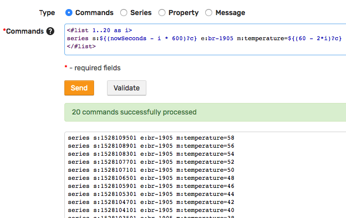

# Getting Started: Introduction

This introduction guides the reader through the first steps of using Axibase Time Series Database (ATSD).

## Preparation

* Log in to your ATSD instance at `https://atsd_hostname:8443/`.

## Introduction

As part of this tutorial, insert and analyze temperature measurements collected from a hypothetical bioreactor such as a **Parr** [Fixed Head Reactor](https://www.parrinst.com/products/stirred-reactors/series-4520-1-2l-bench-top-reactors/) pictured below.


In a real world situation, such measurements are continuously gathered by specialized [controllers](https://www.parrinst.com/products/controllers/4871-process-controller/) as part of a factory-wide SCADA system.

To differentiate this particular equipment from other factory assets, the article refers to the reactor using the identifier in the asset management system:

```elm
br-1905
```

## Insert Data

The database has various interfaces for writing data, including API clients, CSV parsers, REST API endpoints etc., however the easiest way to insert data manually is to submit it on the **Data Entry** form located under the **Data** tab in the main menu.


Open the **Series** tab.

Enter `br-1905` into the **Entity** field. As a universal database, ATSD uses `entity` as a generic term to refer to the monitored object. In this particular case, `entity` means `Device`.

Enter `temperature` as the metric name.

Enter a number into the  **Time/Value** field and click **Send**. Do not enter a value for time, the database sets the value as the current time when **Time** field is left blank.


In a real manufacturing process, the temperature is measured for the equipment itself, as `outer` or `jacket` temperature, and for the compound inside the reactor, for example as a `product` temperature.

A sample product temperature chart looks as follows:


Continue entering numbers into the **Value** field and clicking **Send**, for example `20`, `22`, `30`, `22`. These records are now stored in the database as a series containing multiple `time:value` observations.

## View Statistics

Click **Statistics** `∑` icon to view summary information about the series.


## Insert Initial Data

To populate the database with some initial temperature readings, open the **Commands** tab and submit these commands, created using loops.

```ls
<#list 1..20 as i>
series s:${(nowSeconds - i * 600)?c} e:br-1905 m:temperature=${(60 - 2*i)?c}
</#list>
```



## Graph Data

Click the chart icon to view the default chart for the current `temperature` series.


Alternatively, enter `https://atsd_hostname:8443/portals/series?entity=br-1905&metric=temperature` in the address bar to view the portal.

The portal contains a time chart displaying average values for the last 24 hours.


In the upper right corner switch to **detail** data type to view the detailed values inserted in the previous step.

Click **all** in the timespan control to view all data or use the mouse wheel to zoom and pan the time axis to a shorter time interval.

Spend a moment getting to know the [time chart](https://axibase.com/products/axibase-time-series-database/visualization/widgets/time-chart/) controls.

> The default portal consists of a single time chart for one series. You can create [portals](../portals/README.md) with a custom layout and any number of widgets.

## Add Metadata

### Describe Equipment

At this stage, you have collected temperature observations from the chemical reactor `br-1905`. The measurements are stored in the database as a series object comprising a sequence of `time:value` samples which can be analyzed and graphed.

| Date                  | Value |
|-----------------------|-------|
| 2018-06-01T13:23:25Z  | 20    |
| 2018-06-01T13:23:59Z  | 22    |
| 2018-06-01T13:24:16Z  | 30    |
| 2018-06-01T13:24:24Z  | 22    |

To better organize the data, classify the `br-1905` entity and clarify what kind of temperature it collected.

Open **Entities** tab in the main menu and search for `br-1905`. The search box supports wildcards and partial matching.


Open the **Entity Editor** which allows you to describe entities using custom tags that are specific for the given domain (industry).

Set **Label** to `BR-1905`, time zone to `US/Pacific` and set some custom tags:

```elm
type = bioreactor
model = 4520-1
manufacturer = Parr Instruments
reference_url = https://www.parrinst.com/products/stirred-reactors/series-4520-1-2l-bench-top-reactors/
site = SVL
building = A
```


Entity tags provide an extensible mechanism to make a universal database specific to the current domain.

>Pro Tip. Once the tags are defined, click **Create Tag Template** to save the current tags into a template that can be assigned to entities sharing the same tags.

### Describe Metric

Open **Metrics** tab in the main menu and search for `temperature`. The search box supports wildcards and partial matching.


The **Metric Editor** provides more built-in fields compared to entities because the concept of metric is shared by many domains and fields such as units, value range, precision, seasonality, etc. are commonly required.

Set **Label** to `Temperature` and set fields as follows:

```elm
units = Celsius
min_value = 0
max_value = 1000
```


Refresh the **Series Statistics** page which now displays relevant metric and entity metadata.

 ```elm
https://atsd_hostname:8443/series/statistics?entity=br-1905&metric=temperature
```


Continue to [Part 2: Insert Data](getting-started-insert.md).
