# Versioning

Versioning enables tracking of time-series value changes for the purpose of enabling an audit trail and traceable data reconciliation. 

## Versioning Fields

Once enabled, ATSD tracks changes made to stored values with the following versioning fields:

| Field Name | Description | 
| --- | --- | 
|  Version Time  |  Timestamp when the insert command was received. Set automatically by the ATSD server with millisecond precision.  | 
|  Version Source  |  User-defined field to track sources (origins) of change events such as username, device id, or IP address. <br>Set to `user:{username}` by default for changes made through the [ATSD web interface](#updating-series-value).| 
|  Version Status  |  User-defined field to classify change events. <br> Set to 'invalid' for `NaN` and out of range values by default if **Invalid Value Action = `SET_VERSION_STATUS`** | 

## Enabling Versioning

Versioning is disabled by default. It can be enabled for particular metrics by using the **Versioning** toggle button on the Metric Editor page:

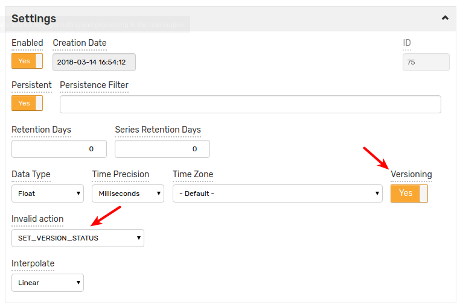

In addition, the **Invalid Value Action** can be set to `SET_VERSION_STATUS` to initialize the _Version Status_ field to an 'invalid' value if the inserted sample is `NaN` or outside of the specified minimum and maximum bounds.

## Inserting Version Fields

To insert versioned series, use the reserved version tags:

 * `$version_source` 
 * `$version_status`

These tags will be converted to the corresponding [versioning fields](#versioning-fields). `$version_status` tag overrides 'invalid' value set by `SET_VERSION_STATUS` trigger. 

Options to insert versioned series:

* [Network Commands](#network-commands)
* [Data Entry Series form](#data-entry-series-form)
* [CSV Parser using Default Tags](#csv-parser-using-default-tags)
* [CSV Parser using Renamed Columns](#csv-parser-using-renamed-columns)

### Network Commands

To insert versioned samples, use the [series](../api/network/series.md) command with the version tags:

```ls
  series e:{entity} m:{metric}={number} t:$version_status={status} t:$version_source={source} d:{iso-date}
```

> Note:
> * if the command references to existing metric with _Versioning = No_, an error will be produced;
> * if the command references to non-existent metric, it will be created as new record with _Versioning = Yes_ and no error will be produced.

Example:

```ls
series e:e-vers m:m-vers=13 t:$version_status=OK t:$version_source=collector-1 d:2018-03-20T15:25:40Z
```

### Data Entry Series form

Versioned samples can be added at the **Data > Data Entry > Series** form by specifying the version tags:

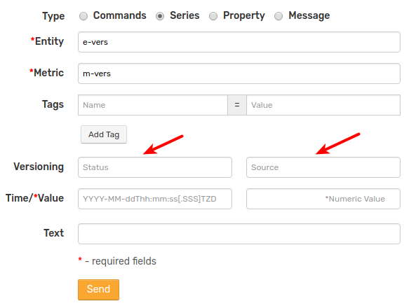

> Note: _Metric_ field must reference to existing metric with _Versioning = Yes_ 

### CSV Parser using Default Tags

To specify the same versioning fields for all records in a CSV file fill in the **Default Tags** field at the [CSV File Upload](../parsers/csv#uploading-csv-files-into-axibase-time-series-database) page with the version tags:

```ls
$version_status={status}
$version_source={source}
```
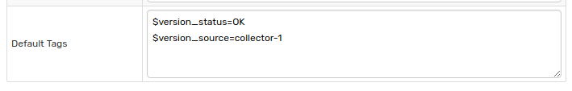

> Note:
> * if the CSV Parser references to existing metric with _Versioning = No_, an error will be produced;
> * if the CSV Parser references to non-existent metric, it will be created as new record with _Versioning = Yes_ and no error will be produced.

### CSV Parser using Renamed Columns

To extract versioning fields from CSV file columns, add the version tags to the **Tag Columns** field and specify mappings between the original column names and version tag names in the **Renamed Columns** field.

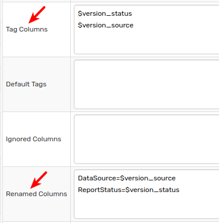

> Note:
> * if the CSV Parser references to existing metric with _Versioning = No_, an error will be produced;
> * if the CSV Parser references to non-existent metric, it will be created as new record with _Versioning = Yes_ and no error will be produced.

## View Versions

Version history can be retrieved at the [Ad-hoc Export](../reporting/ad-hoc-exporting.md) page or via a scheduled [Export Job](../reporting/scheduled-exporting.md).

The settings are the same for both options.

### Ad-hoc Export page

Click on the **Display Versions** toggle button to view version history at the **Filters** section of metric export page:

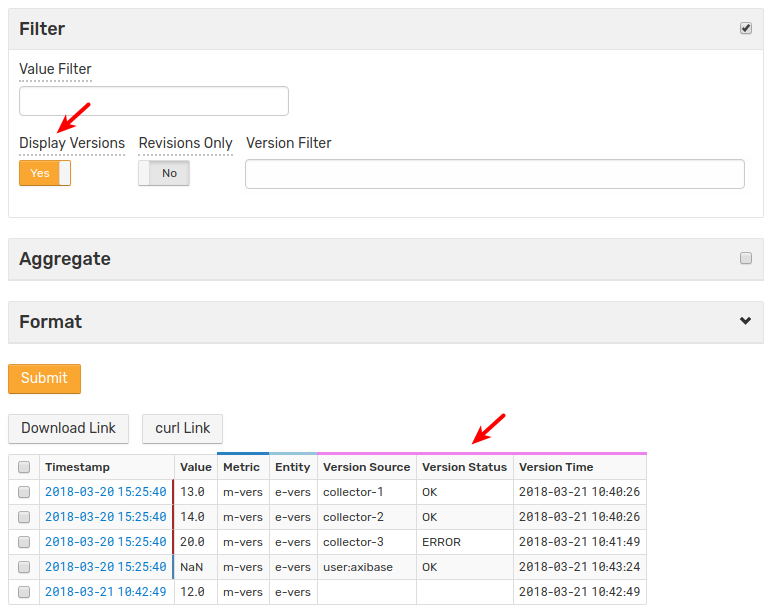

- Records with version history are highlighted with _blue_ and _brown_-colored borders: _blue_ border represents the latest value, _brown_ border represents a historical, overwritten value.
- `NaN` represents deleted values. 
- API requests, aggregation functions and other calculations ignore historical and deleted values.

#### Options to filter versions
|**Name**|**Description**|
|---|---|
|**Revisions Only** |Display only values with version history. Values that haven’t been modified will be hidden.|
|**Version Filter**| An expression to filter version history. May contain the `version_source`, `version_status` and `version_time` fields. <br> The `version_time` field supports [calendar](../shared/calendar.md) syntax with the `date()` function.<br> The `version_source` and `version_status` fields support wildcards. <br> To display deleted values, use `Double.isNaN(value)`|

Examples:

* match using wildcards

    ```ls
    version_source LIKE 'col*'
    ```
    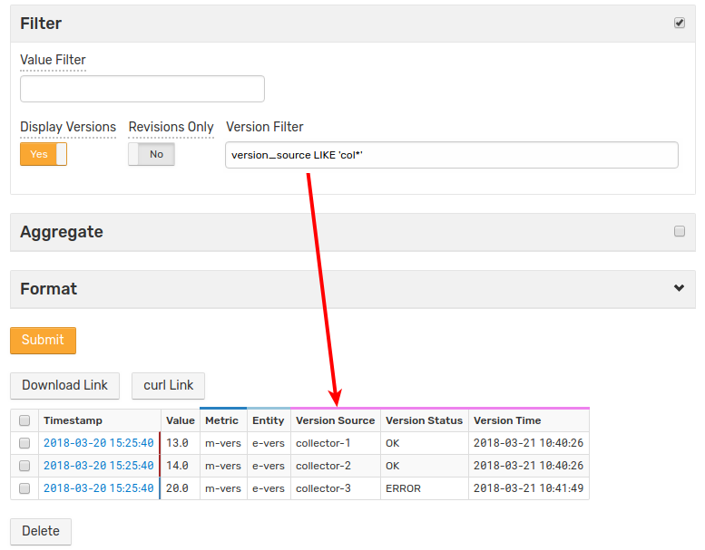

* match using date function

    ```ls
    version_time > date('2018-03-21 10:41:00') AND version_time < date('now')
    ```
    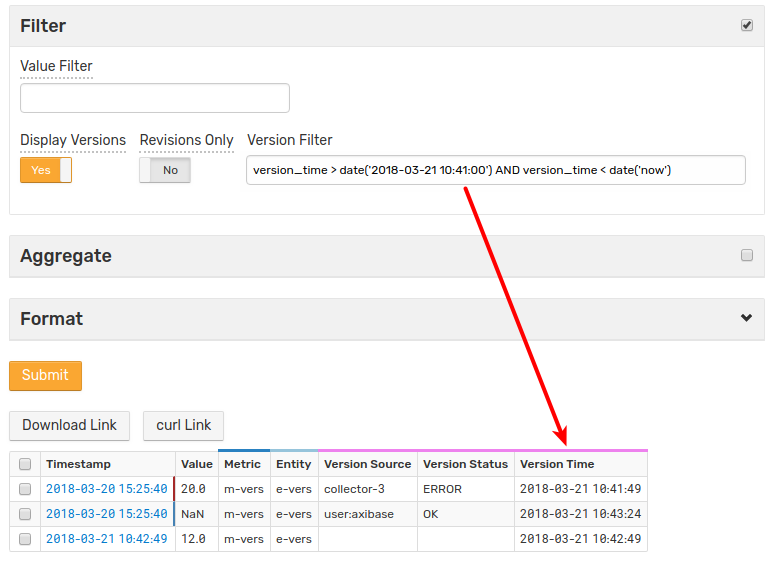
    
* match using exact value

    ```ls 
    version_status = 'OK'
    ```
    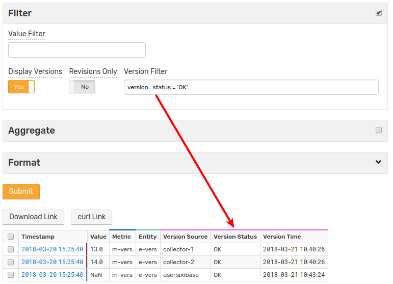
    
* display `NaN` values

    ```ls
    Double.isNaN(value)
    ```
    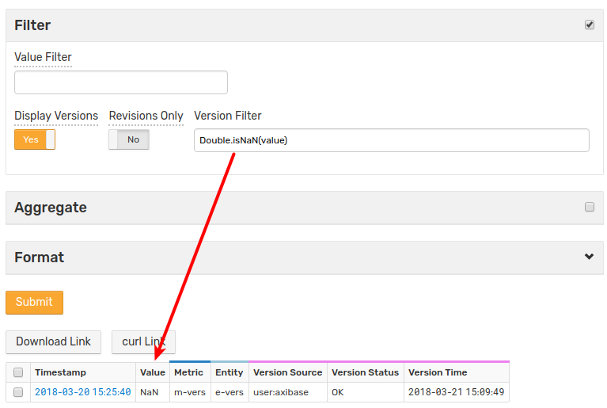
    
* display only modified values

    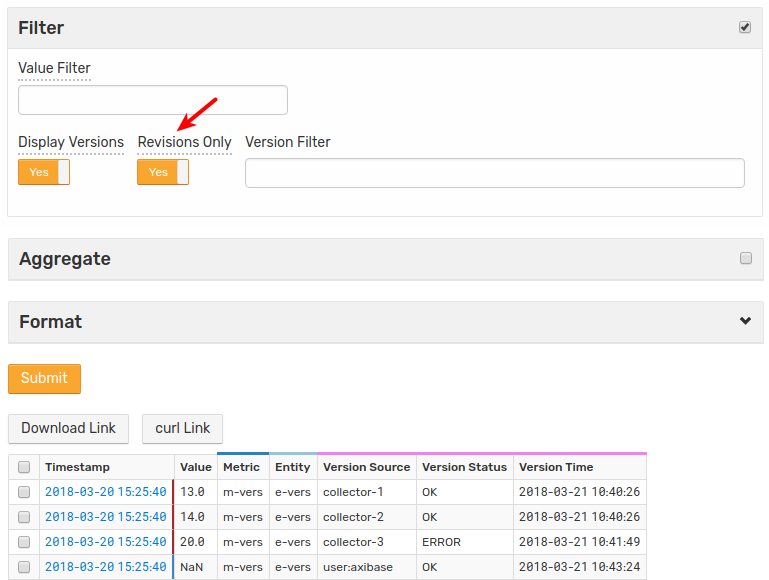

## Updating Series Value

Create a report in HTML format on the [Ad-hoc Export](../reporting/ad-hoc-exporting.md) page with the versioning mode enabled.

Click on timestamp for the selected record to open the **Data Entry** page.

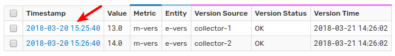

Change version _Status_ and _Source_, change the _Value_ and click **Update**.

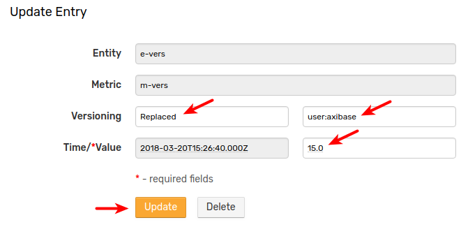

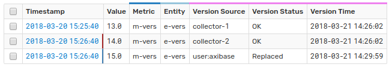

## Deleting Series Value

Create a report in HTML format at the [Ad-hoc Export](../reporting/ad-hoc-exporting.md) page with the versioning mode enabled.

Click on timestamp for the selected record to open the **Data Entry** page.


Change version _Status_ and _Source_, change the _Value_ and click **Delete**.

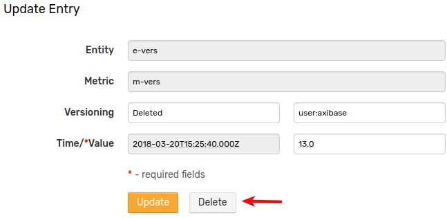

Note that the value will not be actually deleted. Rather, the current value for the selected timestamp will be replaced with a `NaN` marker.

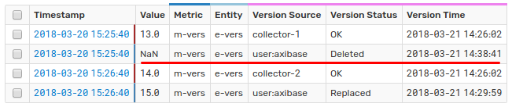

In addition, value can be deleted using checkbox and the **Delete** button at the export page.

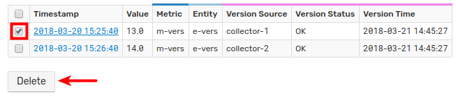

### Deleting Multiple Series Values

To delete multiple values, select checkboxes for the selected rows or click the top checkbox to select all rows, and then click **Delete**.

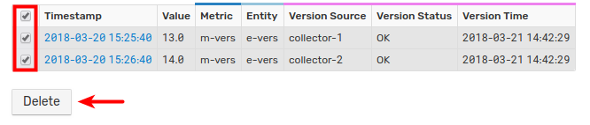