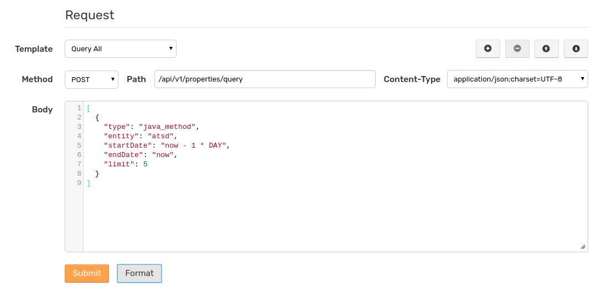
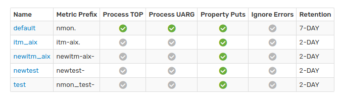
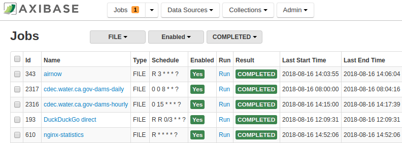

# Writing Data into ATSD

* [API](./api/README.md)
* [Axibase Collector Jobs](https://axibase.com/docs/axibase-collector/jobs/)
* [Axibase Collector Integrated Tools](https://axibase.com/docs/axibase-collector/jobs/examples/)
* [ATSD Integrated Tools](./integration/README.md)
* [CSV](./parsers/csv/README.md)
* [Java Logging](https://axibase.com/docs/axibase-collector/jobs/examples/vmware/)

## Extensive API

ATSD server provides [REST API](./api/data/README.md) and [Network API](./api/network/README.md) to insert time series, properties, and messages, as well as to collect and manage metadata for target systems, devices, and sensors.

## CSV and `nmon` Parsers

Upload [CSV](https://axibase.com/docs/atsd/parsers/csv/) and [`nmon`](https://axibase.com/docs/atsd/integration/nmon/parser.html) files including `.zip` and `tar.gz` archives directly into the database for bulk import. Stream data into ATSD in CSV format with [Network API](./api/network/README.md).

## Axibase Collector

[Axibase Collector](https://axibase.com/docs/axibase-collector/) is an ETL solution for scheduled data collection from external sources with an emphasis on automation.

Use Collector to retrieve structured and unstructured data from a wide variety of sources such as relational databases, web services, and Java applications.

### Protocols Supported by Axibase Collector

* [AWS](https://axibase.com/docs/axibase-collector/jobs/aws.html)
* [Docker](https://axibase.com/docs/axibase-collector/jobs/docker.html)
* [FILE](https://axibase.com/docs/axibase-collector/jobs/file.html)
* [HTTP](https://axibase.com/docs/axibase-collector/jobs/http.html)
* [ICMP](https://axibase.com/docs/axibase-collector/jobs/icmp.html)
* [JDBC](https://axibase.com/docs/axibase-collector/jobs/jdbc.html)
* [JMX](https://axibase.com/docs/axibase-collector/jobs/jmx.html)
* [JSON](https://axibase.com/docs/axibase-collector/jobs/json.html)
* [Kafka](https://axibase.com/docs/axibase-collector/jobs/kafka.html)
* [OVPM](https://axibase.com/docs/axibase-collector/jobs/ovpm.html)
* [PI](https://axibase.com/docs/axibase-collector/jobs/pi.html)
* [SNMP](https://axibase.com/docs/axibase-collector/jobs/snmp.html)
* [Socrata](https://axibase.com/docs/axibase-collector/jobs/socrata.html)
* [TCP](https://axibase.com/docs/axibase-collector/jobs/tcp.html)